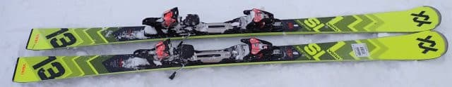
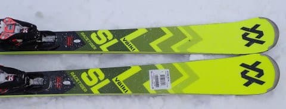
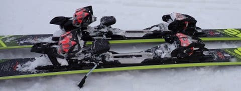
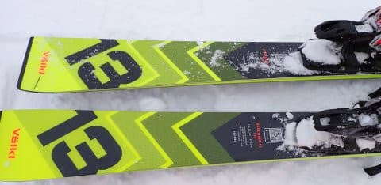
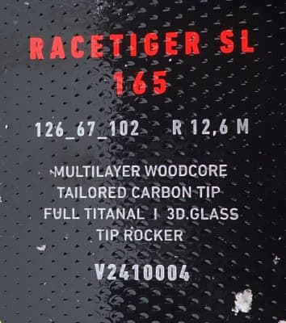

# 2025シーズンモデルのスキー板，試乗レポートその4… VOLKL Racetiger SL

📅 投稿日時: 2024-05-21 03:31:36

🏷️ カテゴリ: [スキー板試乗](c0bd8048615710cee890e403a36cc9a2b.md)

しつこいほど繰り返してますけど．

今シーズンは終わってないのですが…

まだスキーシーズンとはいえ，

毎週スキーに行くモードは終わったので．

この週末は久しぶりにスキーに行かない

週末を過ごしたわけですが…

この週末は，洗車やら車のワクシング，

数多くの板のワクシングやら，

スキーウェアや小物を洗って片づけたり．

スキーシーズンに買い物に行けなかった

ので破壊したまま使っていたあれや

これやを買い物したり…

と，いろいろやっていたら，

全く仕事ができないまま週末が終わって

しまい．

…スキーシーズンが終わって土日に

時間ができるはずだから．

無理して平日に夜中に仕事しなくても

良くなるはず…

という予想が見事に外れ．

今日ももう朝4時近くまで泣きながら

仕事をしているSkier_Sです（泣）

だのに．

今週末，月山へ行こうとしているという…

大丈夫か？？＞自分

…でも．

我が人生で，6月を待たずに月山へ

行くのははじめてだなぁ…

ってなことで．

本日も2025シーズンモデルのスキー板の

試乗レポート．

今回はフォルクル編です！

〇VOLKLRacetiger SL 165cm

基礎小回り用

一応，SLと名前がついてますが，

競技用はSL WCと後ろにWCがつきます．

WCがついてないこいつは競技用ではなく，

FISマークも着いてません…

で，ゲレンデ用トップモデルの小回り機

としては，Racetiger SLとRacetiger SL Masterの

2機種あり，Masterのほうがトップグレード．

こいつは2番目のグレードとなります…

…でも．

来シーズンは2万円ほど値上げするのか…

ビンディング込みで定価19万ほど（涙）

センター67mmと，競技用の64mmよりは

ちょっと広めになっていて，

いろんな雪への対応性は競技用より高そう．

とりあえず，履いてみた感じ…

軽い！かなり軽い感じ．

軽いけど，キョロキョロする不安定感は

全くなく，強めのグリップでしっかり

カービングしていく板．

エッジグリップはトップからテールまで

しっかり食い込んで，結構強めだけど

しなやかなフレックスがあるので

かなり板がたわんで，板がたわんだ

小さなRに沿ってクルッと板が

回る感じ．

ターン後半でのたわみの開放もバネ感が

あってそこそこ早め・強めなので，

スピードを出して横Gがかかっていくと，

かなり大きくたわんで小さく回り，

それが解放されて…と，小回り強制

マシンになっていきます．

たわみが出やすいので，

縦目に落とそうとか，まっすぐ滑ろうと

思っても，スピードを上げていくと

どうしても小回りになっていきます．

でも，非常によくたわむけど，

たわんだ中でしっかりグリップする板なので．

スピードを出してもグリップが

負けていくとか，板が弱く感じるとか

そういうことは全くありません．

どうしようもないカービング小回りを

していく中で，かなりスピードが上がって

行ってもしっかりグリップの安定感は

高いです．

カービングメインのマシンですが，板が

かなり軽いので，谷回りで板を自由に

振り回しやすく，荒れた斜面や新雪でも

結構いけます．

コブ斜面とかも全く問題なく行けるんじゃ

ないかな？

大回りとか中回りの弧の自由度はないけど．

バーンの状況に対する許容度はかなり広い

感じで，雪や斜面を選ばずにどこでも

履いて行ける安心感があります．

ピカピカ整地のロングコースでは，

ひたすら小回りになるので疲れるかも

しれませんが…（笑）

とりあえず，お値段はお高めですが．

他に大回り用の板を持っていて，

小回りメインでいいけど，いろんな斜面．

コンディションで使ってみたいという

上級者に向く板です！
