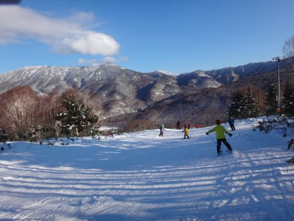
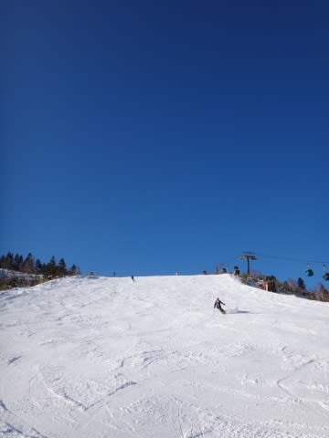

# 1月2日の志賀高原スキー場は…天気は良かったよ！人は多め，そろそろ積雪が欲しいところ…

📅 投稿日時: 2017-01-03 07:29:05

🏷️ カテゴリ: [2017スキー滑走日記](c7d777cecfc91bdf0fa464ad62c6d49ab.md)

志賀高原滞在5日目のSkier_Sです．

昨晩は更新前に爆睡をかましてしまったので，

今日は朝に更新！

うっすら曇りで始まっただった，昨日．

積雪は全くなく．

結構しっかり締まった，すごいスピードが出る

シマシマバーンでスタート！

かなりスピードが出る，超かっとびバーンだよ！！

朝イチは薄く雲があったものの．

9時ごろには太陽も顔を出しはじめ…

すぐにすっきり晴天に！

北アルプスも見える天気になりました…

しかし．

元日はゆっくりして，2日にちょっと出かけようかな，

という人が多かったからか．

ゲレンデは元日より混んだかな～

そのおかげで．

ゴンドラは，10時ごろから11時半ごろまで5分待ち．

午後も時々駅舎の外まで列が続くほど…（涙）

普段は混まないリフトも，列が伸びてます…（泣）

この正月休み一番の混雑だったかな…

その混雑の中，比較的人が少なかったのはオリンピックコース！

…なぜなら．

コースの雪が，アイスバーンというほどではないけど

かなり硬くパックされた雪で．

コンディション難しめだったからか，

人が少なかったですね～．

どうやらオリンピックコース．

10数年ぶりに人工降雪機を動かしているみたいで．

人工降雪が固まった，硬い雪になってる

ようですね～．

固い雪のおかげで．

いつもなら夕方にはこぶ斜面化するオリンピックコース．

夕方まで結構フラットで，かなり飛ばせました！

＃硬くてちょっと怖かったけど

だけど．

3日連続晴天で．

大勢の人が滑って雪を削っていくので…

そろそろコース上，ところどころやばい

ところが出てきちゃてるんですが…

うーむ．

早くもう一降りほしいところ！

オリンピックコース以外のコースは，

夕方まで人が多く．

夕方にはちょっと荒れてきましたが．

でもまぁ，一日天気に恵まれてたので．

まあ，楽しめた一日だったかな！

…しかし．この正月休み．

3日ぶっ続けで晴れるという，

冬の志賀高原ではめったにない天気．

晴れてくれるのはうれしいけど…

そろそろ積雪が欲しいなぁ…

と思った，Skier_Sなのでした．

## 💬 コメント一覧

### 💬 コメント by (bamboo)
**タイトル**: あけましておめでとうございます。
**投稿日**: 2017-01-03 10:17:45

あけましておめでとうございます。

今年も情報発信よろしくお願いします。朝の通勤電車の中でブログを読むのが何よりの楽しみです。

（あ、でも健康第一ですからサボってもらっても結構です）

12/31～1/2まで志賀高原に滞在しました。天気が良かったせいで人が多かったですね。

20年近く年末年始を志賀高原で越しますが3日間ずっと晴れだったことは初めてかもしれません。

大好きな志賀高原、この先どうなってしまうのしょうか。。

この調子だと来週は赤倉とかに浮気しそうです。

冷え冷えマンボが来るように祈ります。

### 💬 コメント by (Skier_S)
**タイトル**: bambooさま
**投稿日**: 2017-01-03 22:35:33

明けましておめでとうございます！

今年もしっかり情報発信していきますので，

よろしくお願いします…

12/31～1/2まで志賀に滞在だったんですね…

やはり私のことは発見できずじまいでしょうか．

…とりあえず，天気は良かったけど，

もう一降りほしい正月休みでしたね…

赤倉の方が雪があるのでしょうか？？

とりあえず，どか雪が降るように祈るばかり…

