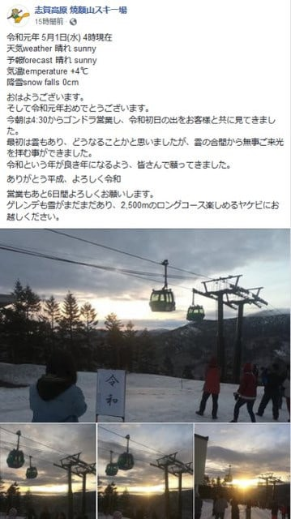
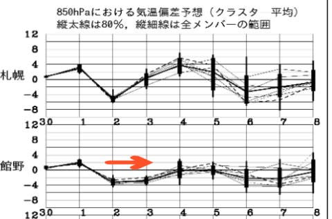
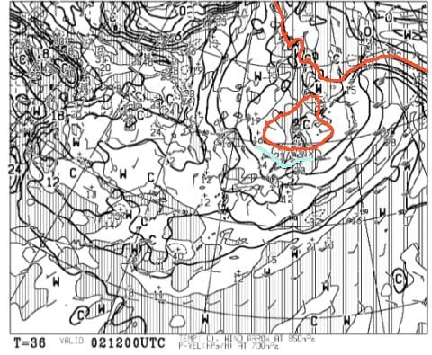
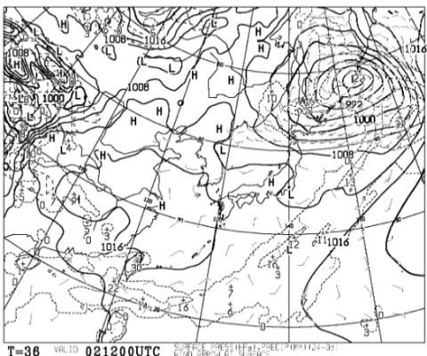
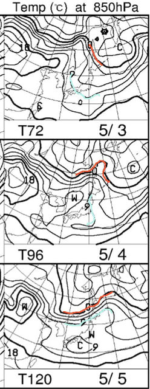
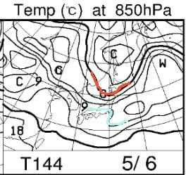

# GW後半の志賀高原スキー場の天気予想！…5月2～6日まで，雨は降らなさそう．2～3日は平年より冷えるけど雪が降るほどではなく，4～6日は昼間は10℃近くまで上がるGW平均的な感じ

📅 投稿日時: 2019-05-01 22:22:03

ってことで．

平成が終わり．

令和が始まったわけですが…

令和初日の焼額山．

令和初日の出ゴンドラは予定通り

営業されて．

悪天候で太陽なんて見れるわけないよな…

と思っていたら．

なんと．

令和の初日の出が無事見れたようですね…！

残念ながら，志賀高原の午後は，

かなりの雨になったようですが．

焼額特派員からは，

「午後は雨で板が良く滑って，良かったよ～」

と，極めて楽観的かつポジティブなコメントが

飛んできました…

さて．

このGW後半の天気ですが．

…特に驚くべき天気になることは

なさそうな．

平均的な天気が続きそうですね…

先週での予想天気図では

3，4日あたりに冷え込みそう…

という予想だったんですが．

最新の情報では．

2，3日が冷え込みのピークで，

それも平年比でせいぜい2-3℃の

冷え込みで収まりそうです…（ちょっと残念）

まぁ．

GW後半に，雪が降ることは

100%なさそうです（涙）．

そして．

2日の850hpa図を見ると．

赤い0℃線が，北海道から東北あたりで

独立した寒気を形成してますけど．

志賀高原には水色の+3℃線がかかる

程度なので．

この日も，昼間は暖かくなりそうですね…

地上天気図見，高気圧が接近して，

降水域は志賀に全くかかっていないので．

この日は午前中から晴れてきそうですね…

で．

3，4，5日は…

0℃線ははるかに北．

志賀高原には，3日に+6℃線，

4，5日は+9℃線がかかるくらいなので…

3日は，最高気温は+10℃近くまで上がり．

4，5日は最高気温は10℃を超えそう（涙）

まぁ，夏スキーみたいな陽気ですね（泣）

3，4，5日の地上天気図は

降水域がかかってないので．

基本的に晴れです．

GW最終日，6日も．

水色の+9℃線が志賀に近づいているので．

この日も最高気温は+10℃を超えそう．

降水域は志賀にかかってないので…

晴れ～曇りって感じでしょうか．

ってなことで．

まとめると．

2日：朝は曇り，気温は早朝で0℃を下回るかギリギリ．

　朝にぐんぐん気温が上がり，昼間最高気温は+5℃．

　午前中に晴れて，日差しが強くなるので．

　午前中のうちに雪は緩み，午後は完全に緩んだ

　滑りの悪い雪に…

3日：朝から終日晴れ！

　早朝は放射冷却でマイナスに冷え込み，

　早朝のゲレンデは硬いか…

　でも，日差しが強いので，通常営業の

　頃には緩み気味のゲレンデに．

　午前中には日も射し，ザブザブの雪に…

　昼間は+7～8度くらいまで上がり，

　いい感じの春スキーに．

　午後の雪はずっしり重い，GWらしい感じに．

4，5日：朝から終日晴れ．

　早朝は放射冷却で，ゲレンデはちょっと

　締まり気味．

　でも，すぐに緩み始め，通常営業開始には

　ザブザブになっちゃう．

　昼間は強烈な日差し＆10℃を超える気温で，

　暑いくらい．雪は朝からずっしり重く，

　滑りが悪い雪になっていく…

　

6日：曇りか，晴れか…ちょいと微妙．

　この日も昼間は+10℃近くまで上がり，

　GWらしい，暑いくらいの一日．

ってな感じでしょうか．

残念ながら，GW後半は奇跡の冷え込みは

なさそうですが．

逆に言えば，平年以上の異常高温にも

上がらなさそうで．

さらに，雨になったり荒れた強風の天気にも

ならなさそうなので．

まぁ恵まれたGWでしょうか…

このGW後半は，夏タイヤでも志賀高原には

上がれそうです．

ってなことで．

また明日から，志賀高原に舞い戻っています～！

## 💬 コメント一覧

### 💬 コメント by (セツ)
**タイトル**: Unknown
**投稿日**: 2019-05-01 23:05:57

こんばんわ～。

２月にアキレス腱断裂で早々に戦線離脱を報告させていただいた者です。

今シーズンは奇跡の積雪量ですね！

地元に近い奥美濃方面はまだかろうじて雪は残っておりますが３月で既に重い雪だったらしく職場のボードキチ達もさすがに行くのをためらっておりました。

今年は無事だったらきっと１０連休馳せ参じていたにちがいない、と思うとちょっと口惜しさいっぱいです。

(ノД`）

それでも来シーズンに向けてバートンのステップオンバインディング買っちゃおうかと算段しております。

怪我は３カ月間経つこともあり、リハビリに勤しんでおりますが、アキレス腱自体の硬さがとれず、筋肉量も落ちてまだまだ片脚立ちが出来ず、復帰に苦労しております。

もともと右足首も２０代の頃のバイク事故で可動域が狭く、理学療法士にはよくこんなんでボードしてると呆れられております。

### 💬 コメント by (Skier_S)
**タイトル**: ＞セツさま
**投稿日**: 2019-05-02 21:21:58

いやーー．

このGW，かなり恵まれてます．

志賀高原はまだまだ雪たっぷりです．

リハビリ大変でしょうが，来シーズンまでまだ時間がありますので，

しっかりリハビリして，来シーズンは無事ゲレンデ復活してください！

志賀高原でお待ちしています～！

