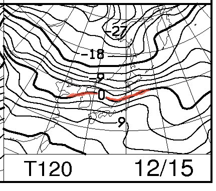
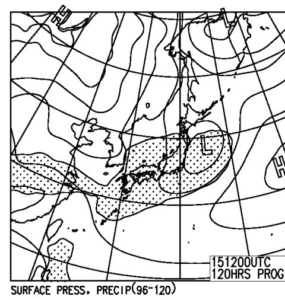
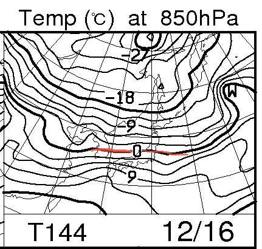
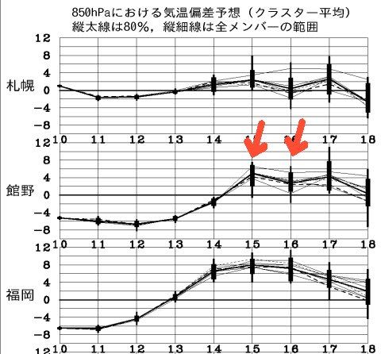
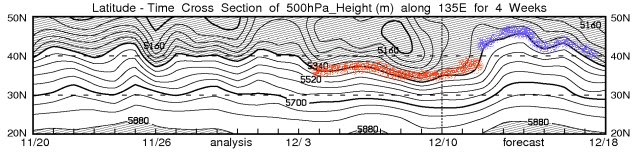

# うむっ!?…この週末は，雨？？？

📅 投稿日時: 2012-12-12 00:57:26

いや，今日は．

ATOMIC SXのインプレッションを書こうと思ったけど．

天気図を見て，

「…これは，やばい」

という感じだったので．

今日は緊急天気予想ということで…

今週土曜，15日ですが…

1500mで雪になる目安，赤く記した850hpaの0度線が，東北まで上がってます…

これは．信州や新潟で，降れば雨ってことです．

んで．

15日の地上天気図を見ると．

雨が降る網掛け領域が，日本にかかってます．

…このままだと．

土曜は雨になりそう…(涙)

16日も，

0度線はきわきわ新潟くらい…

運がよくても湿った超重い雪，悪ければ雨，って感じですね．

こんな感じで，15，16日の気温は，平年より4度以上上がりそうだし．

北緯40度を下回ると結構な雪になる目安の500hpa高度線も．

これまでの冷えまくった1週間．

赤くマークしたように順調に下に下がってましたが…

15，16日以降は．

青くマークしたように，11月以来最高にあがっちゃうよ…（涙)

ということで．

なぜか．

週末が終わった月曜にいい雪が降って．

次の週末の土曜がやってくると雨が降る…という

「嫌がらせか～っ！！！」

っていう週末になりそう…（涙)

…スキーヤーの皆さん．

祈りましょう…
