# 2025/5/10(土)の志賀高原熊の湯スキー場速報レポート！…午前は曇り，午後は薄日も．かぐら特派員レポートもあるよ！

📅 投稿日時: 2025-05-11 00:37:58

🏷️ カテゴリ: [2025スキー滑走日記](cacd3fbf84d4a679ee61a5894c3f95e14.md)

えー．

今日は結局，朝起きて，

とりあえず，リフトが動くかどうかわからんけど

天気は回復傾向だから，スキー場に向かおう

という見切り状態で家を出発し．

かぐらに行くつもりだったけど．

高速を走っている途中で，

かぐらの営業見合わせ

という悲しいニュースが入ったので…

一瞬，家に帰ろうか？？

とも思ったけど．

急遽目的地を志賀高原に変更し，

熊の湯で滑ってきました～！！

…ええ．

そうです．

やっぱり滑りに行ってきました…

ちなみにかぐらは営業開始は遅れたけど，

朝10時から営業して，かぐら第1高速まで

ちゃんと動いたようです～！！

ってなことで．

本日の熊の湯スキー場の速報ですが．

かぐらに行くつもりでいたので，

かぐらより遠い熊の湯に着いたのは

9時半とちょっと遅い時間．

滑りはじめは10時近くになっちゃいました（泣）

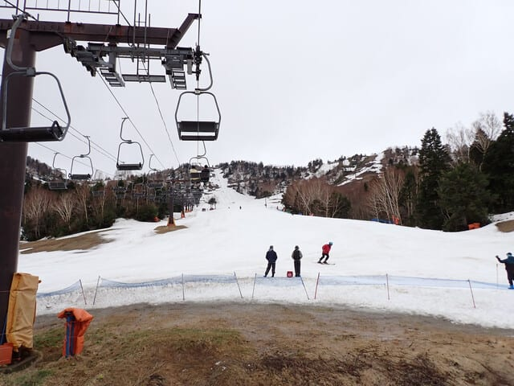

ただ…

熊の湯，予想より雪がありますね！！

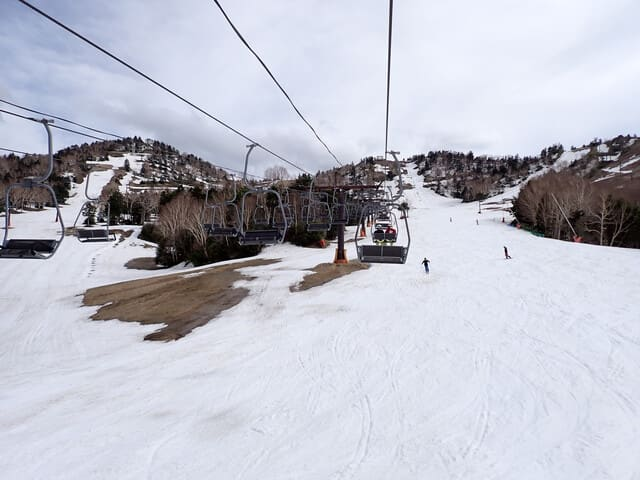

第2緩斜面はまだほぼ幅いっぱい滑れ

ますよ～！！

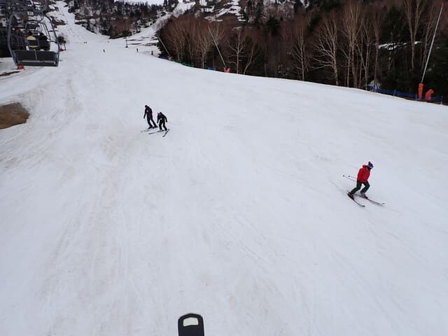

イベントコースはてっぺんのコース入口が

もう幅1mくらいしか雪が残ってないけど…

でも，下側はところどころコブ溝に

地面が出たところもありながらも，

まだ滑れてますし．

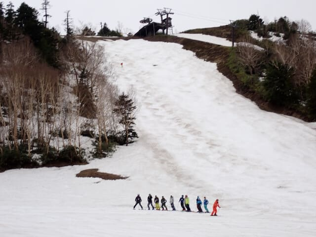

第2Aのコブも，この状態でまだ

オープンしているようで…

滑っている人がいますよ！！

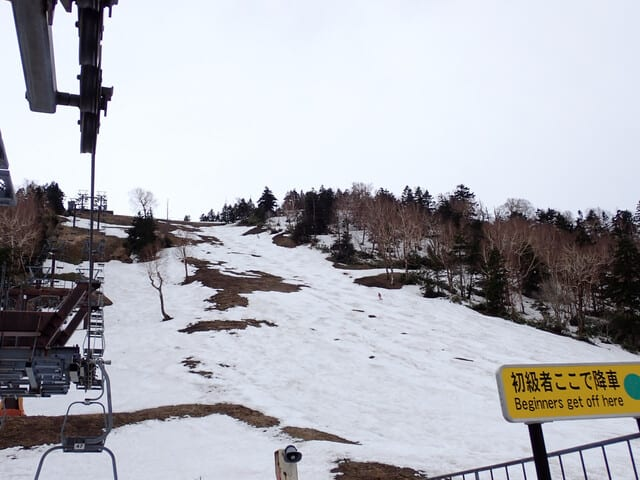

そして，第2ペアの山頂から馬の背に

行くコースも，まだ意外と雪の

厚みがあって…

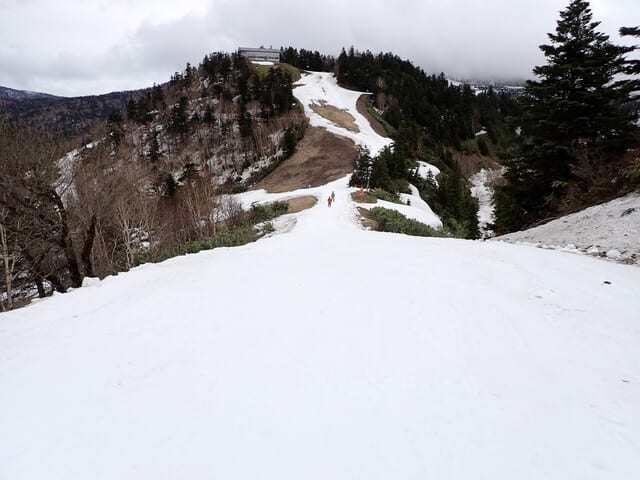

馬の背も，まだ幅が狭いながらも

滑れますよ！

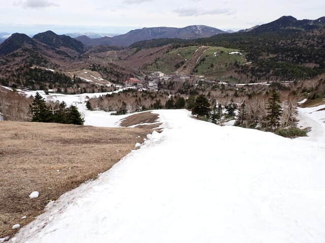

今日は，意外と馬の背の下半分が

板も滑ったし斜度もあって面白かった

かも…

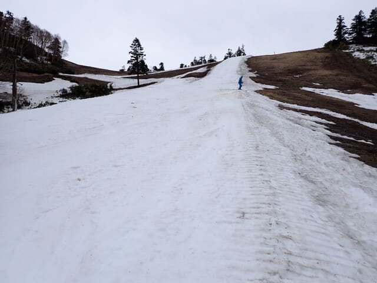

第3緩斜面も，まだほぼ全面に雪が

残っている感じですが…

残念ながら，第3緩斜面は滑る人も少なく，

雪がちょっと汚れ気味だったので，

板の滑りがあんまり良くなくて．

そんなに楽しくなかったかも…

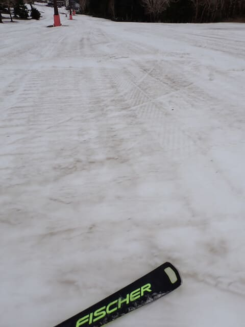

第2緩斜面は，第3よりはまだ滑りは

マシでしたが．

でも，全体的に板の走りが良くない

感じ…

ストップ雪というほどではないけど，

緩斜面で板がそんなに走らないので，

ちとつらい…（泣）

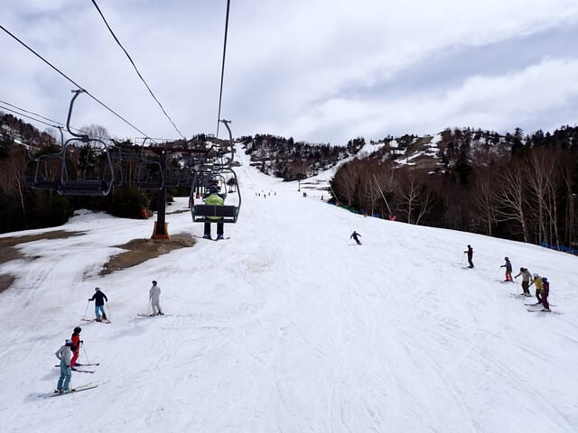

で．

第2緩斜面や第3緩斜面はほぼ全面に

雪が着いているにもかかわらず．

なぜかリフト乗り場前，こんな広範囲に

地面が出てしまっています（泣）

まぁ，この時期の熊の湯．石ころふみ用

板を持っていくのが正解です…

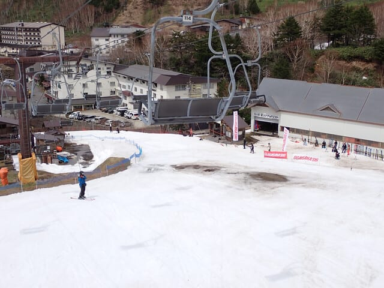

リフト混雑ですが…朝のうちは第2の平行の

2本とも動いていたのでガラガラ．

11時過ぎくらいにリフトを1本だけにしたけど，

オガサカキャンプの団体さんが入った時に

ちょっと並ぶ以外は，ほぼ飛び乗りでした～！

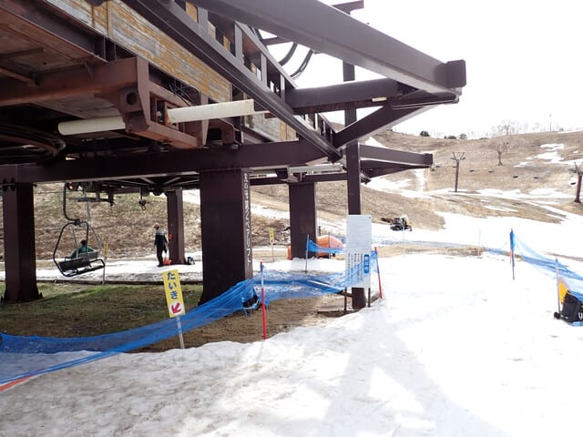

そして．

今日の天気は．

朝10時ごろにはもう完全に雨もやみ．

風もそんなに強くなく…

リフトが減速することもなければ

雨にも降られず．

そして，午後は晴れ間もあるほどで．

昨日心配したよりはずっといい天気

でした～！！！

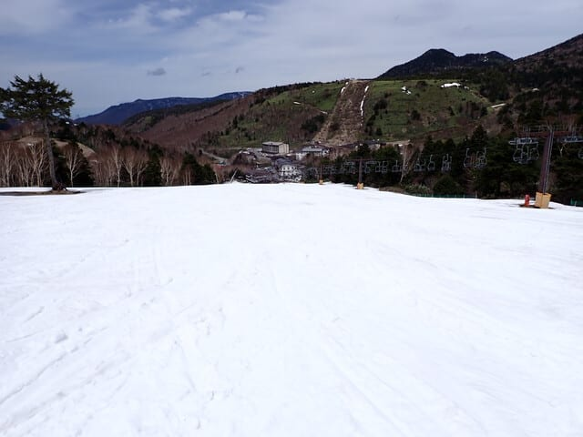

営業終了時は，馬の背はちょっと雪が

薄くなったところもあったけど…

たぶんこれ，明日の営業最終日も

山頂から滑れるんじゃないかな？？

という感じで．

暴風雨で滑れないかも

と，前日に心配したわりには，

天気も風も穏やかで，

リフト飛び乗りでぐるぐる

滑り続けられたのでした～！！

…ちなみに，今日のかぐらに行った

特派員によると．

朝は風で運転見合わせだったかぐらは

朝10時に営業開始となり，かぐら第1

高速までちゃんと動いたようで…

それも，午後は熊の湯同様，晴れ間も

あったみたいです！！

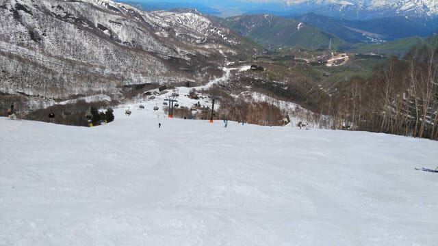

かぐらメインバーン，まだ幅いっぱい

雪が着いてますね…！！

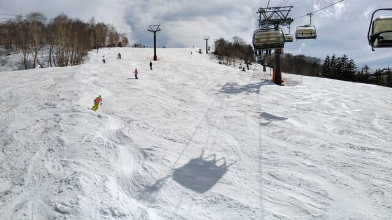

そして，テクニカルもまだ土が全く

出てないのがすごい…

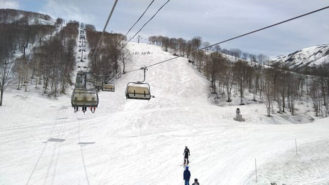

ただ…

今朝までの雨で，みつまたはかなり融雪が

進み，昨日までは雪に隠れていたピスラボが

出てきちゃってたみたいです…

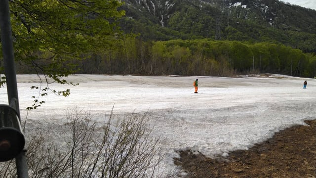

うーん．

来週までスキーで滑ってみつまたを

下りれるといいんだけどな…

ということで．

思わず志賀高原日帰りをやることになった

本日．

睡眠2時間半で朝4時半過ぎに起きたのに，

もう2時近い（泣）

疲れたので，もう寝ます…

おやすみなさい…
