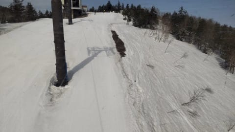
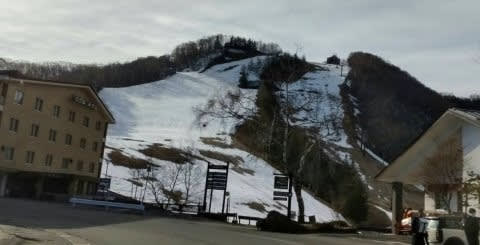

# 2021/4/8(木)の志賀高原スキー場，特派員レポート…天気は晴天！気温は割と冷えて，昼近くまで緩まず快適だったみたい

📅 投稿日時: 2021-04-09 01:25:10

🏷️ カテゴリ: [日記](cc4b5682fb7b8b144980957a978653fb0.md)

ってなわけで．

本日も志賀高原の特派員から写真を

いっぱい送ってもらいましたが…

今朝も，見事な青空スタート！

…というより，安定のおこみん写真で

スタートですね(笑)．

あさイチの気温は，奥志賀の麓で

ギリギリ0℃．

まぁ，ここ数日では冷えた方かな？

山頂の気温はマイナスなので，

あさイチのバーンはかなり

硬かったようですがが…

でも，気温は低くても，今日は

すっきり晴天で，日差しが強かった

からか…

じきに表面がちょっとだけ緩んできた

みたいですね～．

でも．

今日は比較的気温が低めだったので．

11時くらいまでは，奥志賀のバーン状況は

結構いい感じだったようです！

…11時くらいに焼額に移動してみると．

昼近くの焼額は最高気温が4度まで

上がってしまったのもあり．

さらに日当たりが良いということも

あって…

残念ながら．

ちょっと雪が緩んでいたようです(涙）

でも，人が少ないので，ザクザク

雪ながらも，荒れてないのがGood！

焼額は来週から2週間，水・木が

運休になるのですが．

どうやら今週から休みと勘違いした

人が多かったのか，強烈にガラガラ

だったので．

昼でも全然荒れてなかったようです…！

ホントに誰もいませんね…

経営，大丈夫かな…

で．

最近では定点観測になっている，

サンバレーと．

焼額オリンピックコースですが．

…雪，へりましたね…（泣）

でも．

明日，明後日はそこそこ冷えて．

ちょっとだけ雪が降るはず…！

そして，運がよければ明後日土曜までに，

少し積もるはず…！！！

久しぶりの積雪を期待したいところだけど．

…でも，あんまり積もらなさそう（泣）

あぁ…7日から11日ごろまで，水色の

矢印で示すように，実に久しぶりの

冷え冷え期間だというのに．

気温が高い週末には意味もなく

5週連続で雨が降ったというのに．

久しぶりの冷えた週末には

何も降らないのが惜しすぎる…っ！！！

暖かい時には降って，

冷えたら降らないって．

これは何かの嫌がらせじゃなかろう

か…（泣）

ここは，冷え冷え踊りではなく．

降れ降れ踊りを全力で踊らねば

ならないのか…？？

…でも．

降れ降れ踊り，タイミングが外れて

気温が上がってから効果が出ると，

ゲレンデの息の根を止める殺人兵器

になりかねないので．

やっぱり降れ降れ踊りは危険だなので，

やめておこう…

## 💬 コメント一覧

### 💬 コメント by (レインボー73)
**タイトル**: Unknown
**投稿日**: 2021-04-09 13:54:10

金曜日の志賀高原情報

朝の上林1℃　蓮池マイナス３℃。久々のマイナスです。

2ゴン乗り場には５ミリ程の積雪が！

たった今、ゴンドラ故障で30分遅れとのこと。奥志賀もあるけど、ブーツ履いたことだし、待つことに。

それが正解で、８分遅れでスタートしてくれました。山頂ー4,5℃。真っ白な雪面は気持ちいい。

３本滑ったけど、スーパーから上は風が強い。さらさら雪が結構降っている。ありがたいことです。

４本目、雪がやみ、歓迎しない晴れ間が。おまけにパノラマの緩斜面で妖怪の赤ちゃんが出だしてスピードダウン。犯人は新雪かなあ。

強風でゴンドラがやけに遅い。16分17分。

10本目で楽しくなくなったので終了。シーズンラストはいい思い出を残さなきゃ。

昼前の山頂はー３℃、高天ー２℃　蓮池ー２℃　上林６℃。

ヤケビから横手に移動した友人によると、横手は朝一のヤケビよりも硬く、猛吹雪だそうな。早く妻のもとに帰るべきだと、私は思う。

### 💬 コメント by (Skier_S)
**タイトル**: ＞レインボー73さま
**投稿日**: 2021-04-10 00:00:08

新雪が積もったぶん，ちょっと滑りが悪くなったようですが…

でも，この週末も晴れていい感じになりそうですよ！！

