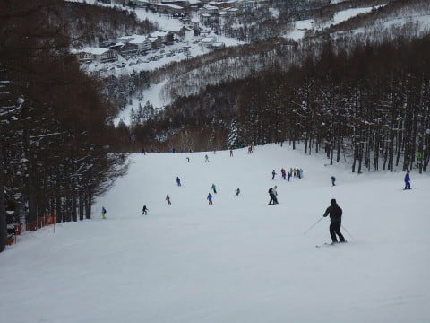

# 1月8日の志賀高原の状況，速報モード…朝は焼額1，2ゴン，奥志賀ゴンドラ動かず(涙）午後はみぞれ~雨（激泣）

📅 投稿日時: 2018-01-09 01:11:34

ということで．

長かった冬休みも終わり．

つい先ほど，

志賀高原から帰ってきました…

で．

荷物を片づけたり，板の手入れをしたりで．

いつも通り深夜になってしまったので．

本日も，帰宅日定番の速報モードにて…

えー．

まず．

朝．

強風のため，焼額山は第2ゴンドラが

運休となり…

それどころか．

第1ゴンドラも強風のため運休決定（涙）

別料金のファーストトラックはぎりぎり

営業したけど，風が強まったので通常営業は

諦めたらしく…

で．

当然奥志賀ゴンドラも動かず．

奥志賀は第1，第2高速の2本しか

リフトが動かないような状況（泣）．

だもんで．

第2高速リフトに乗り，唐松コースからスタートしますが…

ゴンドラが動かない分，リフトのコースは

混雑しますな…

ゴンドラ2本運休の影響は大きく．

いつもはがらがらの第3高速リフトも，

普段ではありえないくらいの

混雑（涙）．

ただ，11時半ごろに，

何とか第1ゴンドラが動き出し…

そして．

ゴンドラが動いてなかったので，

誰も滑ってないGSコースは…

シマシマ！

昼ごろにシマシマを楽しめるとはっ！！

さらに．

荒れる天気予想だったけど，

昼近くに一瞬晴れ間が！！

晴れた無人のフラットバーンっ！！！

最高っ！！

…と思えたのも一瞬のみ．

その後，すごく湿った，

重い雪が降り始めたと思ったら…

午後3時ごろには，山麓では完全に雨（涙）．

もう，完全に予想通りの天気…

なんてこった…（泣）

ということで．

全身びしょ濡れになってしまい．

あまりの状況のひどさに泣きながら，

最終リフトまで滑ったのでした…←それでも最後まで滑るんかい！

…ってな感じで．

詳細レポートは，また明日…

明日からの仕事に備えて，おやすみなさい～！

明日から無事社会復帰できるのかな…（ぼそ）

## 💬 コメント一覧

### 💬 コメント by (yumi)
**タイトル**: えぇっ⁉️・・・泣きながら？
**投稿日**: 2018-01-09 06:50:56

Ｓさぁ～ん

昨日、突っ込みそびれたけど、今日も突っ込み所満載で🎵

７日のナイターで、コロコロ➰➰🌕バーンを泣きながら滑って、

８日もずぶ濡れで、泣きながら滑ったって？

えぇぇ～～～

「スキーは泣きながら滑るもんじゃぁ～無いですね。」

って、誰か言ってたのは私の気のせい？

なぁ～んだあ～

・・・・・

Ｓさんも泣きながら滑るの💫🏂💨好きなんだぁ～

### 💬 コメント by (ほっぽ)
**タイトル**: お疲れ様でした
**投稿日**: 2018-01-09 06:55:10

Ｓさん

昨日は偶然にも二高駐車場でお会いし、更に１ゴンでお会いするという偶然。

１本相乗りさせて頂きありがとうございました。

結局、カッパ未装着で頑張りましたが、ラスリフ５分前でめげてしまいました。

昨日は午後は修行になってしまいましたが、ほぼ１日滑ることが出来て私なりに満足です。

また次回お会いできたらよろしくお願いします。

### 💬 コメント by (FCAMEL)
**タイトル**: やはり滑ってらしたんですね
**投稿日**: 2018-01-09 09:35:11

まさかと思いましたが、あの雨の中やはり滑り続けてらっしゃいましたか。（土砂降りに近いタイミングもあったような・・・）さすがです。

昨夜の帰り道、奥志賀－ヤケビ間は氷と化した路上の圧雪の上にたっぷり雨が滴って私もスリル満点の車スケーティングを楽しみました。奥志賀ゴンドラの坂登れない車も見かけました。

1ゴンもかなり頻繁に覗いているにもかかわらず、なぜか今シーズンはなかなかお見かけしませんが、またお目にかかりましょう！

### 💬 コメント by (つーちゃん)
**タイトル**: 予想的中
**投稿日**: 2018-01-09 13:05:34

昼過ぎに晴れてきたときは

めでたく予想を外すか！？

と思いましたがポツポツきたと思ったら

ガクッと天気が崩れましたねー

まぁでも人は少ないし荒れてないし

板の走りは良くないもののそこそこ気持ち良く滑れたので

最後の一本を何度か繰り返し

再び１ゴンが運休するまで滑りましたー

### 💬 コメント by (しんちゃん)
**タイトル**: 大変だったんですね
**投稿日**: 2018-01-09 22:33:14

冬休み最終日に、泣きながらでも最終リフトまで雪上にいるなんて。。。

大変だったんですね。風邪ひかないようにご自愛ください。

### 💬 コメント by (サトシ父)
**タイトル**: 日帰りチャレンジしてみました…
**投稿日**: 2018-01-09 22:47:46

7日講習受けに初の日帰りチャレンジしました、当日は何とかなりましたけど昨日は死んでました…シーズン劵の魔力は怖いです。行かなきゃという義務感が半端ないないです。

### 💬 コメント by (KENKEN)
**タイトル**: ありがとうございました。
**投稿日**: 2018-01-10 00:09:59

今回は色々と普段以上にお世話になりました。

雨の中カッパを着てゲレンデに向かうSさんを見て、温泉の誘惑に負けた自分に恥じ入るばかりです。

今日の2週間ぶりの仕事は予想通りいきなりトップギアでお腹いっぱいでした。

現実逃避と言う名の週末スキーを楽しみに後3日乗りきります。

### 💬 コメント by (Skier_S)
**タイトル**: 残念な天気の一日でした…
**投稿日**: 2018-01-10 04:34:11

＞yumiさま

泣きながら滑るものじゃないですよね…

スキーは．

だから…

たぶん．

そうです！

この日の涙は，うれし泣きだったんですっ！！（大嘘）．

…なぜだか．

コンディションが悪いから，帰ろう…

と思っても．

リフトが動いていると帰れない呪いが

掛けられているのです．

＞ほっぽさま

いやー．

ひどい天気の一日でしたね…

でも，ラスト5分前まで滑ってらしたのですね．

素晴らしい…

今度はいいお天気の時に一緒に滑りたいですね…

また志賀でお会いしましょう！

＞FCAMELさま

私は，雨が降ろうが槍が降ろうがミサイルが降ろうが

滑っちゃう人なので…

あの天気でも止まりません(笑)

でも，今シーズンはなかなかお会いできませんね…

また1ゴン覗きに来てください！

＞つーちゃんさま

当たってほしくない予想は当たるんですよね…

なぜか…

晴れ間がのぞいた時，雨雲レーダーを見て

「あと30分ほどで降り始めそう」

と分かった時はかなりがっくりでした．

ホントに一気に天気が崩れましたよね．

…しかし．

最後の1本を繰り返すとは．

