# 2018年8月，モアルボアルで小5の娘をダイバー化！その15…ダイビング2日目の3本目，娘の海洋実習ラストの1本

📅 投稿日時: 2019-07-29 00:15:38

🏷️ カテゴリ: [ダイビング日記](ce3a7a8d424d112fce83ee85c81a0e344.md)

前回の記事で．

台風でこの週末はどこにも

出掛けられなさそう…（涙）

と，書きましたが．

なんだか，意外とこの週末の

首都圏近辺の天気，ひどい風雨に

ならなかったので，

昨日土曜日は，娘の用事が終わった後．

娘と一緒に東京都内まで足を延ばし．

そして，本日日曜も．

朝起きて天気図を見ると，

雨にならなさそうだったので．

いきなり娘と一緒に，某県の

とある山の麓までお出かけしてきました～！

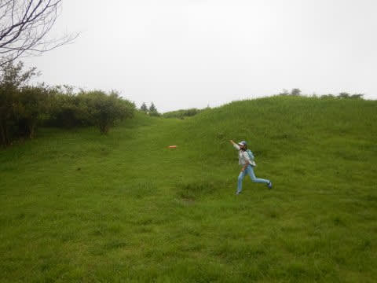

ちょいとガスは出ていたものの，

いろいろ遊んできました…

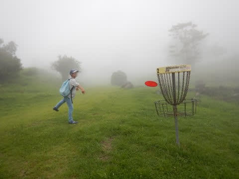

…やっぱり，自分は，

週末は遠距離お出かけしないと

落ち着かない人間だという事が

良く分かりました…（笑）

ということで．

もうすぐ，今シーズンのダイビング遠征に

出発なので．

本日も，急ぎで仕上げなくてはならない，

昨年のダイビング旅行記です！←ってか，もうすぐダイビング遠征出発なら，

今週無理に出掛けなくて良かったのでは？

では，どうぞ～！

--

ってなことで．

本日3本目のダイビングへエントリーしますが．

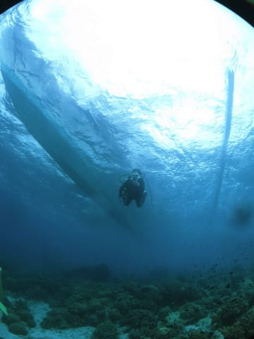

…今回も，海洋実習の娘は，

ファンダイブ組より後のエントリー

だったので，娘のエントリーを

見ることはできず…

とりあえず，ファンダイブ組は，

先にドロップオフへ進んで．

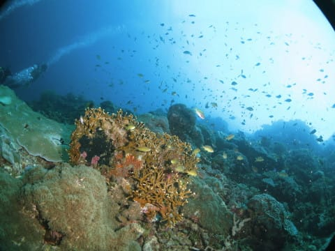

緩い流れの中，ドリフトチックに

ドロップオフ沿いを流していきます…

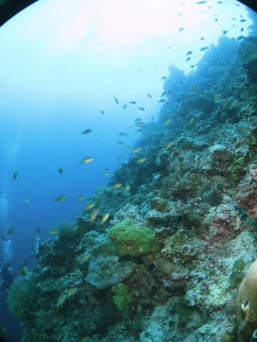

うーむ．

天気が悪くて日が射さないので．

あまりワイドの写真がきれいに

撮れない…（涙）．

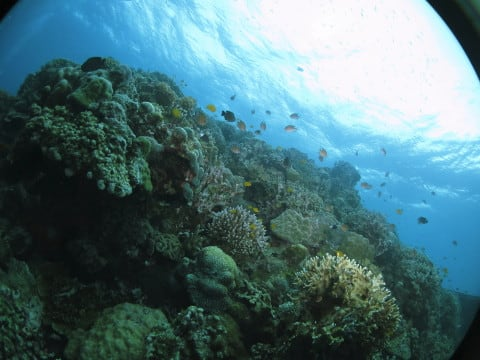

だもんで．

岩に張り付いていたヨウジウオやら．

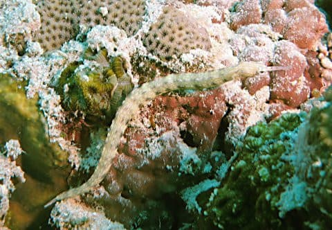

岩の隙間の砂地に居た，

ヤマブキハゼなんかを

ひそひそと撮っていたら．

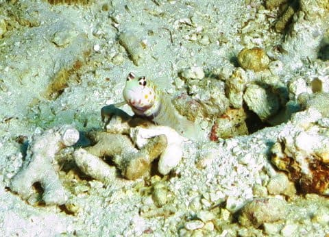

…うん？

むこうからやってくる，

あれはなんだ…？？

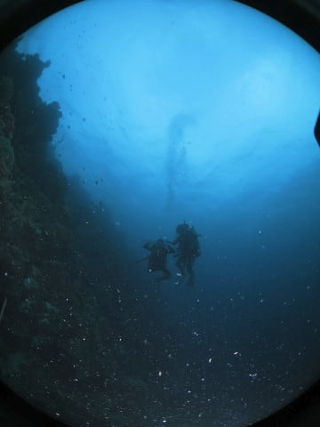

…って，あとからエントリーした

娘じゃないか！！

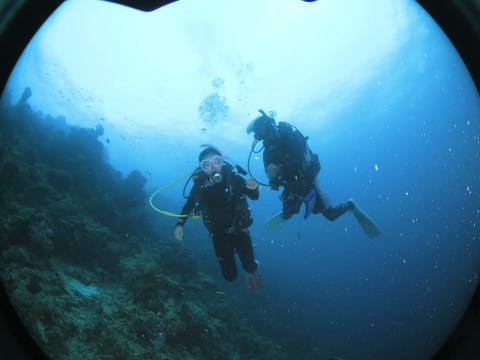

てっきり，浅瀬でゆっくり

実習しているのかと思いきや．

…まさか，ドロップオフをドリフト

してくるとは！！

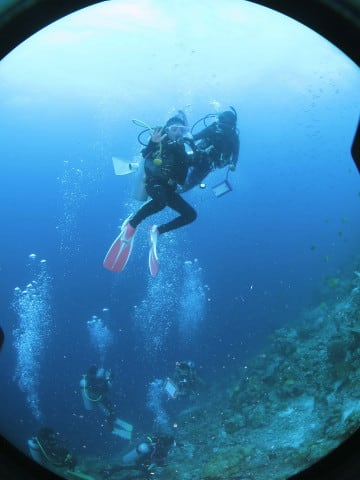

最大深度11mという制限がある，

ジュニアオープンウォーターなので．

ファンダイブ組より浅めのところを

通っていきますが…

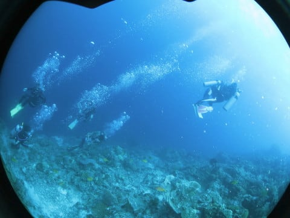

浅めのところの方が，ちょいと

流れが速めだったのか．

ファンダイブ組を置いて，

ずっと先に流れていきました…

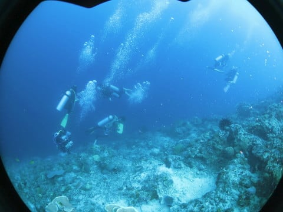

…ってか．

ジュニアオープンウォーターの海洋実習で，

ボートダイビングのドリフトって，

レベル高すぎでは…？？（笑）

とりあえず．

このダイビング．

海中ですれ違った娘のインパクトが

強すぎて．

そのあと，立った姿で群れて泳ぐ，

ヨロイウオやら…

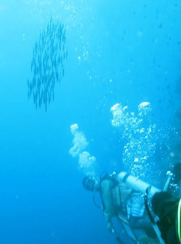

そのほか，いろいろ見たはずですが…

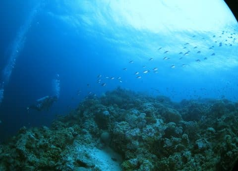

娘以外はあまり印象に残らず，

ボート下に戻ってきました…

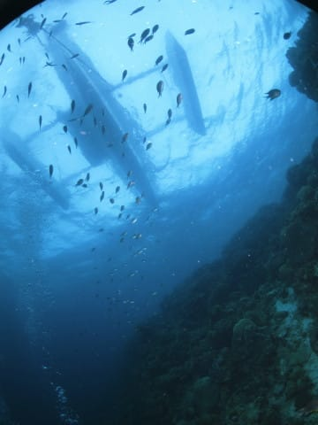

そして，娘がボートに上がっている

姿を眺めた後に，エグジット！

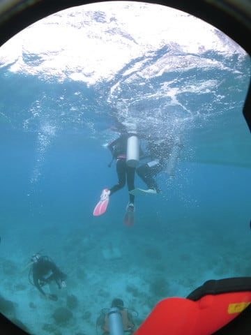

…これにて，本日のダイビング，

すべて終了ですが．

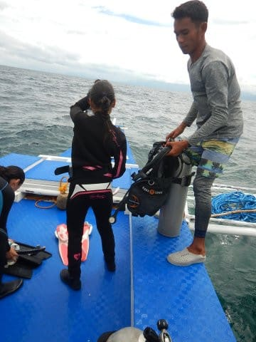

それと同時に，娘の海洋実習が

全ておわったのでした…
