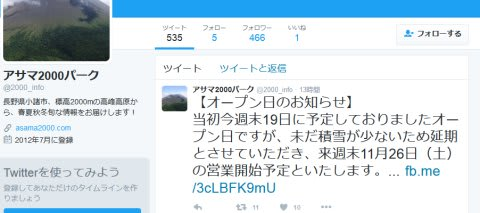
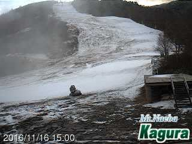
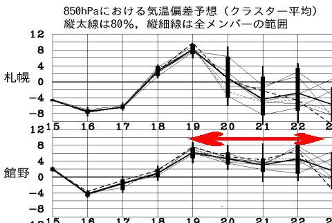
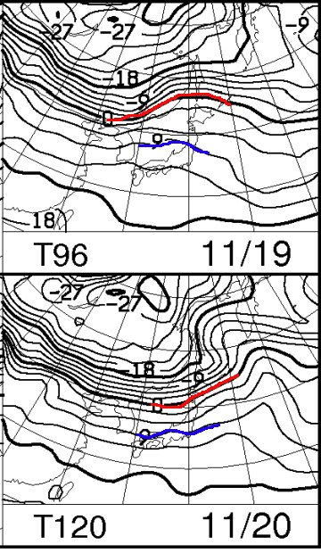
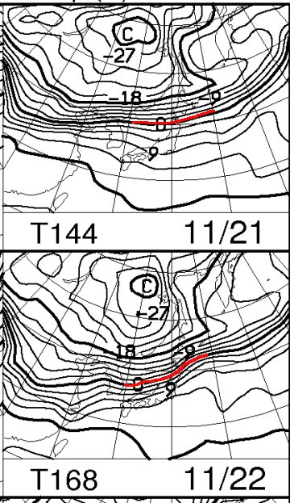

# なんてこった！アサマ2000オープンが11/26に延期！…来週も冷えなさそう…

📅 投稿日時: 2016-11-17 02:18:23

なんてこったーーーっ！！

なんてこったっ！！！

…タイトルの通り．

アサマ2000のオープン日が，

一週間伸びました…（激烈な涙）．

ということは．

11/23の祭日も，アサマ2000は滑れない…という

ことか…（泣）．

どうしたこったっ！！！！

かぐらも，雪がむしろ減っていっており．

現状のライブカメラを見る分には．

とても19日オープンは厳しそうな感じなんですけど…（悲）．

がんばれ．

がんばれ，人工降雪機っ！！←全身全霊を込めて応援

とりあえず．

18日の早朝までは冷えるので，

明日の夜中までは人工雪が打てそうなものの．

…それ以降は…

19日から22日まで，ずっと平年より気温が

高い状態が続きそうなんですが…（泣）．

19日以降，おそらく22日くらいまで．

夜中も人工雪を打つのが厳しい気温が

続きそう…（涙）．

詳細を見てみると．

19，20日の850hpa気温は…

うむ．

11月中旬と思えないレベルで，

景気よく北に上がってますね（涙）．

志賀高原は，やっぱり+9℃ラインがかかるくらいで．

19日午後～20日朝にかけて，気温が上がるだけじゃなく，

雨も降りそうなので．

19，20日でかなり雪が融け．

おそらく20日午後には，せっかく作った雪が

かなり消えてしまった，悲惨な状態になりそう…

その後，21，22日も…

0℃線は信州よりかなり北．

信州は+6℃線くらいがかかっているレベルで…

間違いなく，昼間は志賀もプラス気温．

とても人工雪を打てなさそうな日々が続きます（泣）．

おそらく．

たぶん．

このままでは．

かぐらや熊の湯も．

19日どころか．

23日のオープンも厳しそうな予感…（戦慄）

うううーーーむ．

この週末も，23日も．

Yetiに行くしかないのか？？

なぜ…

なぜ，今シーズンもこんなことに…

みなさん．

どうやら．

今シーズンも．

できれば避けたかった，

冷え冷え踊りを踊らねばならぬようです．

そうです．

これから一週間．

「今週はもう仕方ないけど，せめて23日以降

　ガンガン冷え込んで，来週26日以降は

　たっぷりの雪で滑れるよう神々に捧げる踊り」を．

休まず，止まらず，必死に踊り続けましょう！！←まさか，今シーズンもこのオチとはっ！！！

## 💬 コメント一覧

### 💬 コメント by (ぴよ＠太田市)
**タイトル**: 軽井沢プリンス
**投稿日**: 2016-11-17 09:04:02

軽井沢プリンスはどうでしょうか？

先週、行ってみたら、駐車場1/3程度の入りでした

少年団？のような団体が早朝から滑っており

スキーセンター前の2コースが滑れるようでした

滑ろうかな？と思ったのですが、あまりに大量の硫安散布を目の前で見てしまい、恐ろしくなって帰ってきちゃいました

少年団の人たちも滑走後列を作って板を水で洗浄していました...

今週は軽井沢も高温続き見たいですけど

なんとも悩ましいです

### 💬 コメント by (Skier_S)
**タイトル**: ぴよ＠太田市さま
**投稿日**: 2016-11-18 01:53:37

いや…軽井沢は，昔はよく行ったのですが．

リフトすごく待つので…あまり

いい思い出がありません（笑）．

確かにリフト2本滑れるんですが．

…20分待ちとか，むちゃくちゃリフト

混みますので，ここ5シーズンほど

ご無沙汰してます…

交通費と移動時間，コースの長さを

考えると，やっぱりYetiになっちゃいます…

