# 2023/1/15(日)の志賀高原スキー場の特派員情報…朝はガス，昼間は晴れ~曇り，焼額は雪が緩んで滑りやすかったけど他はアイスバーン

📅 投稿日時: 2023-01-16 03:57:19

ってなことで．

今日も志賀高原には行けず，家に籠って

寂しく一人で仕事していたわけですが．

仕事の進み具合がよろしくなく．

来週末もヤバいかも…(涙)

あぁ．ご無体．ご無体すぎる…

とりあえず．

本日も，週末というのに私が滑り

行けなかったわけなので．

今日こそ志賀高原には槍やミサイルが

大量に降り注いでいるのではないかと

期待して，特派員情報を待っていた

のですが…

期待に反して，予想よりコンディションが

良さそうなレポートが送られてきました(泣)

まず．

あさイチは一の瀬・高天方面は

ガスっていたみたいですが…

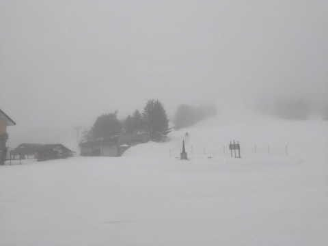

焼額・奥志賀方面は朝は曇り空．

というか，ちょうど眼下にガスが広がる

雲海状態！

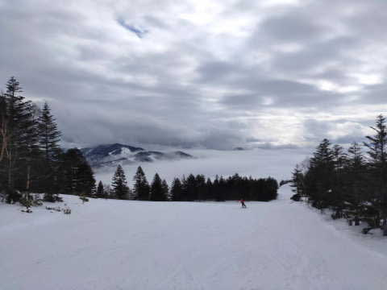

…そして．

じきに晴れてきて．

朝9時過ぎには晴れてきたようです…！！

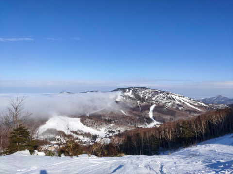

うーん．

この日は晴れる予想じゃなく，曇り空で

時折雪がぱらつく予想だったんだけど…

完全に外しましたね．

…というか，槍やミサイルが降る予想も

残念ながら外れたか…

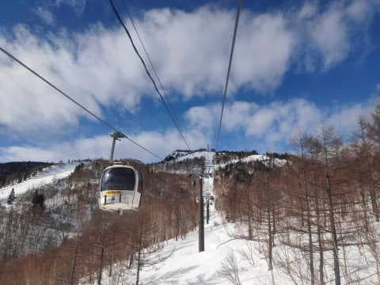

あさイチの気温は不明ですが，

朝はそこそこ冷えていたようで．

そこかしこでバーンはガチガチだった

ようですが．

ただ，焼額や奥志賀など，標高が高めの

場所は全面ガチガチは避けられた

みたいで．

焼額のGSコースや奥志賀のダウンヒルは，

あさイチはちょいと硬めながらも，

いい感じだったようです…

…意外と気持ちよさそうじゃない

ですか…(悔しい)

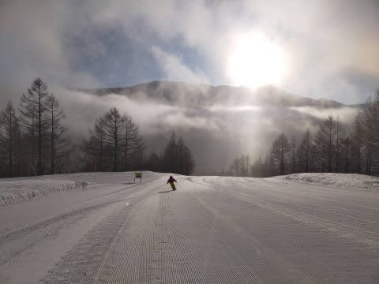

そして，昼間は私の予想より気温が上がり．

プラス気温まで行っちゃったみたいで…

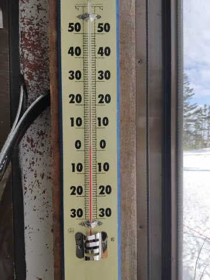

気温が上がったのと日差しのおかげで．

ガチガチだったバーンも適度に緩み，

滑り良くなったみたいですね…

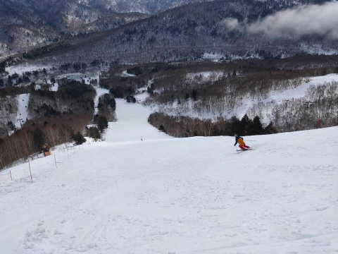

まぁ，1月の志賀高原の雪と考えると

最低レベルですが．

アイスバーンやガリガリバーンに比べれば

まだマシですね…

うーん．

アイスバーン＆ガチガチ斜面になる

呪いをかけていたのに，効かなかったか…

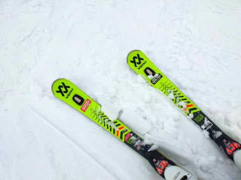

そして．

焼額は第1ゴンドラも終日混まず…

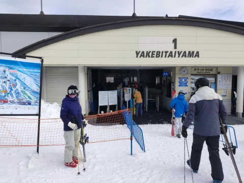

第2ゴンドラも昼ごろには無人状態に

なったみたいで．

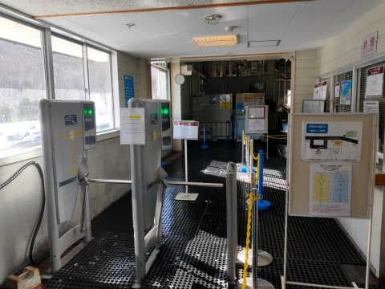

全体的に，ガラガラだったみたいですね…

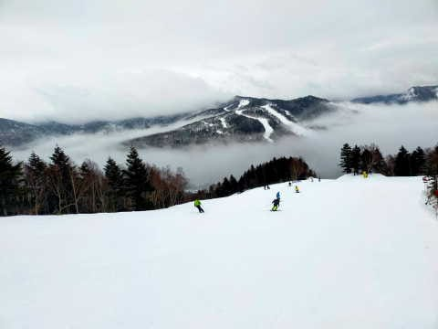

ただ，午後になると雲が増えてきて．

一時的にガスったり…

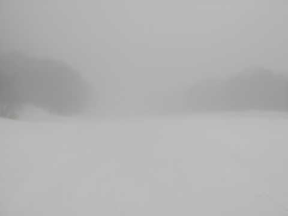

午後遅くには，雪も降り始めたようですが．

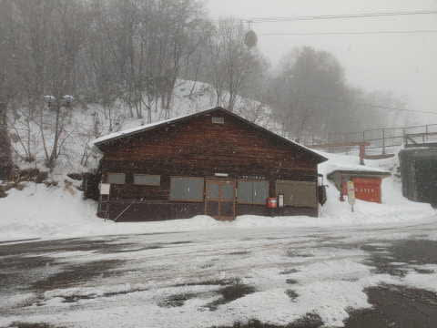

今日の志賀高原は，思ったほどひどい

アイスバーンでもなく．

雪が解けてブッシュだらけになることも

なかったようで．

トップシーズンと考えるとイマイチな

コンディションながらも．

高温の雨⇒その後冷えてアイスバーンという

最悪の天気が予想されていたことから

考えると，意外と楽しめたコンディション

だったようです…

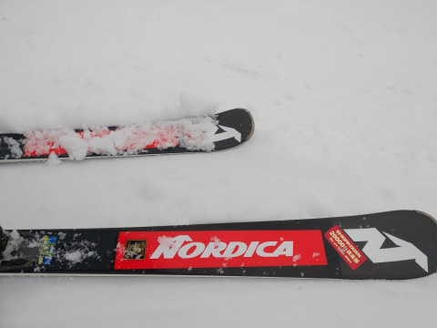

あぁ…滑りに行きたかった．

どんな雪でもいいから，雪があるなら

滑りたかった…

とりあえず．

来週こそ，無事滑りに行けるといいな！！！

…今の状態だとかなりヤバいけど…(涙)

## 💬 コメント一覧

### 💬 コメント by (真美子)
**タイトル**: Unknown
**投稿日**: 2023-01-16 15:46:43

14日15日16日と富良野スキー場で滑りました♥️

15日は雪玉が石の様に固く、バーンも固く、ここは富士見パノラマかと思うほど。

でも、お陰様で16日は新雪。北海道に来た甲斐がありました。

そこで、凄い人と知り合いました。毎週、東京から日月火と富良野に通っていると言う人です。スゴすぎる。

### 💬 コメント by (レインボー75)
**タイトル**: Unknown
**投稿日**: 2023-01-16 16:01:26

月曜日の志賀高原情報

朝の湯田中は小雨。上林0℃　蓮池-3℃。

パノラマの壁が最高。唐松は少し硬め。驚いたのはGS。最後の壁(しんちゃんバーン)が突如比圧雪でびっくり。看板に小さく書いてあったらしいけど止まるわけないし。視界が少し悪いのもあって地肌にズリッ。怖かったあ！

安全快適な三高で遊んでから、シーズン初めてヤケビを脱出。一路懐かしの高天原銀嶺へ。

今日はみんなに合わせて初めてカツ定食1400円×5/6(信州プレミアム割)。これが大ヒット。美味しいです。これからはザルソバやめてカツ定だ。

西館第一が明日からの大会に備えて規制してるとの連絡が入ったので、三高に戻って踏む練習。今日もまた楽しかった。

エス様も天気予報を当てることで、喜びを爆発させて下さいね。スキーなんか行けなくても！

### 💬 コメント by (アリス)
**タイトル**: Unknown
**投稿日**: 2023-01-16 16:40:01

S様

こんばんは😃🌃

仕事でスキーに行けないS様には、毒情報です。

本日もスタートは二高から、先ずは唐松のファースト🎵めっちゃ美味しいです❗️

その後、GSと白樺を交互に好き放題🎵

バーンが乱れず夕方まで快適ですね🎵幸せです🎵

奥志賀に行きましたが、ピステン故障でエキスパは未圧雪😅

ヤケビに長い時間いましたが、レインボーさんとはすれ違いかな😅

### 💬 コメント by (Skier_S)
**タイトル**: コメント回答遅れました
**投稿日**: 2023-01-18 09:33:11

＞真美子さま

富良野までいかれたんですね！！うらやましい…

しかし，毎週東京から富良野？？？

すごい交通費がかかりそうですね…すごすぎる…

＞レインボー75さま

月曜はバーンが硬かったみたいですが…それでも楽しめたんですね．

今週末までには，トップシーズンの雪に戻ることを願ってます…

＞アリスさま

エキスパ非圧雪だと辛そうですね…

でも，バーンが硬めだし，人も少ないし，夕方まで荒れないコンディションで

土日の雨のわりにバーンは良さそうですね．

まだ滞在続くと思うので，楽しんでください！

