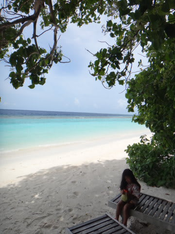
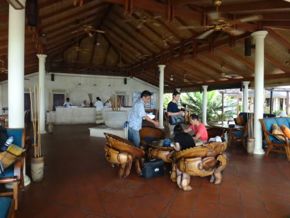
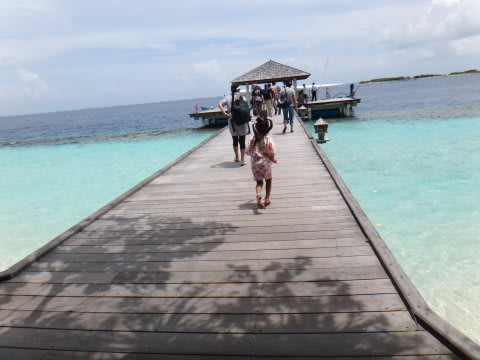
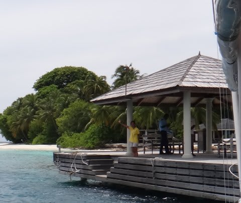
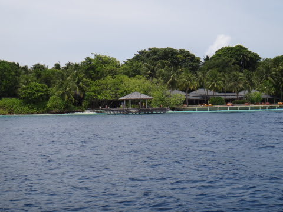
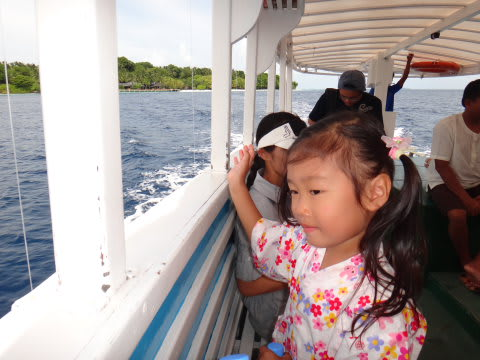

# 2012年　子連れモルジブ　ダイビング旅行記　その25

📅 投稿日時: 2012-12-06 00:19:45

うーむ．

今週．新潟は結構積もりそうなんだけど．

低気圧がちょっと北によりすぎてるんですね～．

…志賀高原を含む信州は．

木曜午前中は降るだろうけど，

木曜午後から金曜日にかけては曇りで，あんまり積もらないかも…

土曜早朝からガバっと降りそうなんですけどね…

平日それほど積もらず，土曜に天気が悪くなるパターンかも(涙)．

まぁ，でも．

土曜以降は信州も降りますし．

去年みたいに，この時期に雨になるより100倍ましかと．

そして…

今日はまたまたダイビング日記に戻るのだ．

------

最終日，あとは日本への出発を待つだけという待ち時間の間に．

さらにリゾートの島をお散歩します．

我が家はこれで今シーズンのダイビングが終わりなので．

この海の景色とも，しばらくお別れ．

やってきてほしくはない時間はすぐにやってきてしまうもので．

ついに．

とうとう．

このきれいな海とお別れする．

出発時間がやってきました．

ロビーへ集合して，水上飛行機乗り場へのボートを待って…

桟橋からボートへ乗り込みます．

そして．

ボートはゆっくりと，思い出深いロイヤル・アイランドを離れます．

ガイドのトシコさんが，見えなくなるまで手を振ってくれました

「またきてくださいね～っ！」

遠く，遠くに見えなくなるまで手を振り続けてくれます．

こっちも，リゾートの桟橋が遠くに見えなくなるまで，手を振り返します．

「ばいばーい！」

さよなら…

さよなら，ロイヤルアイランド

楽しかったよ．
