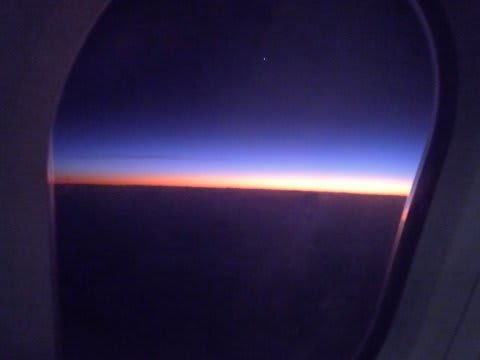

# 2009年　初の海外子連れダイビング旅行記　1　Ｆｌｉｇｈｔ to Tahiti

📅 投稿日時: 2012-08-27 01:28:44

🏷️ カテゴリ: [ダイビング日記](ce3a7a8d424d112fce83ee85c81a0e344.md)

というわけで…

4回に渡ったプロローグ(長っ！）もようやっと終わり，本編突入です．

しかし…このペースでいくと本文は何回になるかな？？

では．旅行，スタートです．

------------

ついにやってきた，

(長いプロローグが終わって…という意味ではない(^^;))

出発の日．

飛行機は夕方の便なので，昼ごろにのんびりと成田空港へ向かいます．

成田からタヒチへの直行便はエア・タヒチ・ヌイしか運行しておらず，

ほとんどの人がこの直行便を利用すると思います．

この出発時間は午後4時(2009年当時)．

到着時間が午前8時．

んで，時差が-19時間．

…っていうより，タヒチのほうが5時間先＆1日遅れ，と

考えたほうが分かりよいですかね．

ということで．

飛行時間は11時間．(帰りは12時間)

はっきり言って11時間の飛行機は大人にも辛い．

んで，うちの娘は椅子に10分間座っていることができず，

家の中だろうがどこだろうがひたすら走ってよじ登って飛び回って…

こんな娘を，どうやって11時間飛行機の椅子にくくりつけて

黙らせておくのか？？？

とりあえず，我が家は

「飛行機でひたすら寝かす計画」

アンド

「2-3時間は黙らせておく秘密兵器購入」

の2作戦で乗り切ることに．

まず，朝は早めに起こして睡眠不足気味にさせます．

そして，空港について午後2時にチェックインが終わったら，

速攻で出国審査を抜け，キッズスペースへ．

搭乗開始時間まで1時間半近く，ひたすら遊ばせ続けます．

いつもならお昼寝タイムですが，珍しい遊び道具がある

キッズスペースに興奮して遊んでます．

むふふ．

所詮子供．

大人の策略に，見事ハマっておるのぉ．

で，午後3時20分には搭乗開始．

…子連れなんで，ぶっちぎりトップの優先搭乗．

プレミアム会員より，ファーストクラスより，誰より先に

飛行機に案内してもらえます．

まだ誰も乗っていない飛行機に一番に乗せてもらえるなんて…

普通はない特権だのぉ．

さらに．

今回，飛行機の席もスクリーン前をリクエスト．

プロローグにも書いたように，予約時にリクエストしておけば，

子連れは優先的にスクリーン前を割り当ててもらえるので，

足元の広いエコノミー最前列の席にゆったり座れます．

この席，子供が足元で十分遊べます．

ここ，足元広いしトイレ近いし，いいんだよなー．

誰もいない飛行機に先に乗って，広い席に座れる優越感．

子連れも良いもんじゃの～．

で，飛行機が離陸するころには．

朝早く起きて，昼寝もせずに遊び続けていた娘は．

親の思惑通り，ぐっっっっすりと寝てました．

ふははは．

娘よ．

見事に親の策略に嵌ったな．

…というわけで．離陸後ドリンクが配られ，機内食が配られて食べ終わるまで，ぐっすり熟睡．

親はその間，のんびりとシャンパンを飲みつつ食事を楽しめたという．

いやー．

大体3時間くらい…国内線なら普通の1フライト終わるくらいの時間，ぐっすり寝てくれたなぁ．

食事がちょうど終わり，食後の一休みをしたくらいで娘が起きだしたので，

子供の機内食を持ってきてもらいます．

エア・タヒチ・ヌイでは，無料の幼児にもベビーミールではなく

チャイルドミールをお願いできます．

もうすぐ2歳の娘には，瓶入りのどろどろ離乳食はもう食べない

ので，チャイルドミールをお願いしておきました．

んで，持ってきたもらったチャイルドミールは…

なんと．あんまり大人用機内食と変わらないではないか．

サラダが無いくらいで，ハンバーグとフライドポテト，

付け合せの野菜，あとはデザート…

ここには写ってないけど，パンもあります．

…味も，大人用の食事より美味いかも…

ただで乗ってる娘にこんな食事出してもらっていいのかな～？？

そうそう，子供用にはこのほか，搭乗時に

・1.5リットルのミネラルウォーターペットボトル

・オムツ1枚，ウェットティッシュなんかが入ったビニールポーチ

・おもちゃ（複数種類あるみたい．今回はガラガラみたいなもの）

がもらえます．

…子連れは，いろんなものがもらえて，ただで食事出してもらって，

先に搭乗できて広い席に乗れて…

やっぱり2歳までの子連れで海外に行くと，オトクな気がしますね～．

んで，食後しばらく．

満足した娘は，もう日本時間で9時ごろという，普段の

お休みの時間だったので，またすぐ寝ちゃいました．

日本時間で夜中のフライトはありがたいですね～

なんと．このまま，5時間以上ぐっすり寝てました．

起きたときは，ちょうど朝食が配られるタイミングで，

残るフライトはあとわずか2時間．

朝食を食べさせていると残り1時間を切ってます．

あとは抱っこして窓から外を見せたり，

持ってきた本を読ませると…あっという間に到着．

…なんと．

なんと．

今回のために持ってきた「秘密兵器」のポータブルDVDを使うことなく，

第一の関門であり，最大の心配事であった，11時間のフライトを

あっさりと乗り越えてしまいました．

まぁ，11時間のフライトのうち，9時間は寝ててくれたからな～．

って感じで．

この旅行，幸先のいい感じでスタートが切れたのでした．
