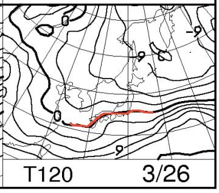
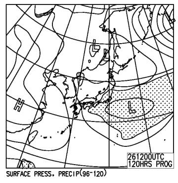

# 恒例！今週末，3月25，26日の志賀高原スキー場の天気は？…予想は難しいけど，冷え冷え，曇りがち

📅 投稿日時: 2017-03-23 05:34:22

えー．

なんだか．また，

ご無体時間に更新している，Skier_Sです（涙）．

…でも．

水曜夜（木曜朝？）定番の．

今週末の天気予想，行くのだ！

えー．

なんだか，土日とも．

微妙に南岸低気圧っぽくて．

…晴れるか曇るか，

予想が大変難しい

天気図になってます…（涙）．

まず，25日の土曜ですが．

500hpa気温図を見ると…

うわ！なんだ，これは！

3月下旬なのに，-30℃の歓喜寒気が入ってます！！

これは，結構な雪が降る目安なのですが…

850hpa図を見ると．

これも，この時期としては冷え冷え．

0℃線は太平洋上まで南下しており．

志賀高原には-3℃線が掛かってるくらいですか…

トップシーズンに比べると「激冷え」って

ほどではないですが．

山頂は昼間もマイナスキープしそうな，

もうすぐ4月とは思えない冷え冷えですな．

そして，問題の地上天気図．

うぐぅ．

む，難しい…

志賀高原は高気圧が覆っていて．

一見晴れそうですが…

上空に入っている寒気，そして西から迫る低気圧…

…ホントに晴れるか？

朝のうち，高気圧の東側にいる時は雪雲が

流れてきそうだし…

うーむ．

難しい…

そして，今度は

日曜26日の850hpa気温は…

うむ．

相変わらず0℃線は太平洋側．

3月末と考えれば恵まれた冷え方ですな．

で，地上天気図は．

うーーーーーーむ．

うーーーむ．

見事な南岸低気圧．

難しい…

降水域はぎりぎり志賀に掛かってるけど．

降るのかなぁ…

わずかに低気圧がずれると，天気が

全く変わりそう…

ということで．

まだ精度は低いですが．

現時点での予想，ということで

25日土曜日：　朝のうちは雪がぱらつく．

　朝はこの時期としては冷え冷え，-5℃以下に冷え込む．

　路面はうっすら積雪路．

　朝のゲレンデは，前日まで降っていた雪が圧雪された，

　Goodコンディション冷え冷えシマシマバーン！

　昼間の天気は…微妙．日が射してくれるか，曇ったままか…

　大雪目安の寒気が入っているので，時折雪が降っても

　不思議じゃないという，予想が難しい状況．

　おそらく，曇りベース．時折うっすら日が射すタイミングも．

　そして，時折雪が舞う…

　という，落ち着かない天気かな．

　昼間もそれほど気温が上がらず，3月でこんなにいい雪で

　いいのか？というコンディション．

　午後になるとゲレンデは凸凹になって，急斜面はちょっと

　固めの下地が出てくるのかな…．

26日日曜：　微妙…難しすぎる（涙）．

　朝の気温は-5℃クラス．

　おそらく曇りの朝．

　この日も朝は冷え冷え雪の，締まった圧雪で

　最高でしょう…．

　基本的に曇りベースの天気．

　時折雪がぱらつくかも．

　この日も昼間はマイナス気温をキープして，

　3月としては恵まれた雪でしょう．

ってことで．

現時点の私の予想はこんな感じですが．

なにぶん予想が難しい天気図なので．

直前にまた補足します…

## 💬 コメント一覧

### 💬 コメント by (まいる)
**タイトル**: 今週末は
**投稿日**: 2017-03-23 20:54:30

Sさん、お疲れさまです

今週末は雪よさそうですね

楽しみです。

たぶん、土曜日はあちこち滑って、日曜日の午前中は焼額かなと

### 💬 コメント by (Skier_S)
**タイトル**: まいるさま
**投稿日**: 2017-03-24 03:44:57

をを！

今週末は復活ですね…

3月末と思えないコンディションだと思いますよ．

ただ，私は今週末，家族スキーです．

朝イチヤケビが滑れるかどうか…

娘次第です（涙）．

