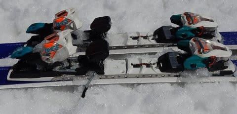

# 2020シーズンモデルのスキー板，試乗レポート…HART編

📅 投稿日時: 2019-06-03 01:53:38

🏷️ カテゴリ: [スキー板試乗](c0bd8048615710cee890e403a36cc9a2b.md)

ということで．

実に7か月ぶりに，K奈川県を脱出しなかった

週末を過ごしたわけですが．

土曜は娘の行事に参加＆夜中までお仕事（涙）

日曜は昼ごろまでのんびり寝て体力回復＆

久しぶりの徹底的洗車ということで．

本日午後は，車の細かな傷をコンパウンドで消したり．

見えない部分を徹底的に磨き上げたり．

ボディコート剤を塗ったくったりしてました…

しかし．

やっぱり．

スキーに行かない週末は．

なんだか物足りない…

ってことなので．

まだまだスキーシーズンが終わってない，

この時期．

スキーのことを忘れないように，

スキーネタを行かないと…

そうです．

今日もスキー板試乗レポート！

今日はハート編．

では，どうぞ～！

○HART Circuit ST DEMO スペシャル  165cm

基礎小回り．

基礎小回り～中回りって書かれてますが．

R=11という，強烈なサイドカーブの板なので．

小回り用として設計されている気がするんですが…

で．

この板．

通常モデルのCircuit STと比べると，

結構ガッチリしたプレートがつけられていて．

強化されている「スペシャルモデル」

らしい，この板．

春の緩みかけの雪で滑ると…

いや．

プレートも強力なのもあって．

フレックスがかなり硬く感じる！

コアの張りが強くて．

結構まっすぐ走るよ！

しっかり前後動を使って，

谷回りでトップをたわませるように動き，

山回りでしっかりテール側を抑えて行けば，

なんとかたわみに乗って曲がっていけるので．

乗り手がかなり積極的に動いて

行かないといけない板だなぁ…

…と，思っていたけど．

朝の比較的締まった時間に乗れたこの板．

硬い斜面に行くと…評価は一変！

硬い斜面だと，チョー最高に

ハイスピード小回りが

ギンギンに決められます！

硬い斜面でスピードをガンガン

上げていった時の，旋回性・安定性・

エッジグリップはもうバツグンで，

驚きのレベル！

かなりのスピード領域に入っていったとき．

山回りの仕上げで，張りの強いテールが

強い遠心力で抑えられて行くと．

そこから板が次のターン方向へ

すっと抜けていき．

そして次のターンの谷回りの位置で，

トップが硬い雪面に食い込んで

板がたわみ．

それに続く強烈なエッジグリップで，

板がこの上ない旋回性で回ってくる…

という感じの．

かなり過激な板．

この板が本領を発揮できるスピード域，

斜面状況はかなり限られていて．

そして乗り手には，強い横Gに耐える

脚力とテクニックが求められます．

何にしろ，板の張り…

それも特にテール側の張りがかなり

強いので．

柔らかい雪では，取り扱いに

ちょっと…というより，かなり苦労します．

かなり難しい板だなぁ…と感じちゃいます．

しかし．

トップスピードを出した時の

過激なグリップ＆旋回性能は魅力的…

間違っても普段のゲレンデで履こうとかは

思いませんが．

ものすごい固い，フラットバーンで，

人がいないところで何本かだけ滑る…

ってなら．

ときどき履きたくなる，

かなり刺激的な板でした．
