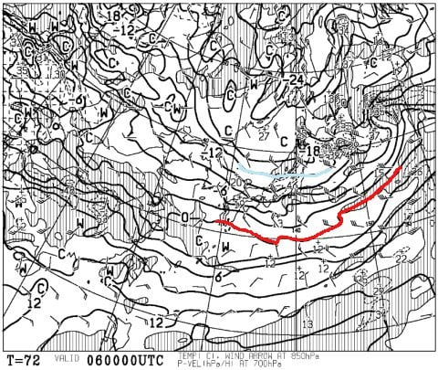
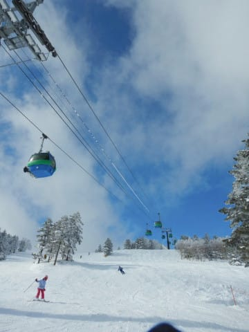
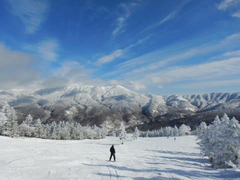
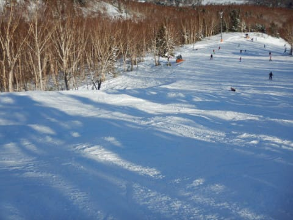

# 2020/2/2(日)の志賀高原スキー場，詳細レポート…焼額は冷え冷え，やわらか最高の雪質！朝は曇ってたけど，午後は晴れで最高のスキー日和！

📅 投稿日時: 2020-02-04 00:34:15

なんだか．

いつもの日課の天気図を見ていると．

…6日木曜の朝の天気図…

うむ！？？

500hpa図の，そこそこの雪が降る目安の

-30℃線．

志賀高原より南にありますよ！？？

そして，6日朝の850hpa気温を見ると…

え？？

なに？？

この水色の線…-15℃線！？？

-15℃線が志賀高原に近づくって…

6日朝，志賀高原は-15℃以下．

-18℃とか，それくらいまで

冷え込みそうなんですけど！？？

そして．

地上天気図を見ると．

うほー．

完全無欠な冬型だわ…

地上天気図を拡大すると．

日本海がほぼ完全に雪雲で

覆われてます！！

これは，大陸からの冷たい風が

日本海に触れた瞬間から雪雲が

発生するという，

激冷えを表す典型的なパターン！

専門的には，日本海に噴き出す雪雲の

「離岸距離が短い」というんですが．

見事なほどに離岸距離が短い予想なので．

…これは．

積もる．

5日から6日朝は，

すごい積もる．

この天気図通りになるなら，

6日朝は40～50cmくらい積もってても

不思議じゃない予想ですっ！！！

雪は5日の昼間から降り続きそうですが．

6日朝は，今シーズン最高最大のパフパフデー！！

それも，850hpaに-15℃線が近づいてるレベル

なので．

激冷え超軽サラサラ最高パウダーデーになりそう！！

パウダー狙いの方．

6日は仕事を休んででも，スキーへ行くべきかも…

あー．

ただ，吹雪です．

凍死しかねない寒さで雪が吹き付けるので．

ご注意を…

この日，奥志賀ゴンドラは強い北風で

運転できないかも…

とりあえず．

今週末にかけて，さらに積雪の積み増しがあり．

志賀高原以外の，標高が低いスキー場も

ドサドサ積もりそうなので．

この週末は，

どこのスキー場もいい感じになりそう…！

…ってな感じの，久しぶりのいいニュースの後は．

昨日速報レポートした，日曜の志賀高原．

詳細レポートです…！

えー．まず．

いつも通りの朝イチの焼額第1ゴンドラに並んで…

営業開始と同時に，山頂にやってくると…

山頂の気温は-10℃と，かなりの冷え込み！

…でも．

山頂はガスってます（涙）

ガスって視界は悪いけど，

ゲレンデはシマシマっ！！！

そう…

今シーズンはほとんど遭遇することのなかった，

最高の柔らかシマシマ！！

山頂付近は視界が悪くて，

ちょっとかっ飛ばすのは怖かったけど…

麓付近はガスも切れて，

美味しい柔らかシマシマを

思う存分堪能！

そうだよ．

ホントは1，2月の志賀高原って．

こんな柔らかい雪のはずなんだよ…！

ってな感じで．

朝のうちは，美味しいシマシマを

楽しんでましたが…

うーん．

朝のうちは曇りで，すぐ晴れると

思っていた天気．

なかなか晴れないなぁ…

朝イチシマシマを，晴天の中

楽しめなかったのは残念…

そうこうしているうちに．

ゲレンデの人は増え始め…

朝10時ごろになると．

人気のGSコースやパノラマコースは，

ちょっと楽しめる人口密度じゃ

無くなってきた感じ（涙）

さらに，雪が柔らかいので，

GSコースとパノラマコースは，

朝のうちから荒れ始めてきちゃったのが

残念…（泣）

でも．

GSとパノラマコース以外はガラガラで．

白樺コースや唐松コースは，好きなライン

取り放題！

さらに．

朝10時半過ぎには，空もうっすら明るくなりはじめ…

11時過ぎには．

こんにちは，太陽さんっ！

待ってたよ！！！

太陽が出たとたん．

一気に雲は空から消えはじめ…

そして．

昼ごろになると，人も減り始めたので…

なんだ，この超最高の天気＆

雪＆ガラガラ具合は！？？

なんだ，この最高の景色と

気持ちよさは！？？

そうだよ…

ホントは，トップシーズンの志賀高原って，

こんな景色と．

そして，最高の雪が出迎えてくれる

はずなんだよ！！

あぁ…

最高．

志賀高原にひたすら通い続けるのは．

シーズン中1回でも，こういう

コンディションの日に巡り合うため

なんだよ！！

そして．

最高コンディションというのに．

日曜午後のいつものパターンで．

ゴンドラももうガラガラだし．

リフト待ちもほとんど無し！

人気のGSコースやパノラマ～

サウスコースは，午後にはかなりの

凸凹になってきたけど．

それ以外は，多少荒れてきたものの．

雪が柔らかい割には，それほどひどく

荒れず．

特に，唐松コースは．

午後になっても完全フラット！

晴天なのに，最高気温は-5℃程度まで

しか上がらなかったので，

夕方になっても，こんな最高雪質の

フラットバーンを滑れます！

しかし．

やはり雪が柔らかかった本日．

夕方になると，白樺コースと

イーストコース以外．

ゲレンデ全面，かなりの凸凹に

なっちゃってましたね…（涙）

まぁ，凸凹になっちゃうのは．

雪が柔らかい日の宿命ですね…

ってなことで．

凸凹になったコースにもめげず，

今日も日が傾くラストリフトまで．

コンディションの良さで，昼休みを

取るのも忘れ．

ひたすら滑り倒したのでした…

いやーーー．

良かった．

この週末は，良かった．

願わくば．

この週末のような雪と天気が，

一年中続けばいいなぁ…←だから，夏もこんな天気になったら氷河期だから！！…地球の危機だから！！

## 💬 コメント一覧

### 💬 コメント by (Hide)
**タイトル**: Unknown
**投稿日**: 2020-02-04 07:38:26

S 様

いや～うらやましい。

やっと「フツー」のシーズンですね。

今年は状況的に気軽に行けないので半ばあきらめていますが、2/23は1.5ヶ月振りにヤケビ出動予定です。

今シーズンは完全に月イチスキーヤーになってます（泣）

またお見かけしたらご挨拶させて頂きますね。

よろしくです。

### 💬 コメント by (かず)
**タイトル**: Unknown
**投稿日**: 2020-02-04 13:47:04

今のところ木曜も日中雪ですか？無理して金曜なら休めそう！

### 💬 コメント by (レインボー)
**タイトル**: Unknown
**投稿日**: 2020-02-04 18:51:24

志賀高原情報

火曜は、終日（２時までですが)雪質最高、天気も良好で、幸せ感満喫の一日でした。チウホテルのビーフシチューも感動、皆さんにおすすめしたいです。寺子屋からジャイアントまでの滑走も気持ち良かったです。ヤケビに戻ると、某国人の密集に悩まされました。ヤケビのリフトは、のり合わせを避けるなり、マスクを用意するなり、対策が必要かと思います。。

### 💬 コメント by (はなげ親分)
**タイトル**: Unknown
**投稿日**: 2020-02-04 19:06:21

そうそう❗️

２月より３月、３月より４月、４月より５月のパターンで１年中トップシーズンでも良いんです‼️

S様の選ばれし民の偉大な力でどうにかならないものでしょうか(願)

### 💬 コメント by (炎の北海道民)
**タイトル**: Unknown
**投稿日**: 2020-02-04 23:20:52

いや〜　S様の力が北海道にまで及んだのか、なまら寒いです。いい感じに冷え込んでおりますよ。

### 💬 コメント by (Skier_S)
**タイトル**: 明日から降る！積もる！
**投稿日**: 2020-02-05 00:59:03

＞Hideさま

2月23日，焼額復活ですか！

お待ちしています～！！

＞かずさま

木曜は，午前中は降りそうです．

午後は雪が止み，晴れてくるかも…

＞レインボーさま

今日は一日良かったんですね…

明日の昼から，また雪が降り始めますよ～！

5日は，ブーツパフ程度ながら，また新雪が楽しめそうです！！

＞はなげ親分さま

やっぱり，一年中トップシーズンだと，家計が破綻するので

ちょっと受け入れられないかも（笑）

＞炎の北海道民さま

やっぱり，私の冷え冷え踊りが北海道を中心に効き始めているみたいですね．

K奈川県はまだそれほど寒くないですが，明日は冷えるようです…

