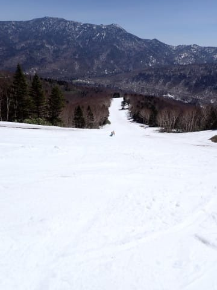

# 2023/4/22(土)の志賀高原焼額山スキー場は…晴天なれど冷え冷え！日差しで雪は緩んで午後は荒れたけど，終日滑走性はGood！

📅 投稿日時: 2023-04-23 00:23:15

🏷️ カテゴリ: [2023スキー滑走日記](cd943df30cfcc3d0896469e2ff98720cd.md)

ということで．

今日も睡眠2時間弱で志賀高原で滑ってました～！

…いや．

眠かったけど．

今日は来てよかった…

ダメダメな今シーズンの4月下旬としては，

予想よりは楽しめましたよ～！！

今日も早朝6時から営業していますが…

早朝から来るには，睡眠0時間で出発せねばならず，

通常営業開始の8時からの参戦ですが…

今日は朝からすっきり晴天！

この時期，正直晴天より曇りのほうが，

雪が解けないのでいいのですが…

でも，今朝はー3℃と比較的気温が低め！！

だもんで，朝イチのバーンは…しっかりシマシマながら，

かなり硬めのカリカリバーン！！

でも．

これまでは朝からユルユルのバーンを滑ることが

多かったので．

久しぶりのスピードが乗る，がっちり締まった

バーン！！

ただ…

気温はマイナスなのに．

春の強い日差しで，朝8時すぎには日当たりのいい

斜面は雪が緩み始めてきてました（ちょい涙）

朝のうちはところどころ硬く，ところどころ

緩んだバーンが入り混じった状況で，

徐々に緩んだバーンエリアが広がっていく

感じでしたが…

ただ，滑っている人が少ないので，午前中は

雪が緩んでも，そこまで荒れませんでした…！

とはいえ．

パノラマコースも途中に穴が開いているところもあり…

第2ゴンドラ側から第1ゴンドラ側へ戻る連絡通路も

結構狭くなっていて．

最後の第3高速をくぐってからゴンドラまでの道も，

何とか1本の廊下でつないでいる感じ…

だけども，今日はゴンドラもほぼ待ち無しの

飛び乗りというガラガラ具合だし．

気温も，最高気温がせいぜい+2℃程度までしか

上がらず．

日差しがあるのに空気はひんやりしていて，

ゲレンデは昼頃まではそこまで荒れず．

板もストップ雪にはならず，むちゃくちゃよく

滑ったので．

午前中はかなり楽しめましたよ～！

気温が低いので，日差しがあっても雪は

そこまでひどく解けちゃうこともなく．

さらに雪が少ないところには，複数台の

ブルドーザを使って，遠くの雪が残っている

場所から雪を運んでいて…

しっかり補強をして，コース維持をしており…

朝から営業終了まで，ひたすら数台のブルで

いろんなところに雪を運び続けるという．

焼額山のこの努力！！

このスタッフの皆さんの努力のおかげで，

今日明日のコース切れの心配はなさそう

ですが…

しかし．

午後になると，気温は低めなものの晴天が続いた

おかげで，バーンは緩んで荒れ始めてきちゃい

ました…(涙)

午後1時過ぎには，かなりバーンが荒れて．

そして，コースの真ん中に茶色い危険エリアも

広がってきました…(涙)

まぁ，バーンが荒れてきたおかげで，さらに

滑っている人は減って，ゴンドラはもう

空き搬器飛び乗り状態！！

で．

このあたりでGSコースを見に行ってみると…

上のほうはまだ雪は十分ありますが…

それでも，もう土が出ているエリアが広がって

ますね…

そして，GSコース中間部は，荒れ荒れバーンで，

小回りレーンが完成しています…（ちょい涙）

一番雪が少ない，突き当りを右に折れる部分は，

コース幅半分に雪が寄せられていますが…

残念ながら，雪が寄せられたところにも，

ところどころブッシュが出てきてます…（泣）

うーん．

ここ，あと1週間もつかなぁ…？？

最後の部分も雪よせされていて，何とか

コースが切れないように努力しているのが

うかがわれます…

うーむ．

GSコース，29，30日のGW前半までもって

くれるか，微妙な感じ…

そして，営業終了のころになると．

気温が低く，雪はそこまでひどく解けておらず，

板も滑ってくれるけど．

パノラマコース側も，土が出てきている

エリアが広がってきて…

バーンはかなりひどく荒れて…

さらに，人が多く滑ったところは雪が削れ，

ブッシュが出てきたところもところどころに

現れてきました(泣）

うーーーーん．

今日はこの時期にしては珍しく，

晴天なのに気温は低く．

午後には日差しでちょっと緩んだ雪が，

カリカリのかき揚げみたいに凍っていくほど

寒かったんですが…

さすがに営業終了間際には，バーンが

結構荒れてきたし…

雪も結構薄いところがいっぱい出てきたけど．

でも，本当にやばいところに雪を運び続ける

スタッフのおかげで．

コースが切れそうな本当にやばいところは

まだ維持され続けているので．

少なくとも明日は，心配なくパノラマコースと

GSコースの2コースは滑れそう…！

ってなことで．

ラストは荒れて，雪が薄いところも

ところどころあったものの，

気温は低く，ガラガラで，午前中はバーン状況も

比較的よく．

終日板が張り付くこともなく，板が良く滑る

雪だったので，15:30の営業終了まで，

結構楽しめた一日でした…！

焼額のホームページによると、どうやら

明日の日曜でGSコースは営業終了のよう

です…（涙）

ても、明日も冷えて，朝のうちはかなり

硬めのバーンコンディションで，

昼間もそこまで気温が上がらず，板は

滑る雪になりそうなので，GSコースラスト

となる明日も、楽しめそうな一日になりそう

ですよ～！！
