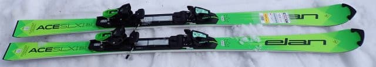
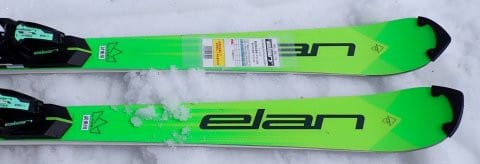
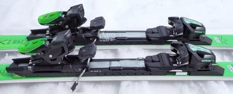
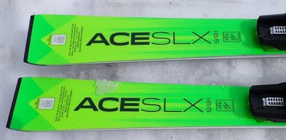
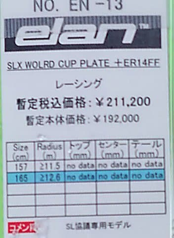
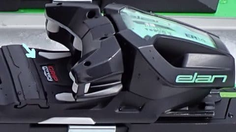

# 2025シーズンモデルのスキー板，試乗レポートその31…ELAN ACE SLX WORLD CUP

📅 投稿日時: 2024-07-18 00:40:49

くそ暑い日々が続くのに，

いまだにスキーネタが続くという，

季節感を全く無視したこのBlogですが．

去年の記事を見返すと．

ほぼ毎日スキーネタ（最後の方はスキー板

試乗レポートがほとんどだけど）という

冬モードが，8月10日まで続いてましたね…

昨年は8月11日の山の日から仕事の夏休みを

取ったので．夏休みの前日までほぼ毎日

スキーネタを書いていたのか…！！

今シーズンは，そこまでスキーネタを

引っ張れそうにない感じで．残念ながら

7月中にはスキーネタが一旦終わりそうです．

まぁ，その後も適宜スキーネタは挟んで

行きますが．

スキーブログは，スキーシーズン以外は

毎日書くネタが尽きるのが欠点だな…

このBlogに求められているのはやはり

スキーネタということらしく．

スキーネタが終わってダイビング記事に

なると，一気にアクセスが減るんですよね…

でも．

なぜかスキーブログなのに，車ネタは

人気がある不思議さ．

ってなことで．

今日はまだスキーネタが続くわけで．

いつもの2025シーズンモデルのスキー板の

試乗レポート．

今回はエラン編です！

〇ELAN ACE SLX WORLD CUP 165cm

SL競技用

板のテールにFISマークがついている，

ガチ競技用のSL板ですね．

RACEPLATE WCR 14にチロリアの

ER14 GW FFがついていて，

一見HEADの競技用に近いプレートと

ビンディングの組み合わせだけど…

なんと．ガチのSL用板のなのに，

グリップウォーク対応のビンディングが

ついている…！！

というところにちょっと驚きはしたものの．

GW対応ビンディングでも滑れれば

問題ないよな…

と，滑り始めてみると．

うむ？

FISマーク付きのSL板だし，ちょっと身構えて

滑ってみたけど…

いや．板も軽いし，とてもSL競技用と

思えない軽快で軽やかな板なんですが！？？

しなやかで軽いし，グリップもNORDICAや

BLUEMORISみたいなガッツリ鬼グリップじゃ

なくて，SL板とすればマイルドな感じ．

それでいてグリップが弱いというわけではなく．

ゲレンデで使うには十分なグリップがあり，

その中でも動かしやすく，たわみも出しやすいし，

SL板というより，扱いやすいゲレンデ用小回り

板という感じ．

もしかすると，VOLKLの基礎用トップモデル，

SL Masterの方がグリップも強く返りも早く，

板もどっしりしていて，よっぽどSL競技用

っぽいかも…？？

軽快な板ではあるけど．グリップして

きれいにたわんで，軽やかにカービング

していきます．

返りもそこまで早くないのでターンの

仕上げにミスって吹っ飛ばされるとかはなく，

取り扱いやすいし，左右に板が吹っ飛ぶ

小回り強制マシンでもありません．

グリップもSL板としては優しめなので

板が動かしやすく，春の雪でも取り扱いやすく

感じました．

硬い斜面が得意そうなガッツリグリップの

硬いSL板と違って，この板は柔らかめの

雪の方が合いそうってこともあり．

ガチSL板のとんがったところが無く，

手ごわさも無いこともあり，ゲレンデ

小回り用として使うには良さげな感じ！

全てが丸く，優しい感じなのに，

良くたわんでグリップして良く回るし，

軽快さもあってどんなふうにでも板を

動かせることもあり，切ってもずらしても

行けるし．

板だけが強い旋回力で回っていく感じは

なく，たわませた分だけ素直に回っていく，

コントロール性の高さもあり，

気負わずに気楽に滑っていける

無難な板．

とがった性能はないけど，急斜面でも

緩斜面でも，圧雪でも春雪でも，どんな

斜面でも安心して降りていける，どんな

ゲレンデとでも合わせられるご飯と

みそ汁みたいな，そういう安心感が

あります…

ガチガチのバーンだと，もう少し

エッジグリップがあってもいいかな…

と思うこともあったけど．

SL競技用にしては柔らかい雪でも

十分たわみを出せたし，

SL競技用の板のくせに，

オールラウンドなゲレンデ小回り用として，

これは結構いいんじゃないかな？
