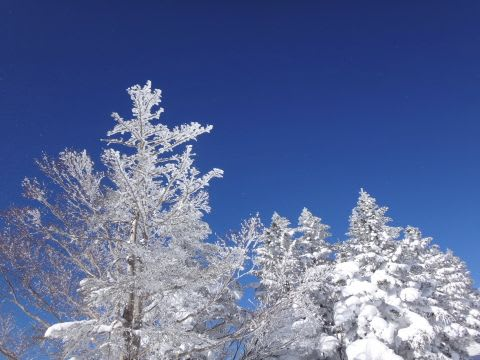
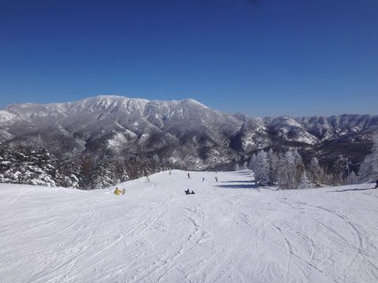
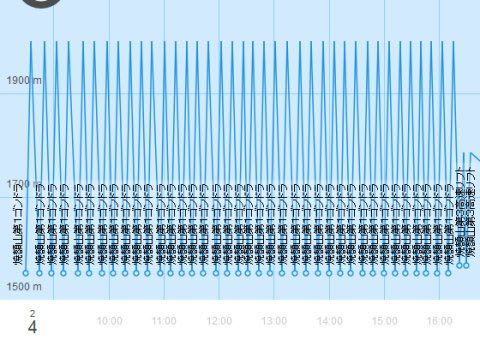
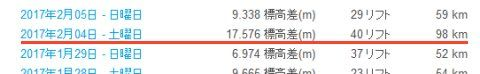
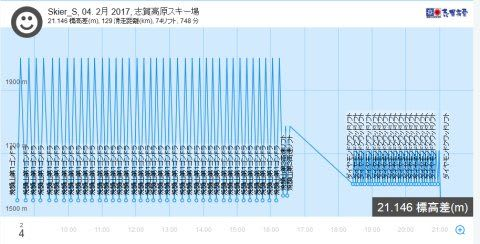
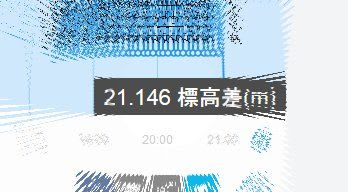

# 焼額の理論的限界まで攻めてみた…焼額だと，いったい一日どのくらいの標高差が滑れるのか？？

📅 投稿日時: 2017-02-10 02:08:46

えー．

今日の天気図を見ても．

昨日からの予想は変わらず．

…もう．

今晩から，ドサドサと降りますね．

そう．ドサドサと．

…そして．

やはり，月曜まで降り続けますよ～！

太板を持っている人は．

間違いなく，出番ですよ～！！

…

…そう．

太板を持っている人は…

あぁ…太板か…（激しく刺激される物欲）

…いや．

買わない．

買わないぞ～！

物欲に負けないぞ～（棒読みで）

ってことで．

本題へ．

えー．

他人から，

焼額山の第1ゴンドラが生息地

と言われる私ですが．←そうだったのか…私は第1ゴンドラに住んでたのか…

この1ゴンを．

限界まで攻めたら一日何回乗れるんだろう？

…という，普通の人なら考えようと思いすらしないだろう．

そーゆーことを計算してみたことがあるんですね～…

まず．

焼額第1ゴンドラが秒速6mのフルスピード運転をしてくれれば．

ゲートをくぐってゴンドラに乗り，山頂駅舎を出るまで，約8分．

そして，全力で板を履いて，止まらず全力で滑れば…麓で板を

脱ぎおわるまでに4分．

…つまり．トータル12分で1サイクル回すことができます．

だもんで．

1時間これを繰り返せば，ぴったり5本滑れます．

…8時半の営業開始から，4時15分の営業終了まで，

7時間45分．

5回/時間 x 7.75時間 ＝ 38.75回．

ということで．

ひたすらトップペースで休まず止まらず飲まず食わず

トイレに行かず←人間には無理だから．それ，サイボーグかロボットの領域だから

…って感じで滑れば，論理的には39回乗れるのか…

と．

理論限界を計算したことがあったのですが．

人が少ないと，秒速5mの減速運転になって，

乗車時間が2-3分延びてしまう，最近の第1ゴンドラ．

＃減速運転だと1時間4回が限度（涙）

人が増えないとトップスピードで運転しないし．

トップスピードになるときはゴンドラ待ちがある

ときなので，最近の第1ゴンドラは，12分サイクルで

一日回し続けるのは無理．

…そもそも．

夕方になって斜面が荒れてくると．

板の脱ぎ履き含め4分で降りるのは，

普通の人間には無理

…だもんで．

この数字．

どう考えても．

普通に考えれば，実現不可能な数字なのですが．

＃ちなみに，これまでの私の最高記録はゴンドラ35回

なんだか．

[激烈なグッドコンディションだった，先週土曜日](ea2705c17de8b9eed7031bfe77c1548ee.md)．

朝から人が多めで，9時半にはフルスピードになった

第1ゴンドラ．

夕方までずっとフルスピード運転するほど人が多めだったけど，

だけど，一人乗りレーンだとぎりぎり飛び乗り可能…

というベスト条件が続き．

営業終了まで減速しなかったのに，ほぼ飛び乗り可能

という，奇跡のコンディションで．

かつ，ゲレンデは夕方までトップスピード大回り可能！

いやーー．

滑ったよ…！！

ということで．

Skilineを見てみると…

うむ？？

なに？

かぞえてみると…

ゴンドラ，38本も乗ってるよっ！？？？

こ，これは…

理論限界まで，あと1本じゃないか！！

…朝の1時間減速運転だったことと，

実際は待ち時間が0じゃなかったことを考えると…

ほぼ理論限界．

ということなので．

リフト営業時間が伸びない限り（そういや，昔は8時営業開始だったなぁ…）

焼額では．

この第1ゴンドラ38回＋第3高速2回乗車の

17576mの記録は超えられないと思う…

おそらく，これが焼額の最高記録なんじゃないかな？？

…もし．

一日焼額張り付きで．

この記録を抜いた人がいたら．

その際は，ぜひお知らせください．

…

うむ？？

そういや．

この日，土曜日だったよな…

…

…土曜は，ナイターに…

…

…あれ？

…！！！！

また，やってしまったか…っ！！

ということで．

どうやら私は．

来年，シルバーシールに格下げになることなく．

無事，来年も20000mクラブのゴールド会員資格を維持できた

ようです…←いや，一旦なったら生涯ゴールド会員だから．

毎年20000m超え続けなきゃゴールド剥奪って，

そんな恐ろしいシステムじゃないから…

## 💬 コメント一覧

### 💬 コメント by (かず)
**タイトル**: 風も無く雪良かったです
**投稿日**: 2017-02-10 18:23:55

そんな寒くなかったですが　軽い雪で非圧雪でもも位でした　朝一のオリンピックも良く板が動き滑りやすかったです　時々日がさしてましたね　楽しいですが初日は午後かなり眠いです笑

### 💬 コメント by (いか)
**タイトル**: Unknown
**投稿日**: 2017-02-10 22:52:53

先週、振られた旗に向かって滑っていく例のアレをやったので、今週はおやすみにしようかと思っていましたが、降るなら行かないといけませんね！太板かついで出撃です（＾＾）

### 💬 コメント by (Skier_S)
**タイトル**: パフパフパウダーの週末！
**投稿日**: 2017-02-10 23:36:58

＞かずさま

あ，雪は軽かったんですね！

低気圧性の雪だったので，

ちょい重いかな…と予想したんですが．

明日の朝までには，またブーツ～脛パフ

くらいに積もるかな～！

またお会いしましょう！

＞いかさま

あ，またやってきたんですね．

例のやつを…

小回りでバランス崩したのが惜しかったですね…！

＃私はプライズ検定なぞ受けたことがないので

＃プライズ受験の方に偉そうに言えませんが…（汗）

今週末は，白馬はドサドサパウダー楽しめると

思いますよ～！

