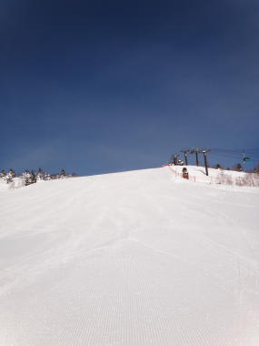

# 2月6日(月)の志賀高原 焼額山は…雨が降ったのか？？

📅 投稿日時: 2012-02-07 00:11:31

🏷️ カテゴリ: [2012スキー滑走日記](cca3a0e9524e0203150f790b1fc3c71ad.md)

先日．職場にて．

S「あの～．…6日，休みたいんですが…」

上司「ん？…休みたい？」

S「はぃ…」

上司「まさか…まさか，雪山に行くんじゃあるまいな？」

S「…（微妙な表情)」

上司「君は…仕事とスキー，どっちが大事だと思ってるんだ？」

S「スキーに決まってるじゃないですか（キッパリ)」

…とりあえず，かなりむちゃくちゃ強引に休みを取って，

月曜日も志賀を滑って来ました．

で．

天気予報では午後から雨になる，というこの日．

朝はその天気予報が全く信じられない快晴！

朝の気温はこれまでより暖かいけど，マイナス6度．いい冷え具合．

うははははっ！

シマシマだっ！

最高のしましまだ！

さすが平日，ゲレンデも貸しきり状態だぁ！

最高．

最高．

今シーズンのベストコンディション．

シアワセだぁ～．

ホントに人がいない！

飛ばしたい放題！

人を気にせず，好きなラインを好きなように飛ばせるシアワセっ！

と．

昨日に引き続きサルのように．

晴天のゲレンデをぐるぐる滑っていると．

11時まですっきり晴れていたのに．

あっという間に曇り初め…

12時には，空からぽつぽつと…

幸いなことに降って来たのは雪．

…っていっても，ゴーグルに着くとすぐ水滴になっちゃうようなべとべと雪．

ううむ．ウェアがしっとり濡れてきた…

でも，降りはそれほど強くなく，ぱらぱらと降ったり止んだり．

気温は上がって，雪質は悪くなったよ～

さらに．

2時ごろにはかなり風も強くなり，ゴンドラも減速運転．

…2時間前には全く想像つかない，天候の急転！

…しかし，[天気予想](e947ab399ecf7b8bc6b7f2dc0dcc19e99.md)，当たったなぁ…．

とりあえず．

それほど土砂降りでなかったのがせめてもの救い．

とりあえず．

夕方まではそれほどひどい降りになりませんでしたが…

これまで冷えひえの1月の状況とは変わって．

ゲレンデはぼこぼこの塊が散らばる雪質になっちゃいました．

うーむ．これ，冷えたらアイスバーンってほどじゃないけど．

かなり固いバーンになるなぁ…

今晩は，もしかするとひどい降りになるかも…．

8日からまた冬型で雪になるので，ゲレンデのコンディションは戻るかな？
