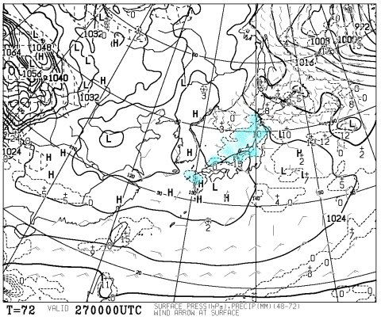

# 恒例！この週末の志賀高原の天気は…久々の，普通の冬の週末だなぁ…

📅 投稿日時: 2016-02-25 00:32:20

えー．

この，1月末から2月にかけて．

普通であれば，激烈冷え冷えの最高粉雪を

楽しめる，この時期．

ここしばらく，週末に立て続けに雨の危機を迎えるという，

ありえない状況が続き．

毎週毎週，冷え冷え踊りを踊らなきゃならなかった今日この頃，

踊りを踊り飽きた皆様におかれましては．

…まさか，今週も冷え冷え踊りを踊らなきゃいけない

状況になったりしないよな！？？

と，心配になっていることかと存じ上げます…．

ということで．

毎週水曜夜恒例の，志賀高原天気予想に行ってみましょうか．

…ふむ．

ふむ．なるほど．

皆様．

ご安心ください．

こんな感じで…

やっと．

久しぶりに．

ようやく．

平年並み程度の気温の週末がやってきます！！（感泣）←いや，それが普通だから．普通に感動してちゃおかしいから．

ということで．

27日，土曜の850hpa気温予想を見てみると．

ふむ．

素晴らしい！

0℃線ははるか南，志賀高原には-9℃線が…

これは，志賀高原の朝は-10℃以下でスタートです．

冷え冷えです．

で．土曜の地上天気図は，

こんな感じで，水色の降水域が予想されていますが．

この降水量は，前日金曜の9時～土曜の9時までの降水予想で，

土曜9時の気圧配置から考えると，この降水量は金曜日のうちに

降るものでしょう．

ってことで．

前日に雪が降って，冷え冷えの一日という…

久しぶりに．

実に久しぶりに，まともな雪質の，

恵まれた週末になりそうな予感！

で．

日曜の850hpa気温図はこんな感じで，

土曜より気温は上がりそうだけど，0℃線は日本の南にあり．

まぁ，志賀高原は昼間もマイナス気温をキープする一日かな．

んで，地上天気図を見ると…

ふーむ．

日本海側に降水域の網掛けが予想されているけど…

これ，ホントに降るかな～？？

まぁ，晴れ～曇り，時々雪もちらつくって程度で予測しておきましょう．

ってことで．

まとめると．

土曜：朝イチは-10℃以下に冷え込む，冷え冷えの一日．

　土曜朝は，前日夜から最大で10cm程度の積雪がありそう．

　朝のうちは雲が多いかもしれないけど…

　おそらく，午後は晴れ間も広がるんじゃないかな．

　木・金とぼちぼち雪が積もるので，朝イチは

　久しぶりに冷え冷えフカフカ圧雪が滑れそう！

　朝イチは冷え冷え圧雪に，うっすら新雪が乗ってる感じかな．

　午後はゲレンデがちょっと荒れていき…

　木，金の積雪が少ないと，下地のアイスバーンが

　ところどころ顔を出すかも．

日曜：朝イチは-5℃程度．土曜よりは気温が高いけど，

　終日マイナス気温をキープ．

　天気は晴れ～曇り．時折雪もちらつくかも．

　朝イチは，締まったいい感じの圧雪が滑れるでしょう．

　この日も，木・金の積雪状況によっては，

　午後に下地のアイスバーンが出てくる可能性はありますが…

　基本的には，2月の志賀高原らしい，冷えたいい感じの

　一日になるでしょう．

…という感じで．

実に，実に久しぶりの．

何もない平穏な週末になりそうです…（感動）

いや，これが普通なんです．

例年，2月ってこんな感じのはずなんです．

ここしばらくが異常すぎたんです…

ってことで．

今週は，久しぶりに冷え冷え踊りを踊らずに済む

週末が過ごせますよ～！！
