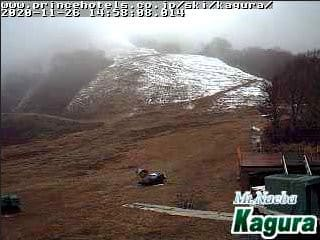
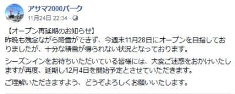
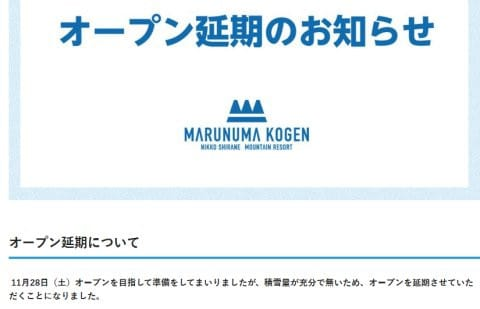
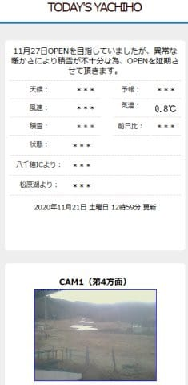
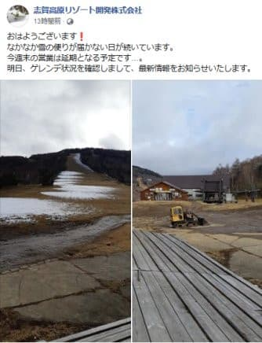
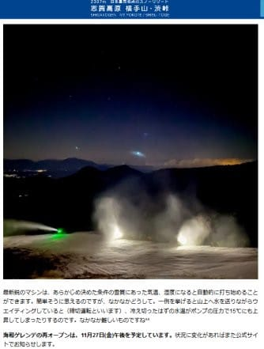
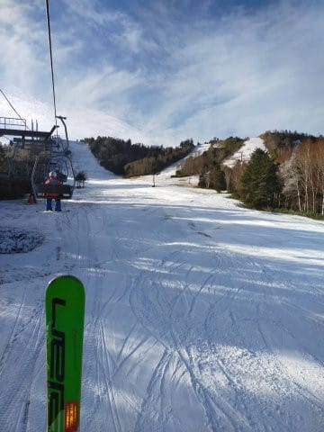
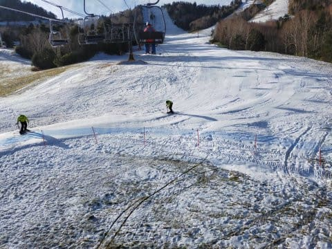
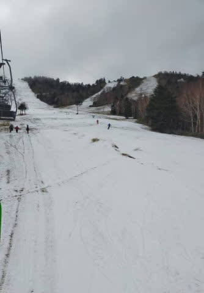
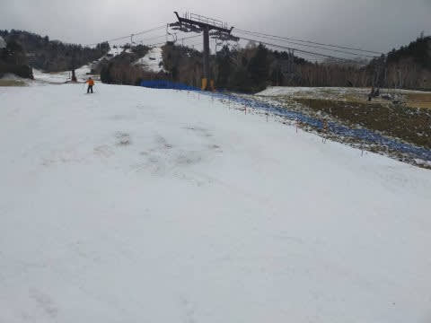

# 丸沼，鹿沢，八千穂高原，湯の丸，アサマ2000など，軒並みオープン延期…そして今日の熊の湯特派員レポート

📅 投稿日時: 2020-11-27 03:48:37

🏷️ カテゴリ: [日記](cc4b5682fb7b8b144980957a978653fb0.md)

えー．

やはり，予想通り．

25，26日と，昼間の気温がちょっと高めになり．

どこのスキー場もほぼ全く人工降雪機が打てず．

…かぐらなんかは，すごい状況になってます(涙)

（[かぐらスキー場ライブカメラページ](https://live.monitorbox.jp/site/kagura/90/#d0)より)

かぐら，まだ再オープンのアナウンスが

出ていないのですが

…まぁ，このライブカメラを見ると．

今週末のオープンは絶望ですね…

そして．

アサマ2000も…

([アサマ2000Facebook](https://www.facebook.com/asama2000park/posts/5422938564398207?__tn__=-R)より)

さらに丸沼も…

([丸沼高原スキー場ホームページ](https://www.marunuma.jp/winter/news/10028/)より)

八千穂高原も…

（[八千穂高原スキー場ホームページ](https://yachiho-kogen.com/ski/)より）

そのほか，鹿沢も湯の丸も，

軒並み今週末のオープンを諦め，

オープン延期になったようです…（激涙）

一の瀬ファミリーも，まだ延期と公式に言ってませんが．

…延期になる雰囲気にあふれてます…(泣)

([志賀高原リゾート開発株式会社Facebook](https://www.facebook.com/ShigaKogen.Ski/posts/3464573706992141?__tn__=-R)より）

あぁ…冷え冷えだった10月の頃には．

11月最終週になってもまだほとんどの

スキー場が滑れない状況になろうとは，

全く予想してなかったよ…(涙)

そういった中で．

なんとか横手山は，26日明け方は

冷えて人工降雪が打てた様子で．（昼間は打てなかっただろうな…）

予定通り，27日(金)に再オープンするようです…！

([横手山スキー場ホームページ](https://yokoteyama2307.com/news/11320/)より)

そして．

熊の湯も．

本Blog独占契約特派員からの情報によると．

なんとか26日明け方に2時間ほど人工降雪機を

動かせたようで…

昨日はヤバかったリフトをくぐるあたりも，

なんとか雪を被せて寄せてあり，

状況が改善していたようです…！

とはいうものの．

人工降雪が打てたのもわずか2時間なので，

雪が薄く，コース幅が狭いことには変わりなく…

やはり，ところどころちょいとヤバい感じに

なってきてるみたいです…

最新の気温図を見直してみたけど．

昨日予想した，

27日（金）：基本的に曇り．時々晴れるか？…気温は朝にちょっと

　人工降雪機が動かせ，夜になったらまた人工降雪機が

　稼働できそうな気温に

　熊の湯のこの日のゲレンデ状況はかなり厳しいかも．

という予想は変わらず．

27日も，熊の湯の状況はこの状況から

ほとんど変わらなさそう…(涙）

でも．

来る．

28日に来る！！

最新の天気図を見ても，昨日予想した，

28日（土）：朝から雪！終日気温は上がらず，一の瀬エリアも

　フルパワーで人工降雪が行ける！

という予想は変わらず．

白馬の上の方や，かぐらは天然雪もかなり積もる！

その他のスキー場も人工雪打ちまくれる！

イケる！

根性の入ったスキー場は，29日に

オープンするところもあるかも…

そして．

私の冷え冷え踊りの効果である，

28日から続く冷え冷え期間．←降るところは自分のおかげなんだ…

28，29，30日と天然雪も降りそうだし．

5日の週末にはかなりのスキー場が

オープンすることを願いましょう…！！

とりあえず．

この週末，志賀高原に行こうとしている方は．

土曜朝はドサドサ積もるほどではないものの，

終日降り続けそうだし．

日曜も午前中は雪で，土曜夜から10cmほどの雪の積み増しが

ありそうな感じなので．

志賀高原の道路は，積雪・凍結路だと思って

覚悟して行ってください…

## 💬 コメント一覧

### 💬 コメント by (Goku)
**タイトル**: やはり志賀が一番！
**投稿日**: 2020-11-27 18:13:30

どんなに暖冬の年でも、志賀は11月下旬には必ず滑れますよね。

昨年も志賀で滑っている限りでは、他ほど酷くはなかったしやっぱり志賀は素晴らしい。

明日は海和ゲレンデで滑ってます。

### 💬 コメント by (Northfox)
**タイトル**: 初滑り
**投稿日**: 2020-11-27 23:25:19

予想に反して雪が降らず、予約した渋温泉の宿どうしようかと悶々としていましたが、明日滑りに行きます！

熊の湯、横手、それなりに滑られそうなので良かったです。

### 💬 コメント by (Skier_S)
**タイトル**: 土日は冷えてくれそう
**投稿日**: 2020-11-28 01:13:03

＞Gokuさま

明日は横手ですか．

私は日曜日帰り参戦予定です～！

＞Northfoxさま

 

なんとかギリギリ熊と横手，滑れそうですね…

明日は天然雪がちょっと積もってると思います！ 土曜は一日寒い日になりそうです．

初滑り，楽しんできてください！

