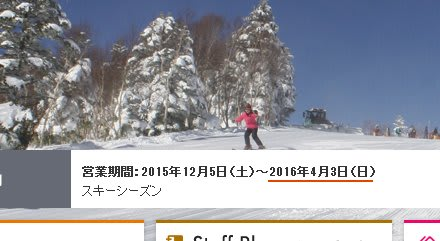

# 2016シーズンの焼額営業が4月3日までだとっ！？？？なんということだっ！！！（激涙）

📅 投稿日時: 2015-10-08 01:44:35

な，な，な，

なんてこった～っ！！！

昨日の記事に，maeさんからコメントをいただいて．

初めて知ったのですが…

[焼額スキー場のウェブページ](http://www.princehotels.co.jp/ski/shiga/)を見てみたところ．

う，うむ！？？？

うむむむ！！？

…拡大してみると…

…

…ふ，

ふげげげげげげげげ～っ！！！

なんと．なんとっ！！！

なんということだ～っ！！！

来シーズンの焼額の営業期間．

4月3日までになってるじゃないかっ！！！！！！

ちょっと待て．

これまで，焼額はGWまで営業してくれてなかったっけ？

4月に入ると土日のみ営業になるけど，

それでも早朝からゴンドラで滑れるし．

早朝のゴンドラは，トップシーズンでも味わえない

締まったハイスピードバーンが楽しめるという，

そーゆー最高の春スキーが楽しめるという，

4月の焼額ではなかったっけ？？

…4月にこれだけ雪質がいいスキー場は志賀高原を

置いて他はなく．

（2013/4/27の焼額山頂）

その中でも，ゴンドラ一本，長距離を

気持ちよく滑れるのは，唯一焼額だけだったのに…

＃奥志賀もゴンドラはあるけど，人工雪がない奥志賀は

＃GWはボコボコになってることが多いので…

（2014/5/2の焼額…5月とは思えない！）

おーまいがーーっ！！

なんてこった～っ！！

もう，こんな気持ちい早朝バーンを滑ることはできないのかっ！！？？（激烈な涙）

（今年GW早朝の焼額）

2011年，地震の年に，電力不足のために，

4月で焼額の営業が終わってしまったシーズン．

その年は，かなり悲しい思いをしたけど…

今後はそれがずっと続くのか…？？

うーむ．

以前，焼額スキー場のウェブページに「営業時間は16:00まで」

と書かれていたのが，実際は16:45まで運転してくれることも

あったみたいに．

今回も，3月末くらいに，

「雪が多かったから，GWまで営業します～」

ということになってくれないかな…（強烈な懇願）．

とりあえず．

ショック～っ！！！

## 💬 コメント一覧

### 💬 コメント by (Goku)
**タイトル**: マジすか!
**投稿日**: 2015-10-08 10:55:50

何かの、何かのマチガイに決まってる(T_T)

もおー皆で、2ゴン前で座り込みの抗議でもしますか！

### 💬 コメント by (はなげ親分)
**タイトル**: うげげっ！
**投稿日**: 2015-10-08 11:35:55

は、春の楽しみがっ！

子分引き連れて、座り込みに参加したいっす！

### 💬 コメント by (mae)
**タイトル**: Unknown
**投稿日**: 2015-10-08 17:57:26

GWも午前の早い時間以外はガラガラだったようだし

山の神が営業しないことによる需要を見越した対応かもしれませんね。

上場会社だし利益も出ず赤字経営だと株主からも批判もあるし。

一の瀬、ヤケビ、奥志賀エリア間の経営の合理化が必要なのでしょう。

西武が山の神、ダイヤモンドを買い取るか、リゾート開発か奥志賀リゾートが

ヤケビのスキー場だけを買い取ってしまえばと思います。でもそんな資金は無いか..

西武は春でも来場者が確実に見込める、かぐらにリソースを移したのかもしれませんね

話は変りますが、プリンスの共通シーズン券、GWに知りましたが、このシーズン券は早朝やナイターでも利用できるようですよ。

但しファーストトラックはダメ。今年は4/3以降は志賀では使えなくなるため、以後は苗場とかぐら通いになってしまいますが、5月末までかぐらで滑り倒す

Sさんにはメリットありと思いますがどうですか。

### 💬 コメント by (Skier_S)
**タイトル**: マジみたいっすよ！
**投稿日**: 2015-10-09 02:24:19

＞Gokuさま

悲しいことに，事実みたいです…（激涙）

Gokuさんが2ゴン担当なら，私は1ゴンの前で座り込みます…

＞はなげ親分さま

まさに，春の楽しみが無くなっちゃいます…（涙）

あれだけ快適に4月に滑れるスキー場が，

他にあるでしょうか…

今シーズン，4月はどこで滑ればいいの？？

＞maeさま

そうなんですよ．

GWも，午後10時にはガラガラでした…

ゴンドラ1本，高速1本だけの焼額を

滑りに車で移動するか…という感じしょうか．

車で移動するなら，奥志賀まで行っちゃう人が

多いでしょうし．

第1ゴンドラが動いてないと，ヤケビと奥志賀の

移動もやりにくいし…

ホントに，志賀エリアの経営が一体になってくれれば

と切に願いたいところ…

で．

プリンスのシーズン券，検討したこともありますが，

志賀でもヤケビ以外を滑ることがそこそこある

我が家．

また，ヤケビナイターは圧雪を掛けてくれなくなったので，

ナイターはダイヤモンドメインで滑ってますし．

10万円ってことを考えると，やっぱり志賀高原

シーズン券かなぁ…

という判断です．

