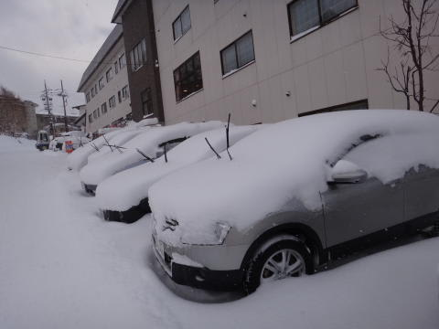
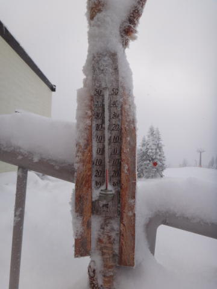
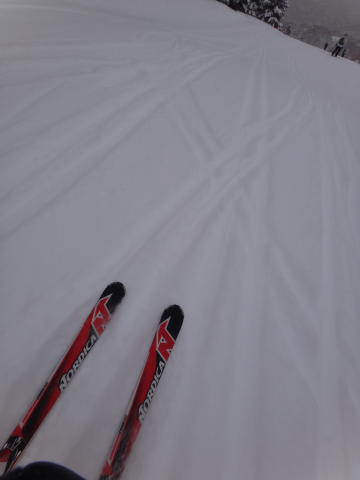
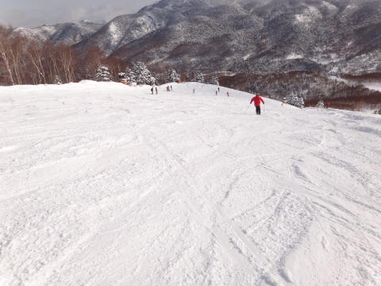
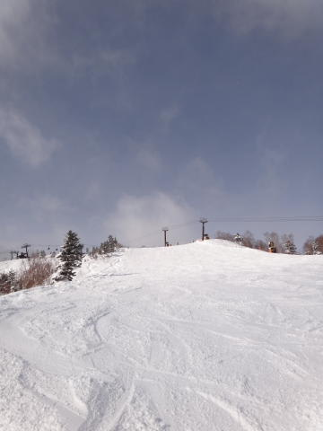
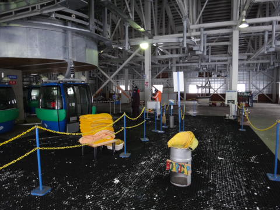
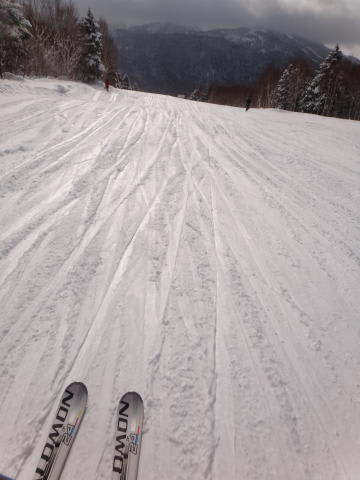

# 1月15日(日)も志賀高原の焼額はがらがらだった…

📅 投稿日時: 2012-01-16 00:12:34

という感じで．

日曜も志賀高原は焼額で滑ってたわけですが．

土曜の夜からの積雪は15cm～20cmってところでしょうか．

天気は，朝のうち雪．

昼前に時々日が差し，午後は曇り後雪…とめまぐるしく変わった

一日でした．

ゲレンデ状況は，非圧雪部分はブーツが隠れる程度のぱふぱふ．

気温マイナス16度なので雪はすごい軽いです．

圧雪バーンは圧雪の上に3cmほどの薄い新雪が乗ったコンディション．

圧雪バーンもすごい柔らかいです．

シュプールが深く掘れていくので，結構早いうちに

ぼこぼこになりましたねー．

昼過ぎには，結構荒れて凸凹した感じになってきましたが，

人が少ないからか完全なコブってまでにはならなかったなぁ．

どうでもいいけど，今日はめちゃくちゃ空いてました．

昨日も空いてたけど，昼間に人が乗ってないゴンドラ搬器が

出るほど．

…滑っている人間としては，待ち時間がないのはいいけど…

スキー場の経営，大丈夫なのか？？

＃人が少ないとゴンドラやリフトが減速運転するようになったのも，

＃経営が苦しいからかも…

しかし，昼間もすごく寒く，雪はいいですよ～．

この週末で，ようやっとブッシュや石が出ていたバーンも

雪で覆われた感じです．

雪がいいこんなトップシーズンで，ゴンドラ待ち無しで

がんがんすべれたんで，とりあえず満足の週末でした．
