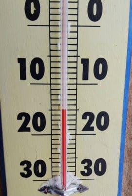
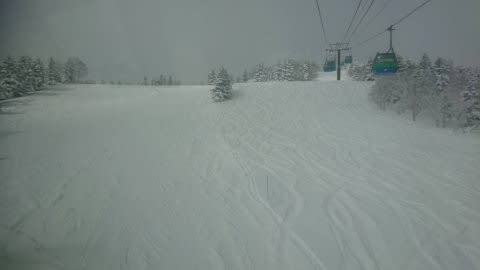
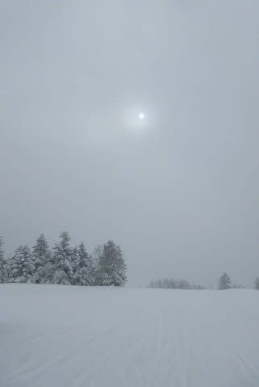
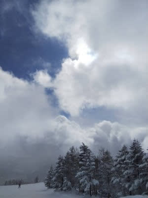
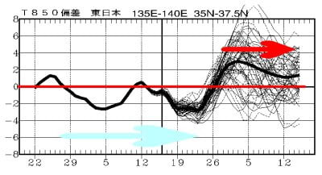
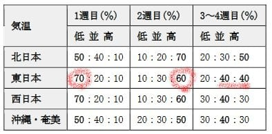
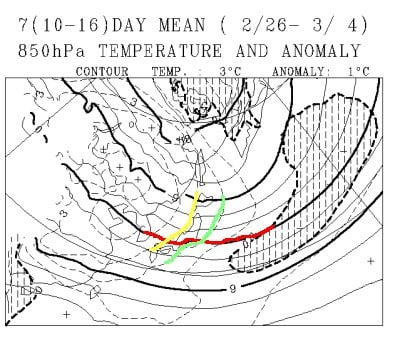
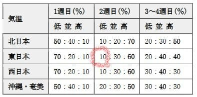

# 気象庁1か月予想を見てみると…スキー場が冷え冷えなのは2月で終わり．3月から気温が上がって雪はあんまり降らなさそう（涙）

📅 投稿日時: 2022-02-18 02:34:46

えー．

志賀高原の天気がどうなるかについては，

天気図を必死に読み込んで一生懸命に

予想するのに．

家の周りの天気がどうなるかは

天気図から読み取ろうとせず，

「あ，今日雨が降ってるのか！」

とか当日になって知るSkier_Sです．

…何度も言ってますが．

私は気象予報士も持ってなければ

気象関係の仕事もしてるわけじゃなくて．

単に執念と経験でスキー場…それも

志賀高原の局地的な天気を予想できる

ようになってしまっただけで．

家の周りの天気を時間をかけて予想する

モチベーションはもってないのだ．

家の周りの天気は，スマホの天気予報

で十分なのだ…

ってなことで．

その，必死に天気図を眺めた結果である

昨日の予想では，本日木曜は

　朝は-15℃以下まで冷えそう．

　朝までの積雪は10～20cm程度．

　終日雪が降ったり止んだり，時折

　強く降って，昼間も雪が積もる．

という予想だったけど．

果たして，特派員からの写真を見ると…

朝の気温は…ドンピシャ-15℃！

うーん．すばらしい！

そして，朝の積雪は10~20cmほど

だったようで…

ここも大正解！！

天気は曇りベースで，時折雪も

ぱらついたらしく．

だいたい「雪が降ったり止んだり」

だったようですが．

でも，雲は薄くて，雪が強く降るときは

無かったらしく．

…それどころか，時折わずかに青空も

のぞいたみたいで…

うーん．ここはちょっと外したか…

でも，

本来なら北アルプスに雪雲がブロックされて

志賀まで届かないはずの完全西風だったのに，

500hpaで-36℃というドカ雪目安の

強烈寒気が入ったせいで，根性がある

雪雲が北アルプスを越えまくって

志賀でも曇り~雪だったわけで．

普通なら志賀は完全にすっきり晴れに

なる風向きだったのに，それでも雪が

降るって当てた自分はすごい！！（自分でほめておく）

そして．

今日もまた天気図を眺めていたわけですが…

明日の予想図がちょっと変わりました．

高気圧の接近が遅れ，明日の雪の降り止みが

ちょっと遅くなりそう．

だもんで，予想をちょっと修正．

18日(金)：朝の気温は昨日の予想と同じく，

　-12℃くらい．

　朝の積雪は30~40cm以上，膝から

　太ももパフのパウダー！！

　朝は激しい雪降り．志賀高原の

　登り道が心配になるくらい．

　昼間もひたすら降り続けて，

　ゲレンデに積もっていく．

　圧雪バーンにも新雪が乗って

　エンドレスパウダー状態．

　昼を過ぎてしばらく経つと，ちょっと

　雪が弱まっていくが，夕方まで

　降り続けそう…

　夜は止む．

って感じで．

明日は激冷えパウダーデーですよ～！！

昼間も降り続けますよ～！

ってなことで．

ひたすら天気の話題が続きますが．

今日は木曜ということは…

そうです！気象庁から一か月予報が

発表される日です！←そんなこと知ってる人少ないから

だもんで，当然のごとく一か月予報を

眺めてみるわけですが…

まずは[FCVX14](https://www.data.jma.go.jp/gmd/cpd/data/longfcst/fax/fcvx14_12.png)を見てみると…

うげげげげげげ！！！

水色矢印で示した2月中は，

赤線の平年気温より低い

冷え冷え期間だったのに…

赤色矢印の2月28日あたりから，

平年比2～3℃高い気温が

続きそうなんですが！！？？

これはヤバいかも？？？

[FCXX92](https://www.sunny-spot.net/chart/FCXX92.pdf)を見てみると…

うぎゃーーーー！！

第1週，2/19～2/25は平年より冷える確率が

70％と，冷えそうだけど…

第2週，2/26～3/4は平年より暖かくなる

確率が60％！？？

そして，3，4週の3/5～３/18も，

平年並みが40％，高温が40％の確率で…

あまり冷えなさそう(涙)

一か月北半球予想図，[FCVX12](https://www.data.jma.go.jp/gmd/cpd/data/longfcst/fax/fcvx12_12.png)から，

第2週の850hpa気温予想を見てみると…

赤い0℃線が志賀高原のそばまで

上がってきていて．

日本は黄色の平年比+3℃の線と

緑色の平年比+2℃の線に囲まれてて．

平年比+2.5℃くらい行きそう…(泣)

一週間平均が平年比+2.5℃って，

異常高温のレベルです(涙)

いや．

3月上旬に0℃線が志賀近辺って…

ヤバすぎる．

日が射すと春の重い雪になる気温だし．

ちょっとでも気温が上がると…

空から液体が降ってきかねない

レベルなんですがっ！？？

オーマイガーーーっ！！

なぜ…

なぜ，平年通りでも寒くて雪質がいい

1-2月に意味もなく冷えたのに．

平年より冷えてほしい，春が近づく

3月になって気温が上がるかなぁ…(涙)

…いや．

まだわからない．

予想では．

第2週でも，低温になる確率が10％あるのだ！！

平年より冷える可能性は0ではないのだ！！

スキーヤーの熱い思いを集結すれば，

第2週も平年より低くできるはず！！

皆さん，3月になってもスキー場が冷えるよう，

祈り，歌い，熱烈に冷え冷え踊りを踊り．

そして，寒いギャグを言い続けましょう！！！←神の怒りを買って激荒れ天気になっても知らないから

## 💬 コメント一覧

### 💬 コメント by (レインボー74)
**タイトル**: Unknown
**投稿日**: 2022-02-18 18:58:26

金曜日の志賀高原情報

大雪強風の一日なので、初めて山の駅スタート。

まずは悪天候に強い西舘へ。

第一ファーストで、重い雪に足をとられて久々の転倒。あとは恐る恐るの西舘回し。

ダイヤが最悪。視界ゼロで怖くて怖くて。

やけびに行くと、やっぱり雪がいい。でも、獅子昼食のあとは荒れ荒れ。

へろへろになりながら、遠路山の駅までやっとたどり着きました。あんな遠くでスタートするとあとが大変だと！

レインボー遅刻という大罪を犯してしまいました。

### 💬 コメント by (Skier_S)
**タイトル**: ＞レインボー74さま
**投稿日**: 2022-02-19 00:16:46

今日の雪はそこまで重くないと思ったんですが…

午後は天気も回復したみたいですね．

残業お疲れ様でした！

### 💬 コメント by (地元民)
**タイトル**: Unknown
**投稿日**: 2022-02-19 07:40:18

志賀高原の麓に住んでるので、志賀高原限定の高精度詳細天気予報&降雪予報は、気象台の天気予報以上に役立っています。

地元の気象予報士kasayanのお天気ブログが終了してしまったので、今や貴重な情報源なのでした。

### 💬 コメント by (Skier_S)
**タイトル**: ＞地元民さま
**投稿日**: 2022-02-19 22:47:51

役立っているようで良かったです（笑）．

kasayanさん，お天気ブログやめちゃってたんですね…

