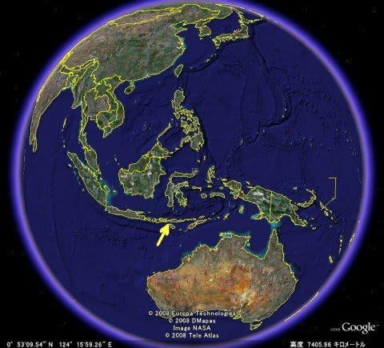
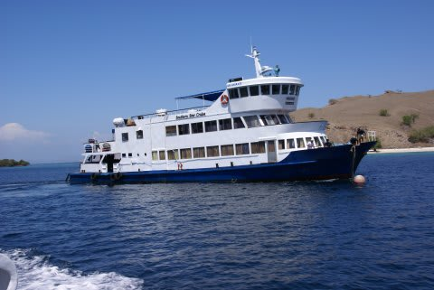

# 2010年9月の子連れダイビング日記…インドネシアはコモド諸島！

📅 投稿日時: 2011-07-01 00:50:34

ラブハンバジョーの空港から，車で5分．

これから5日間を過ごす，サザンスター号…正式名称「しまじ」に

乗り込む港へ到着した．

天気は，気持ちよい晴れ．

昨日までの雨は上がり，心地よい日差しが海面を明るく照らしている．

船は沖に泊められており，船まではボートに乗っての移動となる．

今回のクルーズのゲストは，我々親子を除くと，5人．

ホテルでは朝5時15分というド早朝にあわただしくピックアップされ，

空港では各個人ごとにチェックイン，そしてこの港までの車も2台に

分かれたので，このボートが他の全てのゲストとじっくり顔を合わせる

初めての機会となる．

ボートはゆったりと桟橋を離れ，南半球の海を掻き分けてゆっくりと

進み始めた．

海が大好きな娘は，ボートに乗るのがうれしいらしく，海を見るといつも

歌う歌を大声で歌いだした．

娘「うーみーは広いーなー，おおきーいぃーなぁ～」

我々夫婦は，お詫びを兼ねて，早速他のゲストへ挨拶を行った．

私「騒がしくてすいません…

　　これからも子連れでいろいろ迷惑かけちゃうかと思いますが，

　　よろしくご容赦のほどお願いします…」

娘「つーきーはーのぼるーしぃー，ひはしーずーむぅ…」

他ゲスト「いえいえ～．全然かまいませんよ．

　　　　こちらこそよろしくお願いします」

ゲストの皆さんが，快く子供との乗船を了解してくれた…

ほっ．子供嫌いのゲストに，白い目で見られるという悲劇は

起こらずに済みそうだ…

娘「うーみーにーおふねーを，うかばーせーて～」

でも，みんな子供にやさしそうな人ばかり．

娘が歌っているのを，やさしそうに見てるなぁ．

娘「行って～みたいーな，よそのーくーに～」

他ゲスト「よその国へもう来てるがな！」

やさしそうなのだが．

ツッコミには，子供とはいえ容赦が無いようだ…

----------

という感じで．

いつもと違う感じの書き出しでスタートしてみましたが．

昨日予告したとおり．

これから，昨年9月に行った，子連れダイビング遠征の

記録なぞ書き残してみようかと思うわけです…

で，どこに行ったのかというと．

インドネシアは，「コモド」諸島．

ここに，妻と子供と，3人で行ってきました．

それも．

子供づれというのに．

無謀にダイビングクルーズです．

あー．このBlog.

これまでスキーの記録しか書いてこなかったので．

「ダイビングクルーズ？なんじゃいな，それは」

って人が多いと思いますが．

ゲスト最大20人程度が乗れる船に一週間泊り込み，

朝から晩までダイビング漬け．

朝起きたら，まず朝食の前に1本．

1本目のダイビング後，朝ごはんを食べている間に，

船は次のポイントに移動，朝食後に2本目，

2本目が終わったら昼ごはんで，それが終わったら3本目…

みたいな感じ．

普通のホテルに泊まると，宿から潜りに行くポイントに

行くまでに1時間かかったりしますが．

ダイブクルーズなら，玄関開けたら5分でポイント状態．

ダイビング以外の無駄な移動時間が無いので，

時間が有効に使えます．

…あ，普通は，子連れで乗せてくれるダイビングクルーズ船は

無いのですが．

昨年乗ったコモドのクルーズ船．

過去に一人で2回乗ったことがあり，

半分冗談で「今度子連れで乗りたいなぁ…」

と言っていたら．

ダイビング船のマネージャーからの

「ぜひ子連れで来てください！お待ちしています！」

との回答．

半分本気，半分冗談と思っていたのですが…

約束どおり，子連れクルーズ予約を受け入れてくれて．

クルーズ船で初めての子連れゲストの乗船ということで，

当然これまで無かった

「子供料金」

という設定を作ってもらい． 

そのほかにも，いいろと受け入れ態勢を

整えてくれました…

このあたりの詳細は，これからのレポートの中で述べていく予定です…．

（続く）
