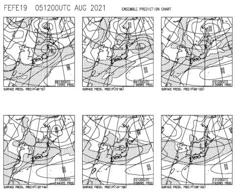

# 2020年10月，八ヶ岳の編笠山に登ってみた，その4

📅 投稿日時: 2021-08-07 00:29:10

天気図を読むようになってからこのかた．

8月中旬で，こんなに一週間ぶっ続けで

全国的に雨降りになる天気図を

見たことがない気がする，今日この頃．

…皆様いかがお過ごしでしょうか（時候の挨拶）

いや．

この太平洋高気圧の張り出しの弱さ．

とても8月とは思えない天気図なんですが…

この天気図，何月か聞かれたら，

多くの人が「10月上旬くらい？」って

答えるくらいの天気図じゃないかと

思うんですが←みんなそこまで天気図に詳しくないから

しかし．

なぜ，お盆休みの1週間．

こうまで見事に降り続けるのか…（涙）

とりあえず．

コロナもすごいし家にじっとしていろ

という神からの采配なのかも…

ってなことで，本題へ．

今日も引き続き，登山日記です！

ーーー

という感じで．

標高2300mを超えると…

そこは，スキーヤーのテンションを

上げる雪世界！←喜ぶところじゃないから

ってか．

ホントに一気に登山道の積雪も増え．

道の上にところどころ積雪があっただけ

だったのに．

10分も登ると…

道はもう真っ白．

登山を諦めて引き返してきた人と

何組かすれ違ったので

これはやっぱり，今日は山頂は

無理っぽいかな…（涙）

自分も，

「これは…今日は引き返すべきだな…」

と思いながらも．

スキーヤーの本能というべき

この先，もっと雪が積もっているところを見たい

という欲求で，しばらく登り続けましたが…

登山開始から3時間15分ほど，

標高2350mを超えたあたりで．

これまでひたすら続いた木立から抜け出し．

一気に視界が開けました！

うわ！

目の前には，見事な南アルプスが！

冠雪した富士山も見えるし…

御岳から乗鞍方面も

きれいに見えるよ！

さすがに今日は，乗鞍も真っ白に

なってますね…！

いや．

見晴らしがよくなって，景色が

良いのはいいんだけど．

ここからは…

このゴロゴロの岩場の上を歩いて

いくんですか？？

そしてそこからわずかに進むと．

どうやら，この矢印は．

この積雪している岩ゴロゴロの崖をよじ登って行け

ということのようだな…

写真で見ると緩く見えますが．

完全に手足を使って，身体を

持ち上げていかないと登れない

ゴロゴロ岩場です．

いや．

諦めるよね？

普通，あきらめるよね？

…と，思いながらも．

良く見ると，全く踏み跡がないわけ

じゃなく．

2人ほどの踏み跡があるな…

これは，何とかなるかな？

と．

滑らないように，足場の雪を一歩

ずつしっかり踏み固めながら．

しっかり3点確保をキープして，

岩場に張り付くように

登り始めたのでした…

いや…普通，登るかな…←冷静な自己突込み
