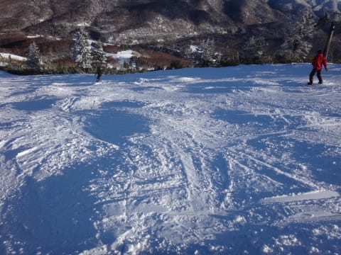

# 3連休初日，1月9日の志賀高原は…積雪10cmなれど，結構よかったかな．

📅 投稿日時: 2016-01-09 23:14:23

🏷️ カテゴリ: [2016スキー滑走日記](c70c67ed5248e9432b899dcd5747048bb.md)

で．

3連休も，予告通り志賀高原滞在中のSkier_Sです．

えー．

今朝の積雪は．

残念ながら，わずか10cmでした…（涙）（涙）（涙）

これは，きっと…

皆さんの祈りが足りなかったってことですね…っ！！！←人のせいにしている

ということで．

あんまり積雪どさどさではない上り坂を，志賀高原に

登っていくと…

雪がかぶさってない分，下の凍結部分がツルツルで，

難渋する車，多数…

志賀への登りみちは，結構ツルツルなので

明日お越しになる方はご注意を．

で．

山を登ってやってきました，

いつもの焼額．

今朝の山頂の気温は-10度と，この時期らしい気温ですね～．

＃これまでがあったかすぎた…

うす曇りの山頂へ到着すると…

うむ！

ぴかぴか圧雪に，冷え冷え最高の雪質の雪が

うっすら乗った，かなりいいコンディション！

ちなみに，コースわきの新雪はこんな感じで．

…昨日からの積雪はわずか10cmってところですね…（泣）．

で，いざ，第1ゴンドラのGSコースへ！！！

…をを！

ブッシュがほとんど出ていない！

年末年始は石を踏まずに滑れなかった，

このGSコース，ブッシュがほとんど気にならない…！

どうやら，この数日間で，1ゴン側にも人工降雪を

打ったようです．

先週までの石ころ地獄から，

ゲレンデ状況は劇的に改善しました！！！

…ただ，人工雪なので．

コース上に，ちょっと氷のコロコロが出てますが…

でも，許す．

氷のコロコロなら，許す．

石のコロコロに比べれば，2800万倍くらいマシなので，

すごく許す．

まぁ，ちょっとこんな感じでブッシュが出てるところも

あったけど…

気を付ければ避けられるレベルなので，

どうやっても石を踏まないで降りられない先週に比べれば，

全然許す．

…ってことで．

第1ゴンドラ側．

GSコースはゲレンデ状況がかなり改善しましたが．

今日は，なんと．

スーパージャイアントスラロームコースも

オープンしてました！

非圧雪なので，10cmほどの新雪を堪能できましたが…

10cmの新雪の下はアイスバーンで，ちょっと滑りにくかった…

あ，ブッシュは結構出てましたけど，

草の頭が出てる感じで，石や土は出てませんでしたよ！

2ゴン側，パノラマコースも，10cmの積雪で

かなり状況は改善したのか．

デンジャラスブッシュエリアは見当たらなくなり．

うむ．

焼額，この一週間で積雪はそんなになかったけど，

結構状況はよくなった感じ…

あー．

でも．

クローズした白樺コースはまだ滑れないし．

エキスパート，ミドルコースもまだクローズ，

GSコースも，ふもと近くの最後の落ち込みは滑れず，

迂回路のみ．

オリンピックコースもまだ全然滑れる感じじゃない…

ってことで．

まだ，全面オープンには今一歩．

もう一降り必要なレベルですが…

うーん．もう少しどっさり雪が欲しいな！

でも．

今日はゴンドラもリフトもほぼ飛び乗り状態で．

さらに，午後になると．

予想通り．

ええ，そうです．見事に私の予想通り．←ここ，すごく強調するところ

天気は回復に向かい．

をを…すっきり晴れてきたではありませんか！

夕方に向かい，ゲレンデは多少荒れたものの，

人が少なかったので，それほどひどく荒れず…

先週は夕方には地面が盛大に表れ，石ころだらけに

なっていたGSコース．

今日は夕方でも大丈夫だったよ！

…多少のブッシュはあったけど，避けられるレベルだよ！

＃まだ新品の板は持ってこないほうがいいけど…

（これはブッシュというより，人工降雪が固まった氷）

気温も冷え冷えで．夕方まで，雪はいい感じでした…

＃ところどころ，人工雪で硬かったけど（ちょっと涙）

…ってことで．

いつも通り，日が暮れるリフトストップまで堪能し．

「あー．ようやっと，いつもの焼額が

　帰ってきたかな～」

と，満足できた一日だったのでした…

…

…

で．

そう．まだ終わらない．

そのあとは．

いつも通り，ナイターです．

今日は，今シーズン初のダイヤモンドナイターに行きましたが．

いやー．

雪は冷え冷え，シマシマっ！！！

コースもガラガラで．

んもう，最高っ！！！

もう，朝も昼も夜も，全部ナイターならいいのにっ！！←なんのこっちゃ？？

って感じの，最高のナイターで．

うーむ．

年始のガックリ感が強かったので．

今日はそれに比べると，かなり満足できた

一日でしたよ～っ！！

…でも．

今はきれいな星空．

明日も雪は積もりそうにないなぁ…（ちょっと残念）

## 💬 コメント一覧

### 💬 コメント by (Goku)
**タイトル**: Unknown
**投稿日**: 2016-01-10 07:08:45

昨日はお疲れ様でした～♪

やっと、ヤケビらしくなってきましたね。

今日は朝からピーカン

サイコーの『朝イチジャイアントスラローム』を楽しんでください。

### 💬 コメント by (Skier_S)
**タイトル**: Gokuさま
**投稿日**: 2016-01-10 22:28:01

昨日はお世話になりました～！

今日の朝イチはよかったです．

…朝イチは．

それ以降は，雪が剥げていく一方でした…（涙）

一体いつになったら，幸せが来るんだろうか…

### 💬 コメント by (まいる)
**タイトル**: 集中
**投稿日**: 2016-01-10 22:39:47

お疲れ様です(^^)　昨日、舞子で滑り、今日は、かぐらで滑りました。舞子は残念な雪質でしたが、かぐらは良かったです。ただ、周辺のスキー場がどうしようもないせいか人間集中でバブルのスキー場状態(>_

### 💬 コメント by (Skier_S)
**タイトル**: まいるさま
**投稿日**: 2016-01-10 23:37:10

雪がいいところは混むし，

空いてるところは雪がひどいし…

究極の選択状態ですよね．

とりあえず，今晩どっさり積もることを

祈るばかりです…

