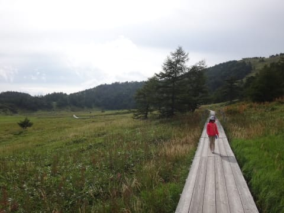

# 夏のアサマ2000と湯の丸へ行ってみた…その2

📅 投稿日時: 2015-09-10 02:13:29

ということで．

ランチタイムが終わったら．

車に乗って，アサマ2000のゲレンデを突っ切る道を

登ってみます…

登り道の途中で．

道路がゲレンデを横切る場所に出ましたが．

ふむ．これは…

まさに，ゲレンデの途中で，みんなが立ち止まる段差．

夏の間，こんな道だったんだなぁ…

ゲレンデで滑っている間は，単なる中間地点の段付きだけど．

夏の間は，誰もが通れる道だったんですね～．

…ってことで．

ゲレンデを突っ切り，さらに車で走ること15分ほど．

やってきたのは，池之平湿原．

これは，アサマ2000と湯の丸スキー場の中間あたり．

遊歩道があり，トレッキングに最適．

午後は，ここを散策へ…

駐車場から10分も歩くと，湿原へ．

こういう景色を眺めつつ…

ゆるゆると湿原をお散歩．

ここも結構，お花がいっぱい咲いてます．

ヤナギランが見ごろを過ぎた頃でしょうか…

散策コースは結構いっぱいあって．

全部まともに回ろうと思うと，一日仕事かな．

ここは，自然を散策したい，ゆったりした

お散歩コースとしてはかなりいいかな！

…ということで．

池之平湿原を堪能したので．

次は，またスキー場巡りへ…

車に乗って，湯の丸方面へ抜けていくと．

…出てきました．

湯の丸スキー場！

残念ながら，ここは冬の写真がないのですが…

ここは，一回しか来たことがないので．

＃ここまで来たら，鹿沢まで足を延ばしちゃう…

ふーん，という感じ．

ということで．

このあとは，定番の[アトリエ・ド・フロマージュ](http://www.a-fromage.co.jp/product)に寄って，

美味しいチーズソフトを食べたり，いろいろ巡って帰ったのでした…

いやー．

この日は，日帰りだったけど．

朝の高峰山登山，アサマ2000でのランチ，池之平湿原散策，

湯の丸スキー場…などなど．

いろいろ盛りだくさんで楽しめて．

…ふむ．

なんだか，我が家では．

夏のスキー場巡りが，定番化しそうな勢いですね～．

## 💬 コメント一覧

### 💬 コメント by (いか)
**タイトル**: Unknown
**投稿日**: 2015-09-12 01:20:28

夏のスキー場は発見がありますね！

八方グリーンシーズンに昨年一度行きましたが、斜度に絶句しました。

「この斜面をあのスピードで！？」

アタマオカシイ…デス…笑

### 💬 コメント by (Skier_S)
**タイトル**: いかさま
**投稿日**: 2015-09-12 03:46:12

そうなんですよ．

夏のスキー場，

「ああ…こんななだ」

って感じで．

いろいろ発見がありますよね！

しかし，娘が完全に山のトレッキングに

ハマってしまいました…

今シーズンはあと1-2回，どこかの

スキー場に行きそうです．

