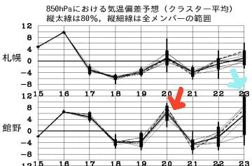
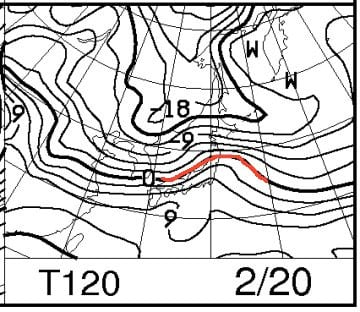
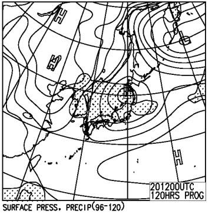
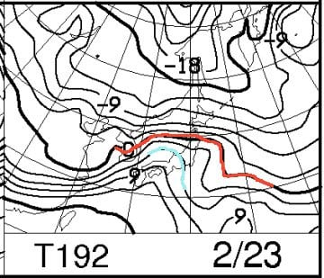
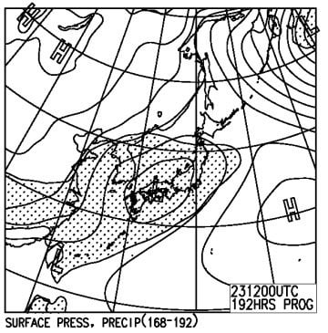
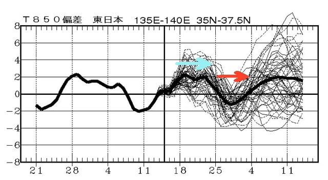
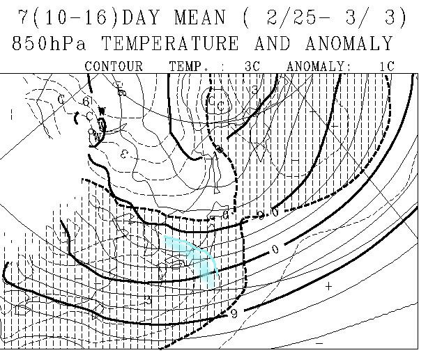

# ぐはぁ！来週は20日，23日とかなりやばい高温になりそう…

📅 投稿日時: 2017-02-17 01:54:27

ということで．

どうやら，来週…

うむむむむ？？？？

なんだ，この20日と21日の異常高温は…っ！！？？

20日の850hpa気温を見てみると．

うむむむ？？

赤く印した0℃線は東北地方まで上がって，

志賀は+3℃線がかかってるよ！？？

そして，地上天気図は…

ううううううーむ．

降水域の網掛けが，広く日本を覆ってますが…

まぁ，低気圧が志賀高原の北を通ってくれそうなので．

南風は吹き込むけど，志賀はそんなにひどい降りに

ならずに済みそう…

そして．

23日，だ．

うぎゃーーー！！

赤く印した0℃線は青森近辺まで上がり．

志賀高原には水色で示した+6℃線が！？？

これは…志賀高原でも+5度以上に上がってしまいそうで…

で．地上天気図を見ると，だ．

チーン．

ダメです．

この日は，ダメです…

残念ですが．

志賀高原でも降ります．

それも，液体が降ります（涙）

うーむ．

23日の木曜雨になっちゃったら．

来週末のゲレンデは，アイスバーン化しそう

なんですが…（泣）

とりあえず．

来週一週間は，ちょいと気温が高めの

日が現れる一週間になりそう…（涙）．

で．

24日以降はどうなるか．

24日以降も高温が続くのか？？

FCVX14を見てみると…

青く印した，来週．18日から24日までの期間．

高温が続きますが．

…再来週，赤く印した25日から4日までは．

平年より気温は低くなりそう！

FCVX12，一か月予想図から．

再来週の予想を抜き出してみると…

ふむ．

2月25日～3月3日まで．

水色で囲った，平年より1℃気温が低くなるエリアに

志賀高原は入っているので．

再来週は，平年よりは冷え込みそう…

…高温になるのは，来週一週間だけで

収まってくれそうな感じです…

今シーズンは，1月に入ってから，

結構冷え冷え期間が続いたので．

その反動でこれから高温期間が続くのか…？？

と，心配しましたが．

そう言うことはなさそうかな…（一安心）．

でも．

もう一度，この図を見てみると．

3月4日以降．

また気温が上がりそうなのがちょっと気になるなぁ…

というか．

かなり気になる．

うーむ．

もう今シーズン．

先週のような，冷え冷えパウダーは

望み薄なのかな～．

望み薄かな～．

…だとすると．

ちと寂しい感じではあるけど．

今シーズンは太板を買わずに済みそう

そう．

買わなくて済みそう．

うん．

今シーズンは太板無くても大丈夫だな…

と．

必死に自分に暗示をかける，Skier_Sなのだった…
