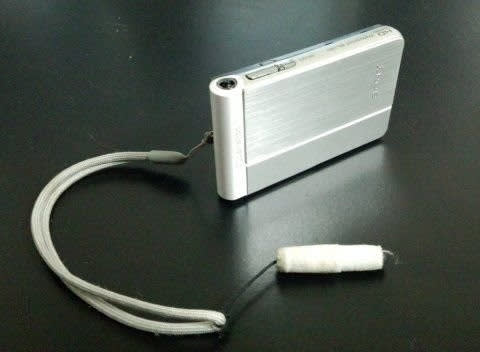

# そして，落としたデジカメは出てこなかったよ…というわけで，後継機種を買わねばならぬのだが

📅 投稿日時: 2017-05-23 01:27:13

えー．

先週のかぐらで紛失した，

わが愛用のデジカメ，SONYのTX30．

（在りし日の写真（泣））

残念ながら，一週間たっても

出てこなかったようで…（涙）

今頃は，かぐらの雪の下深くに

埋もれているのでしょうか…（泣）．

…まぁ．

でも，

記録マニアともいえる私のメインマシンだった，

このカメラ．

3年間で3万8000枚ほど撮影しており←どんだけ写真撮ってるんじゃ

1万枚が寿命と言われるコンパクトデジカメの寿命

を激しく超えていて…

シャッターボタンの接触が悪くなってきてたり，

手ぶれ補正モーターの振動がブルブルするとか，

「そろそろマズいかな～」

と，思っていたころなので．

まぁ，買い替え時ではあったのですが…

「単体デジカメなんか買わず，スマホでいいじゃん」

…って声も聞こえてきそうですが．

だめなのだ．

私のカメラに対する要求は高いのだ

スマホのカメラでは，要求を全く満たさないのだ…っ！！

そもそも，スマホのカメラでは．

ゲレンデで，グローブしたまま

さっと取り出して写真を撮るのは

難しいし．

あー．

私は，ゲレンデで滑りながら写真を撮るという

芸をよく使うんですが．

＃ゲレンデで滑りながらデジカメを構えている私を

＃見たことある人が，読者にもいるのでは…

グローブしたままの片手でさっと取り出して

そのまま撮れるデジカメじゃないとできない技で．

これ，スマホじゃ無理だと思う…

さらに，ゲレンデで一日100枚近い写真を

撮っちゃう私．

スマホで写真を撮ってたら，電池が無くなっちゃう…

ってことで．

無くしたデジカメの後継機を探さねばならぬわけですが．

これまで使っていた，TX30.

こいつが良くできてたんですね～．

カメラとしての基本的な絵作りは

結構きれいで．

さらに，広角が好きな私は．

換算24mm程度の広角が欲しい…

暗くなると自動で働くマルチショット

（複数写真の重ね合わせによるブレ除去）で，

暗所にも強いし．

スマホのカメラだとここまで広角の

写真は撮れないし．

旅行用カメラとしては，かなりいい感じでしたね～．

…こんなコンパクトなくせに10m防水で，

スキー場でびしょぬれにしても大丈夫だし．

シュノーケリングなんかでも，海の中に

もっていって撮影できるし．

鏡筒が出っ張っておらず，

電源を入れてもレンズが繰り出さない

カメラのため，起動も早く，

頑丈だったし．

有機ELのモニタもきれいで，良いカメラだったなぁ…

そして，このカメラで気に入っていたのは．

動画撮影機能．

普通のカメラだと．動画撮影では

電動ズームが使えないとか，

あるいはモーター音が入らないように

ズーム速度が異常に遅く，

スキーの動画を撮るには適さない…

ってカメラが多いところ．

こいつは光学4倍＋5倍デジタルズームを使って，

20倍望遠で動画が撮れ，ズーム速度も速く．

スキーの動画撮影用ビデオカメラ代わりにも

使えるという．

いやーー．

良いカメラだったなぁ…（しみじみ）

だもんで．

TX10,TX20,TX30x2台…と，

このシリーズのカメラを，[これまで
4台も使い続けてきた](e7b1ed1c4f2346b92cd121b28a9e45143.md)のですが．

しかし．

2年前に製造中止になった，このカメラ．

後継機も出ておらず，すでに同じモデルを

入手することはできないという…（泣）

さて．

・防水＆頑丈

・鏡筒が繰り出さない・起動が早い

・液晶モニタの画質がきれい

・広角側換算24mm

・動画ズームが早い・デジタルズームミックス

　でもいいので換算300mm以上の望遠

・グローブしたまま起動・ズーム・撮影が

　片手でできる

…などという，要求レベルの高い，

超ワガママな要求

を満たすカメラは，はたしてあるのか…！？？

（続く）

## 💬 コメント一覧

### 💬 コメント by (しんちゃん)
**タイトル**: こんなのはいかがでしょう
**投稿日**: 2017-05-23 21:44:14

タッチペン付きの超特徴のあるカメラが未だ発見されずにいるのは切ないですね(^^ゞ

かぐらの雪の神様にカメラが見つかりますように、お祈りの踊りを踊っておかないといけないかもしれませんね

←そんなのはないですけどね(笑)

さて、買い替えるなら↓こんなのはいかがでしょう。

ご希望の仕様を満たしている気がします。

https://www.olympus-imaging.jp/product/compact/tg4/index.html

### 💬 コメント by (いさ)
**タイトル**: 物欲（カメラ編）期待してます
**投稿日**: 2017-05-23 23:30:16

TX30、いいカメラですよね。薄型コンパクト、使いたいときにさっと取り出し、スライドするとすぐ撮影。グローブつけたまま操作できて超便利ですよね。私もウエア胸ポケットに必ず忍ばせています。（その前はTX10を愛用してました！）後継機もう出ていないんですね。特に不満なく使っていたので知らなかった…ざんねんです。

しかし、約4万枚とは、、、板同様、マテリアルにとっては過酷な使用環境ですね。要求を満たすカメラはでてくるのか？後継機種選びに期待してます。

### 💬 コメント by (鈍足メタボランナー)
**タイトル**: Unknown
**投稿日**: 2017-05-24 00:03:37

たまにスキーもやるランナーです。

オリンパスのTG－２を使ってますが、防水耐衝撃で起動は速いです。

問題は重いことかなあ。

価格の安いＴＯＵＧＨシリーズも、ありますよ。

### 💬 コメント by (Skier_S)
**タイトル**: すでに購入済みでした…
**投稿日**: 2017-05-24 01:32:57

＞しんちゃんさま

いや～．

TG-4も有力な対抗候補だったんですが．

動画撮影時にデジタルズームが効かず，

スキーの滑りを撮影するビデオカメラ代わりとして

使うには，ちょいと物足りないか…

というのがあって．

NIKONになりました～！

でも…

TX30が出てきてくれないかな～．

踊ったら出てきますかね～．

ちょっと，踊ってみます…

＞いささま

いやーー．

TX30，ホントに名機でした．

モニター画面もきれいだし，

防水なのにごつくなくてすごく小さいし，

起動も早く，グローブしたままさっと撮れるし…

後継機が出てほしかったのに，残念です…．

記録マニアの私は，年間1万枚ほど写真を

撮っちゃうので，カメラの消耗も激しいです…

＞鈍足メタボランナーさま

TG-2も，防水で名機ですよね～．

TG800シリーズも結構いいカメラだし．

昔はダイビングにはOlympusを

愛用していました…

ただ，遠くから滑ってくるスキーヤーを，

望遠で動画撮影する…という要求には

ちと物足りないところがあり，

今回はNIKON製品となりました…

