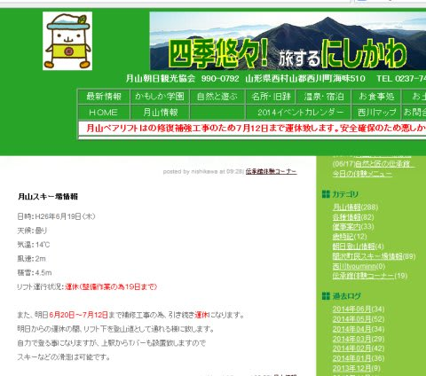

# 今週末は…山形にまでは行ってみる．うん．山形までは．

📅 投稿日時: 2014-06-20 01:02:04

ということで，だ．

昨日書いたように，月山リフトは

しばらく運休になるらしいのだが．

…でも．

この週末の月山行きは，もともと家族で行く予定で．

滑った後のサクランボ狩りやら温泉やら，

おいしいものの食べ歩きやらを，

家族は楽しみにしていた…というのもあるし．

もうずっと前から，山形市内の宿も抑えているので．

…とりあえず，山形には，行こうかな…と．

で．

肝心の月山は，というと．

…[って感じ](http://www.gassan-info.com/)で．

リフト下を歩いて登れるようにするらしく．

そして，歩いて登った先で，Tバーは営業するらしく．

…まぁ．

せっかく山形まで行くんだし．

まぁ，月山の麓までは，行ってみようかな…

と．

…ということなので．

この週末．

月山の「ふもと」までは行ってきます．

…え？スキー板？

…スキー板，ですか．

一応ね．

念のため．

念のために，持っていきますけど．

「月山リフトが止まっているのに，

板を担いで登って滑った人」という，

救いようがないレベルで終わっちゃった人に

なりたくないな，とは思っているので．

滑らないで帰ってくる…

…つもり，なんだけど．

もしかすると．

せっかく月山まで行くんだから．

観光がてら，ちょっとだけ，リフト沿いを

歩いてもいいかな～…

と，思っている自分がいたりする．

とりあえず．

この週末．

月山の「ふもと」までは，行ってみます…

## 💬 コメント一覧

### 💬 コメント by (ゆうこ)
**タイトル**: 麓まで行けば
**投稿日**: 2014-06-20 11:09:51

K県からわざわざ板を持って月山麓まで行って登らない人の方が意味不明なので、是非登ってください。

スキーダイエット法にさらなる項目が追加できますね！

### 💬 コメント by (Skier_S)
**タイトル**: ゆうこさま
**投稿日**: 2014-06-20 21:44:34

うーむ．

確かに，わざわざ板をもって麓まで行ったら，

滑らない方が意味不明かも…（＾＾；

でも，今回は，娘とのサクランボ狩りとかが

メインですから～！

…と，一応は言ってみる．

### 💬 コメント by (ひろちゃん)
**タイトル**: 月山是非楽しみましょう
**投稿日**: 2014-06-20 21:59:50

エス様お疲れ様です。先週、無理しながら、月山に、さよならして、良かったです。実は、明日いくかもでしたが、仕事が入りでした。梅雨中休みで、かなり、雪無くだが、やはり、月山で、心整理しないとですね、応援してます(⌒-⌒; )

### 💬 コメント by (Skier_S)
**タイトル**: ひろちゃんさま
**投稿日**: 2014-06-20 22:15:15

日曜は雨になりそうですから…

先週滑れたのはラッキーでしたね．

明日は，シーズン終わり恒例の，

雪にサヨナラの儀式だけしてきます～．

