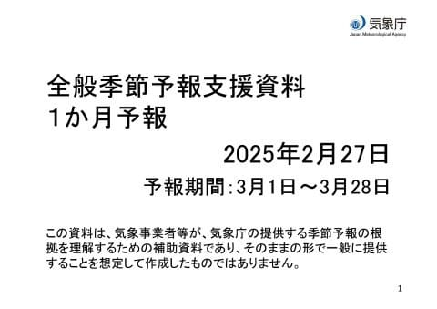
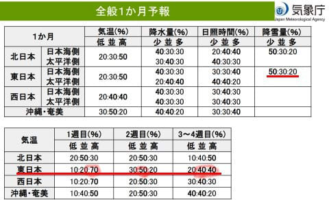
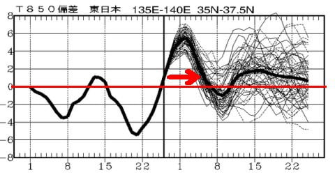
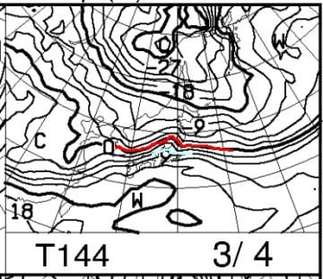
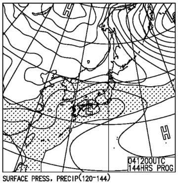
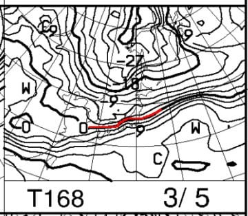
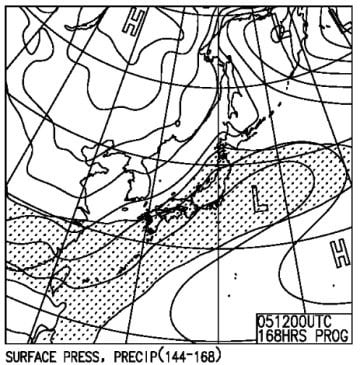
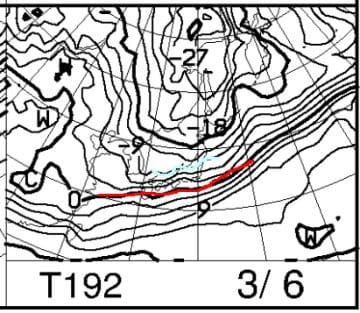
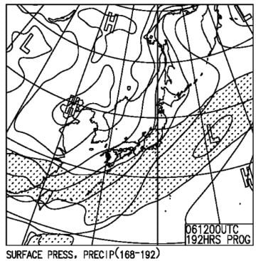

# 気象庁の3月の1か月予報が出たよ！…1週目は高温，あとは平年並み～わずかに気温が高めな程度で志賀の雪は大丈夫かな．でも，来週3/4～5日にかけても雨？？

📅 投稿日時: 2025-02-28 02:25:43

🏷️ カテゴリ: [日記](cc4b5682fb7b8b144980957a978653fb0.md)

ということで．

今週中に終わらせなくてはならない仕事が

まだ3つほど全く手つかずで残っている

今日この頃．

仕事をやっつけなくてはならないのに，

シーズンの疲れ（睡眠不足？）のせいか，

夜に起きてられず…

いつもなら，「夜中にやっつけるぞ！！」

と夜中に頑張るのですが．

最近は仕事を終わらせる前，夜中の2時か

3時ごろには眠たくなって起きてられず…

倒れたように寝るか，気づいたら床で

寝てるかのどっちかです（泣）

まぁ，毎週末このペースでスキーしていて，

平日も4時や5時まで起きて仕事してたら

死ぬと思うので，できれば2時や3時には

寝ないと…←いや，2時や3時でも十分遅いよ…今日ももう2時過ぎてるよ…

しかし．

その状態なら，普通はBlogなんて書いてる

どころじゃないはずなのに…毎日Blogを

書いているのは，余裕があるのか？？

とりあえず，今日ももう夜中2時を過ぎている

のに．

そして，まだ仕事が終わってないのに，

Blogを書いて現実逃避してます…←それが仕事が終わらない理由だよ

ということで．

いろいろマズい状態なので，

今日は手短に更新…！

で．今日は木曜日なので…

はい．そうです．

気象庁の1か月予報の発表日！

今回の予報は，3/1~28日までという，

ほぼ3月まるまる一か月分の予報です！

果たしてこの3月はこれまでと同じ

冷え冷えが続くのか？？

あるいはダメダメ3月になるのか？？

3月は春スキーを占う大事な時期なので，

ドキドキしながら見るわけですが…

概要を見ると．

1週目は，平年より気温が高い確率が70%と，

かなり気温が上がりそう…（涙）

でもまぁ，これは3月1，2日の週末が

異常な高温になりそうということがすでに

分かっていて，ある程度覚悟済み．

続く2週目は平年並みが50％，

3，4週目は平年並み＆平年より高めが40％と，

平年よりちょい高めになりそうですね…

まぁ，850hPa気温のグラフを見ても，

3月1日を中心として気温がすごい上がり

ますが，その後は大体平年並みか

平年比+1-2℃程度高めな感じ．

うーん．3月下旬，平年比+2℃が続くと

痛いんだけどな…（泣）

まぁ，平年比+1度で収まってくれれば，

まだ許せるんだけど…←なぜ上から目線？？

とりあえず，この3月は，3月4日くらいまで

高温期間が続き，

そのあとは一旦平年並みになり，

後半は平年並み~気温ちょい高め…

ということで．

昨年のような奇跡の3月にはならなさそう

ですが．

3月中旬以降は多少気温が高め傾向は

あるものの，壊滅的高温が続いて雪が

解けまくる…ということもなさそうです…　

ということで．

3月でヤバいのは第1週．

昨日の予想で，3月2日の日曜は早ければ

昼過ぎ，遅くても夕方から，空から液体が

落ちてきそう…

と予想しましたが．

その雨は3日月曜の朝まで降り続き，

3日の朝から，また雪に変わってくれそうです…

が．そのままずっと雪に変わるかというと，

どうやらそうでなさそうな天気図に

なってきました…（泣）

3月4日の850hPa気温を見ると，

赤い0℃線は東北まで北上し，志賀高原は水色の

+6℃線がかかっているので…

これだと何があっても，奇跡が起きても，

もし降るなら空から落ちてくるのは液体（泣）

で，地上天気図を見ると…

うぎゃーーーー！！！

ダメだ！！

日本全域降水量がある網掛け領域に

かかっているので…

4日の火曜，雨になりそう…（泣）

おそらく朝のうちは雪だろうけど．

午後，あるいは夕方から雨になります（涙）

そして，5日水曜は．

850hPa気温を見ると，この日はぎりぎり

赤い0℃線が志賀高原にかかっているので…

この日は降れば雪に戻ってくれそう．

ちなみに，5日も日本は降水域に覆われて

いるので…

5日も終日降りますね．

液体→固体に変わるタイミングはまだ

正確に読めませんが…午前中は液体が降る

かもしれないけど，午後に雪に変わってくれ

そうかな…

で，6日の木曜は…

うわ．

この日は逆にすごい極端に，水色の-6℃線が

志賀にかかっていて…

これは，平年より低い気温に戻ってます！！

…極端なんだよな…

そして，この日も本州中央部は

降水域がかかっているので…

この日は冷えた雪がちょっとは

降ってくれそうな感じ…！！

とりあえず，

3日(月)；日曜午後から朝まで雨が降り続け，午後は雪に戻る

4日(火)：朝のうちは雪だけど，リフト営業のころから雨になり，

　一日雨かも？結構な雨になりそう…

5日(水)：朝から午前中まで雨，昼から夕方にかけ雪に変わる？

6日(木)：朝から雪．気温がぐんぐん下がり雪が積もる．

　かなり冷える

という感じで．

2日(日)夜→3日(月)昼頃

4日(火)朝→5日(水)朝ごろ

まで，2回空から液体が降り，2，3，4，5日の

4日間は，雨にたたられた4日間になり

そうです…(泣)

ただ，その後6日から冷えてそこそこ冷えた

雪が積もりそうなので…

8日の週末までにはガチガチアイスバーンは

隠れてくれそうかな…？？？

ってなことで．

今週日曜以降，水曜までは試練の日が

続きそうですが…

その後すぐの雪でバーン状況が回復するという

予想に，期待！！

（そして今日も手短に更新のはずが，長い記事に

　なってしまった…)

## 💬 コメント一覧

### 💬 コメント by (レインボー77)
**タイトル**: Unknown
**投稿日**: 2025-02-28 13:00:10

金曜日の志賀高原情報

朝の蓮池-2℃、暖かい。今日も最高のカミカミコンディション。

ヤケビも奥志賀も勘違いバーンばかり。今日はしっかり上級者になれた(気分に浸れました)。

圧巻はやっぱりさ○らちゃん。彼女のキレッキレターンを、あのYouTubeで有名な○楽さんがやってたけど、やっぱり何をやらせてもうまい人はうまい。私もしばらくはこの課題で退屈しない日々が続きそうです。

そして恐ろしい出来事が！　帰路(12時頃)の蓮池がなんと+8℃を記録。これはシーズンワーストです。もう春が来ちゃうの？

### 💬 コメント by (副院長)
**タイトル**: Unknown
**投稿日**: 2025-02-28 15:31:08

ああ、低気圧がぁ。もう少し南に下がってくれませんかね。それか、急遽今年はうるう年にして、一日ずらしてくれればまだ少しましなんですが、そうはいきませんかね～。でも行きます。よろしく。

### 💬 コメント by (Skier_S)
**タイトル**: 今週末は滑りに行けず（涙）
**投稿日**: 2025-03-01 03:00:11

＞レインボー77さま

今日は思ったほど雪が緩まなかったんですね…！

でも，気温は+8℃ですか(泣)

気温は，明日明後日の土日がピークで，まだ上がりますよ(涙)

＞副院長さま

日曜は何とか夕方までは降らずに持ちそうな予想になってきました…！！！

ご安心ください．

ただ，月曜は降ります…

運が良ければ昼間は雪ですが，雪だとしてもかなり湿った，

ゴーグルに張り付くような雪です…

