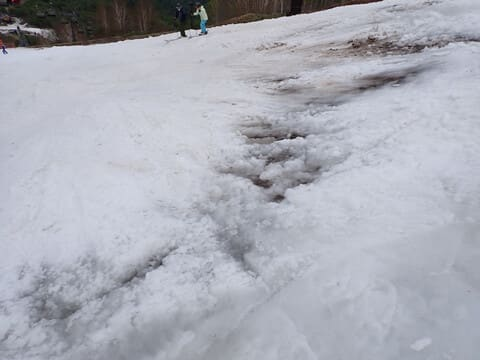

# 2024/5/12(日）かぐらスキー場ファイナルの速報レポート！…曇り時々晴れ，一瞬ポツポツ雨．コースはかなり混んで昼頃にはかなり土が出てきてたけど，リフトは待ちほぼ無し！

📅 投稿日時: 2024-05-13 01:44:58

🏷️ カテゴリ: [2024スキー滑走日記](c453f687e8a0f05679e95831d0a02cd0c.md)

というわけで．

予定より1週間早く，本日最終営業日と

なったかぐらスキー場で滑ってきました～！

今日も帰宅後にやっつけなきゃいけない

仕事が突如発生し（涙），そしてまた

明日も朝早いので，今日は速報モードで

本日のかぐらのレポートです！

…まず，あさイチは気温は高めながら

曇り空．

ペアリフトに乗車できる人数しか

ゲレンデに送り込まれないので，

朝のうちは人数が少なかったけど…

9時半を過ぎてくると，ゲレンデの

人口密度はすごいことに…（泣）

コース幅が狭いこともあり，

人が多い午前中のコース上の人口密度は

かなりすごかったです…

ただ，狭いコースに高速クワッドリフトで

人を送り込んでいるからコース上が

混むだけで．

リフトの待ち時間はそれほどひどくなく．

平均的に搬器2-3台待ちくらい．

午後はほぼ飛び乗りで．

リフトに関しては，こんなに空いてていいの？？

って感じでした…

天気が悪くなる予報にもかかわらず．

昼間は日差しが出てかなり暑くなったり

したこともあり…

コース上は午後になると雪が融けて，

そこかしこで雪が薄くなり，土が

出てくるところ多数…（泣）

そして，当然のごとく．

午後は多くの人間による掘削作業で，

コース全面コブになるので…

コブ溝にはそこかしこで土が

出てきます（泣）

うーん．

かつてのかぐらなら，この状況から

まだ1週間営業したこともあった気も

するけど．

午後遅くになると，石ころを踏まずに

滑り降りるのが難しいくらいの状況に

なってきました（泣）

やっぱり，もう終わりって感じですね…

ってな感じで．

15時30分にかぐらクワッドが終了し．

今シーズンのかぐらも営業終了と

なりました…

あぁ…寂しい…

うーん．

無理すればあと数日は営業できたと

思うのですが．

あと1週間は厳しく，来週末まで

営業できなさそうならあきらめよう…

ということなのかな．

とりあえず，これにてかぐらも終了！

残るは横手山第4リフトと，月山の

2か所だけとなりました（涙）

あぁ…シーズンが終わるのが早すぎる…

また明日，余力があれば詳細レポート

します！←と書いておいて，最近余力がないパターンが多いよね…
