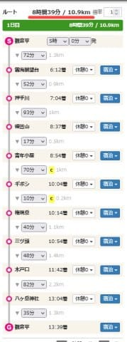

# 山登りの膝の痛み予防のサポーターは効いたのか？？本格的な登山でチェックしてみた

📅 投稿日時: 2021-07-21 02:36:28

🏷️ カテゴリ: [日記](cc4b5682fb7b8b144980957a978653fb0.md)

ということで．

ここ2年ほど，

登山の下り坂で右膝が痛くなる…

という残念な症状が出るようになり．

騙されたと思って，痛みが出にくくなるという

膝サポーターを購入してみたわけですが．

[前回の低山ハイキング](ed5d3fb11d9a830f9ae2b172dd8a3caf8.md)では，

歩行距離20km，獲得標高差1100mでも

膝の痛みが全く出ず．

そこそこ効いているように感じたものの．

いや．

それほどきつくない山だったから

痛みが出なかっただけかもしれない．

もっと過酷な山で試してみないと

…と．

こないだの[日曜の記事の冒頭に
軽く書いた](e7ce78fd6da2778d043fac8eeda8c62b8.md)ように．

土曜日に，本格的な山で試してきました～！！

登ってきたのは，南八ヶ岳の，

編笠山＆権現岳．

この地図の赤い線で書いたルートに

沿って，ぐるっと巡ったんですが．

赤く囲った部分．

コース図が黄色くなっているのは，

鎖場などがあって，そこそこ本格登山になる

難易度Cのコースを表します．

前回，膝の痛みと積雪のため，

標準コースタイム以上の時間がかかった

編笠山のリベンジと，

鎖場や岩登りがあるような，そこそこ

きつい本格登山のコースでも

膝が大丈夫か試してみよう…

ということで，このコースを選んだわけですが．

愛用している，[ヤマレコ](https://www.yamareco.com/)で

ルート設定してみると…

標準コースタイムは8時間39分．

まぁ，ぼちぼちの登山コースですね…

そして，青年小屋から権現岳山頂までは，

難易度Cのマークがついてます．

ってなことで．

さすが難易度Cのコースだけあって，

久しぶりにちょっとドキドキする

ところもある山登りで．

かなりの急登もあり…

（矢印の先に人がいます…このてっぺんまで登る！）

多少の高度感もある山でしたが．

妙義山ほど手強くは無く．

景色も良くて，すごい楽しい山でした！

（ここも，矢印の先に人が…）

ちなみに．

上の写真の出っ張った岩が権現岳の

山頂なのですが．

さすがにここのてっぺんに立ち上がる

根性は無く．

てっぺんタッチだけしてきました…

ってなことで．

登山の日記はまた別に書くとして．

膝のサポーターは効いたのかどうか？

というところですが．

結果的には．

効きました！！！！

膝は全く痛くなりませんでした！！！

それも今回．

いつもなら膝が痛くならないよう，

抑え気味ペースで登るところ．

あえて昔と同じペースで飛ばしてみたのですが…

全然大丈夫でした！！

まず．

登りのログ記録スタート直後．

左上の時計が示すよう．

午前5時ごろ登り始め，

赤丸で示すように，コースタイム1時間6分と

示された，雲海展望台へ向かうのですが…

雲海展望台着はコースタイム1時間の

半分となる，30分後の5時36分到着．

ヤマレコアプリは優秀なので，

コースタイムの半分で登ったら，

その先のルートもそのペースで

登った時間で計算しなおしてくれて．

次の押手川までは

コースタイム51分のところ，半分の

23分で到着，到着時間は6時5分と

予想してくれています…

で．

実際に押手川に着くと．

予想23分のところ，24分で到着！

実際の到着時間は6:07と，予想は

かなり正確ですね！

こんな感じで．

トレーニング＆膝への負荷テストも

兼ねて，飛ばし気味のペースで登り続け．

編笠山頂到着は7:07．

スタート地点からのコースタイム

3時間37分のところを，半分強の

2時間で駆け上りました…

そして．

ここからさらに権現岳へ登りますが．

…ここは，景色のいいところで休止したり，

山頂付近で30分の休憩をとったので，

ほぼコースタイム通りの移動で…

で．

権現岳山頂からの下りも飛ばす！

膝のテストを兼ねているので，

あえてちょっと負荷をかけてみました．

ここもコースタイム3時間25分のところ…

2時間27分で下りてみました．

登りはコースタイム半分ペースでしたが，

下りはコースタイム70％程度と，

ペースが落ちますね…

でも．

最終的には標準コースタイム8時間39分のところ．

5時間48分で移動し．

昼過ぎに下山できました…！

膝のテストであえて飛ばしたのですが．

これだけのペースで移動しても，

結果的に，

全然膝が痛くなりませんでした！

…というか．

膝が痛くなかったから，これだけの

ペースで飛ばせたんですよね…

昨年，これより短い編笠山～西岳ルートを

歩いた時，膝の痛みもあり11時間以上

かかったことを考えれば，劇的改善！！

ということで．

この膝サポーター，私にはかなり効果が

あったようです！

以前のペースで山登りができるように

なったので，嬉しい限り…

これで，以前同様．

かなりのコースタイムの山も，

安心して日帰りプランが組めるように

なりました～！

いやーー．嬉しい．

万人に効くかどうかは保証できませんが．

少なくとも私は効果があったということで．

登山時の膝の痛みに悩んでいる人は，

試してみる価値はあると思います…

（今回はCW-Xタイツの上に着用）

## 💬 コメント一覧

### 💬 コメント by (ヒータロゥ)
**タイトル**: Unknown
**投稿日**: 2021-07-21 07:11:45

ＺＡＭＳＴはバレーボーラーでよく怪我をした私にとって馴染み深いメーカーです。どのサポーターも出来がよく品質が高いです。右手首の骨折跡にも使用中ですが他のメーカーより安定したホールド感あってリハビリ中であった状態でも安心してスキーできました。どこか痛いところある人にはお勧めです。

### 💬 コメント by (Goku)
**タイトル**: Unknown
**投稿日**: 2021-07-22 07:32:53

以前、腰痛になった時にお貸ししたベルトもこのメーカーでした。

### 💬 コメント by (Skier_S)
**タイトル**: 4連休だけど…
**投稿日**: 2021-07-23 02:08:30

＞ヒータロゥさま

やっぱりZAMSTは利用者が多いんですね…

これまであんまりサポーターにお世話になってなかったので…

いや．効きました…

＞Gokuさま

そうだったんですね！

覚えてませんでした(笑)．

おかげさまで，腰は今はもう痛くないです！

