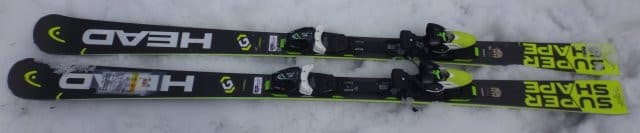
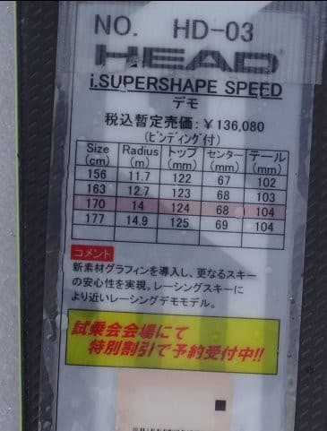
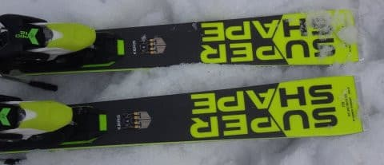

# 2018シーズンモデル，スキー試乗レポート第23回…HEAD編その3

📅 投稿日時: 2017-07-05 00:43:43

🏷️ カテゴリ: [スキー板試乗](c0bd8048615710cee890e403a36cc9a2b.md)

ということで．

先日の月山で，私のスキーシーズンは

終わってしまいましたが．

…まだまだ続く，スキーネタ．

そろそろ残り少なくなってきた，2018年モデルの

スキー板の試乗レポートです…！

本日はヘッド編．

4月3日の一の瀬ダイヤモンドの試乗会で一度乗った，

i-Supershape Speed．

4月下旬の一の瀬ファミリーでもう一回乗ったので．

そのレポートです…

では，どうぞ～！

---- 

◎HEAD i-Supershape speed 170cm　（2回目）

基礎オールラウンド

前回履いてみて，比較的いい感じを受けたこの板．

SX亡きあとの次世代機候補ということで，

もう一回乗ってみました…

[以前試乗した](e74940c210e231c5e3d48322df90f360e.md)のと長さも同じの板です．

前回はダイヤモンドスキー場の緩斜面だったけど．

今回は一の瀬正面バーンの急斜面を，

自分のリアルトップスピードを含め

試してみました…

急斜面を攻めてみたところ．

谷回りで体をしっかり落としていくと，

板のトップが雪面に食い込み，

トップがインにステアしていく感じで，

エッジが効いてくーーっと曲がっていきますが．

エッジは妙に頑張りすぎず，エッジが

食い込んでいく山回りでも，

板をずらそうと思えば割とルーズなずれで

動いていきます．

…これは，板が動かしやすいとも言えますが，

X-RACEのように，ひたすらスピードを上げていっても，

どこまでもガッツリグリップして，どこが限界か

分からない…というような，どこまでも耐える感はなく．

ホントのトップスピードでは，ちょっと

心持ち板が逃げていく感じも受けます．

…あー．

これは，かなりのスピード域での話です．

普通のゲレンデではめったに出さない

スピードでの話ですので…

割と前後動を使っていく板かな．

トップに乗ってトップをたわませてやると，

トップから食いついて回っていく感じで．

トップがクッと入って切れていき．

山回りでテールを抑えていくと，

板がすっと切り替わっていく…

という感じを受けます．

ミドルターンから大きめのターンに

向いた板ですが．

比較的動かしやすいので，ズラシの

小回りまでもっていけなくもないです．

とりあえず，比較的どっしりした感じがあり，

そこそこのスピードまで耐えて，

エッジグリップもあるけど，

その中でも板が動かしやすく，コントロール性が

高い…

という板でした．

大回りベースで，一セットであらゆるシチュエーションを…

ってのならおススメの一つかと．

…ただ，リアルなトップスピードで滑る場合は．

X-RACEの方がいいかな～．

だもんで．

私の次世代機候補からは外れました…

## 💬 コメント一覧

### 💬 コメント by (Goku)
**タイトル**: Unknown
**投稿日**: 2017-07-07 22:55:25

かみさんの時期候補のひとつに上がってます。

163cmでは長いかな？って おもうけど、その下だと短い気もするし…

かみさんが163で長ければ、私の小回り用になりますか？

### 💬 コメント by (Skier_S)
**タイトル**: Gokuさま
**投稿日**: 2017-07-08 01:59:13

この板の163cmは履いていないので，

確実ではないですが…

おそらく，奥さんなら問題なく163cm履けると

思いますよ．

ただ，もともと小回り用に特化したような

返りの早い板ではないため，

小回りメインであればi SLの165cmの方が

面白いと思うのですが…

…でも，奥さんにはi SLの165は長すぎますか．

小回りスペシャルじゃなく，小回りベースの

オールラウンドと割り切れば，163cmで

行けなくはない気がします．

…ただ，やはり163は履いてないので，

正直なところ断定はできません…

役立たなくてすみません（謝）．

### 💬 コメント by (Goku)
**タイトル**: Unknown
**投稿日**: 2017-07-08 14:54:11

なるほど～

今乗ってるフィッシャーＳＣ165と、スーパーシェイプ163、プロポーションはほとんど同じですけど板の性格が違うので、あとはかみさんの好みの問題ですかね。

あとi-SLは私がいま一番気になってる板です。

### 💬 コメント by (Skier_S)
**タイトル**: Gokuさま
**投稿日**: 2017-07-09 09:24:12

そうなんですよ…

私が試乗した170cmはR=14とちょいと

大きめのサイドカーブだったので，

ちょっとSC165とは性格が違う感じです．

163cmは，サイドカーブが12m台なので，

どうかわかりませんが…

でも，FISCHERの来シーズンのSCも良かったですよ．

