# 定番ネタ！…1シーズン，12000km走ったスタッドレスタイヤ，YOKOHAMA iG5+はどのくらい減ったのか？

📅 投稿日時: 2022-05-13 02:25:20

🏷️ カテゴリ: [車](cba0e8330b3f2ded7c1addfacc75d4547.md)

ってなことで．

GWの間の休みに，LEVORGに履かせていた

スタッドレスタイヤ，YOKOHAMA iG5+を

夏タイヤに交換したので．

いつもの定番ネタをば…

まず，このタイヤは今シーズンの最初から

履いていたんじゃなくて，今シーズン最初の

11月から12月末までは古いスタッドレスを

履かせていて，

[12月末に新品に交換した](cba0e8330b3f2ded7c1addfacc75d4547.md)…

という経緯のタイヤ．

なので，厳密には1シーズン履いておらず．

12月末からGWまで，だいたい4か月で

12000km走ったタイヤになります…

ちなみに，古いスタッドレスで

11月から12月いっぱいまで，

約4000km走ったので．

今シーズンは2セットのスタッドレスで

トータル16000km走ってますね…

昨シーズンまでの2シーズン，

コロナで走行距離が短かったけど．

今シーズンは大体いつものシーズン

並みに戻ってきたのかな…？

ってことで．

いつも通り，タイヤ交換するわけですが…

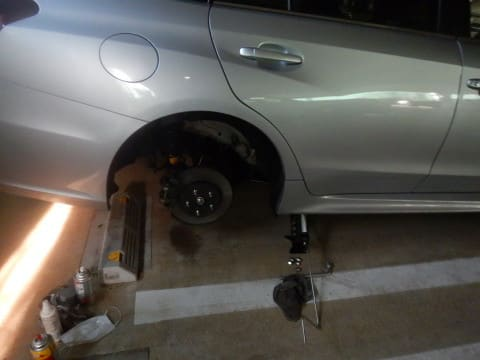

12000km走ったタイヤ，フロント側の

減りを見てみると．

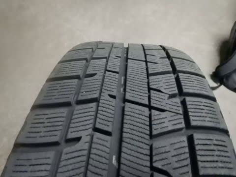

うーん．プラットフォームまでの

1/3強ほど減ってるかな…？

このペースだと，3シーズンは

もたないように感じますが…

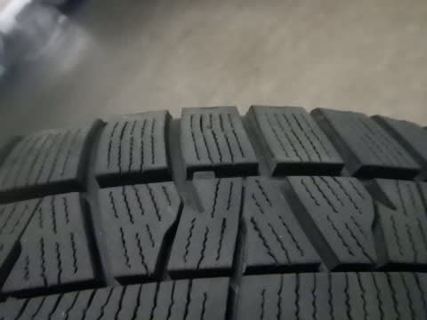

でも．

リアタイヤの方を見ると．

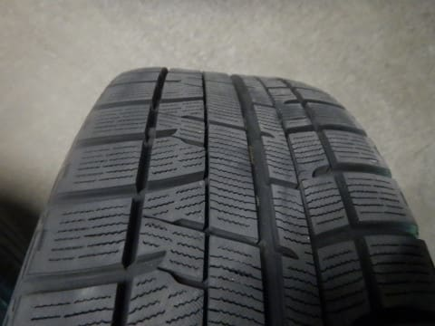

なんだか，まだ新品の時のギザギザの

表面加工が残ってますよ…！！

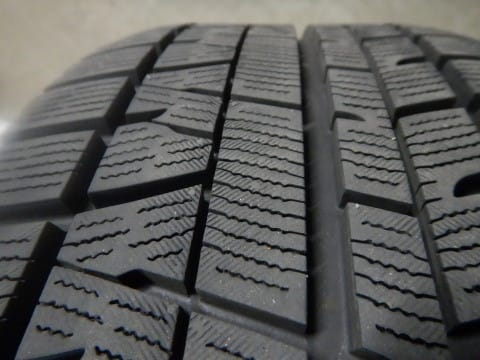

当然のごとく，プラットフォームまでも

まだまだ残っていて，ほとんど減ってない

感じ…！！

これなら，フロントが1/3以上減っていても，

フロントとリヤを上手くローテーション

すれば，3シーズン，4万kmちょいはもって

くれそうかな…？

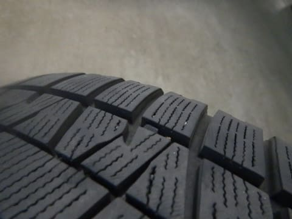

ってなことで．

タイヤを外したついでに…

今回もいつもの定番作業，

凍結防止剤で汚れた下周りを徹底的に

綺麗にしますよ…！！

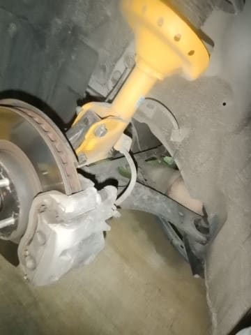

…いや～

1シーズンぶんの凍結防止剤＆泥汚れが

すごい…

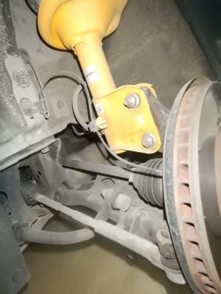

当然のごとく，徹底的に汚れを落として…

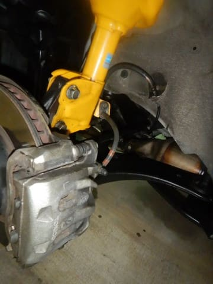

そして，いつも通り，シャーシコート！！

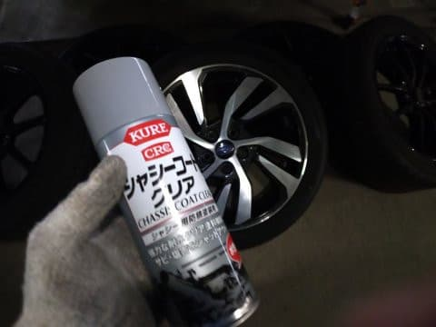

ガッツリ吹きかけておいて，また下周りを

しっかり保護してもらいましょう．

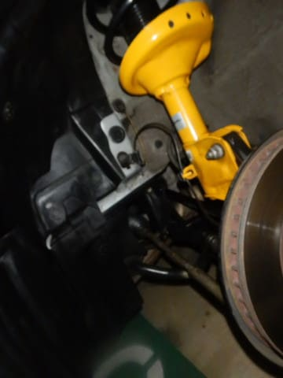

そして，リヤ側も…

かなり汚れてます（涙）

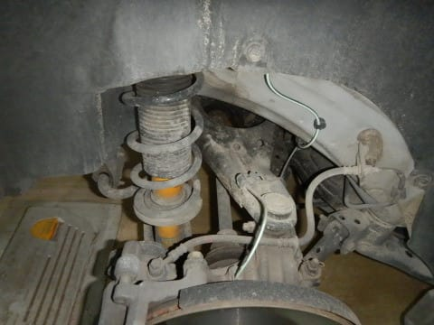

フロントより汚れ方がひどいですね…

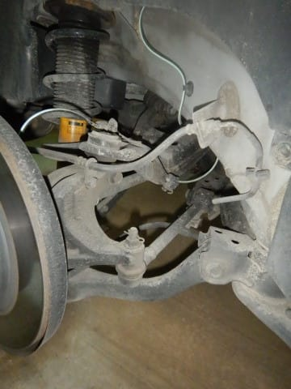

こいつも徹底的に磨き上げる！！

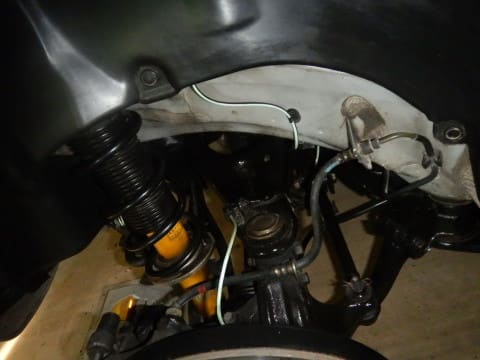

そして，さびないようにコーティング！！

…うむ．

95000km走っている足回りには

見えなくなったぞ．

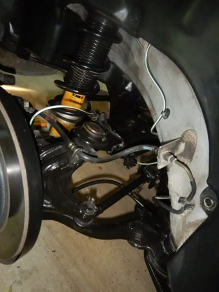

ってなことで．

無事，夏タイヤ装着完了～！！

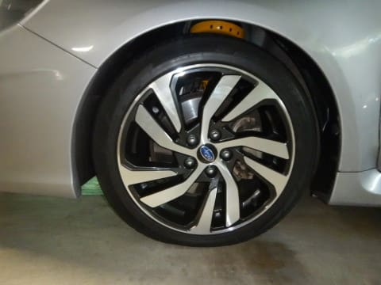

…せっかくのGWの谷間の，一日

スキーをしない休みというのに．

タイヤ交換＆下回り磨きという

肉体労働で（タイヤを家から駐車場まで

往復運ぶのも辛い…），その一日を

使い切ってしまったのでした…
