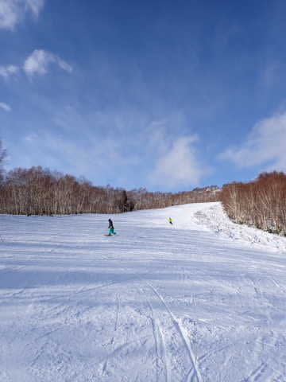
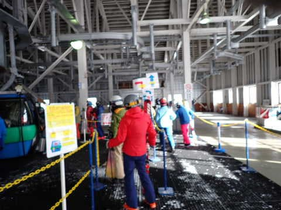
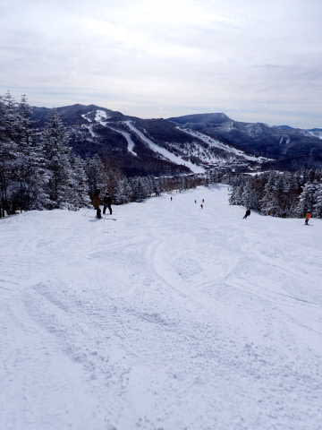

# 2023/1/22(日)の志賀高原スキー場，速報レポート！…晴れ時々曇り．ゲレンデの雪質は最高で冷え冷えガラガラ，間違いなく今シーズンベスト！！

📅 投稿日時: 2023-01-23 03:47:12

ってなことで．

今日もラストまで滑って深夜に帰宅して．

一仕事終えると，こんな時間…(涙)

だもんで．

今日の志賀高原，速報レポートで

お送りするのですが…

その前に．

…今晩見たら，これから一週間の予想

天気図が結構変わっていたので，

改めてこれから一週間の天気の

予想を簡単にお伝えします！

これから一週間の志賀高原は…

23日(月)：降りません．晴れ~曇り．

　絶好のスキー日和

24日(火)：朝は西風で降りません．

　昼のどこかのタイミングで北風になり，

　それ以降ドサドサ降ります

25日(水)：朝はどっさりパウダー．

　一日中降り続く．エンドレスパウダー．

　激冷え，吹雪いて荒れる

26日(木)：24日から続いた雪は

　朝には雪は降り止む．

　曇り空だけど晴れ間もあるかも？？

　あさイチパウダーねらい目

27日(金)：難しい．10~20cmくらい

　雪が降るかも…

28日(土)：冷える．25日ほどではないけど

　雪降りの一日．

29日(日)：まだよくわからん…たぶん

　雪はそんなに積もらない

って感じで．

月，木曜以外はずっと雪が降り続け，

来週末も雪が降りそうです…！！

土曜の雪で，焼額はコース上の

ブッシュはほぼなくなったけど，

まだ例年よりは雪は少なく，

一の瀬ファミリーのパーフェクター

コースはまだ空いてないし，東館や

ジャイアントは雪が薄いみたいだし…

この一週間の積雪に期待！！

週の後半はまだどうなるか分からないので，

また時々予想を更新していきます…

ってなことで，本題へ．

本日の志賀高原ですが…

いやーーーーーーーー．

良かった．

最高でした．

シアワセでした．

天気もいいし，雪もいいし．

ゲレンデもガラガラだし．

バーンは荒れないし…

最高の一日でした！！！

まず，今日は朝から日が射す，

最高の天気でスタート！！

晴れてるのに-10℃以下に冷えてて，

シーズンで数回あるかどうか…

という，最高級の冷え冷え雪が

見事に圧雪された快楽バーン＆

晴天の組合せ！！

いやーーー．

人生，このために生きてるんだよ！！

最高…！！！

と，感激の涙にむせびながら滑るような

最高級のバーン！！

シマシマが消えても，最高級の雪質だし．

人も少ないし，天気もいいし…

そして，焼額第1ゴンドラは，午前10時過ぎの

1回だけ混んだけど．

それ以外はゲートの外まで並ぶことは無く．

だいたいこのくらいの待ちでガラガラ

だったし…

当然，ゲレンデもガラガラ！！

最高雪質で，人がいないゲレンデを

飛ばし放題！！

そして，人が少ないから午後になっても

バーンが荒れない！！

最高雪質のバーンを，終日大回り可能！

ただ，天気は終日晴れってわけではなく，

時折曇り空になったけど…

でも，雲は薄くてゲレンデは明るいので，

曇ってた時もバーンは見やすくて

滑り良かったよ！！

ってなことで．

営業終了まで，雪質は最高だし．

人は少なくて飛ばし放題だし．

バーンは荒れないし．

ゴンドラ待ちも無かったし…

もう，最高．

間違いなくシーズン最高の一日でした．

毎日こんなだったらいいんだけどな～…

ってなことで．

明日，詳細レポートやります～！！

## 💬 コメント一覧

### 💬 コメント by (レインボー75)
**タイトル**: Unknown
**投稿日**: 2023-01-23 19:57:45

月曜日の志賀高原情報

今日も冷え込んで、天気もそこそこで、まさに悶絶バーン。

ヤケビのどこもかしこも悶絶バーン。

奥志賀またしかり。

奥志賀高原ホテルでの昼食を試みましたが、スリッパへの履き替えはNG。やむなくグランフェニックスへ。今日の海鮮丼はまた凄い。品数の多いこと。旨すぎて安く感じます。

ところでいつもいいものを食べてるなと感じておられる方へ。私らはリッチとは無縁の庶民です。ただ志賀高原の未来が心配で贅沢しようと決めているだけなのです。これもまた金持ちになった気分を味わえるだけ気分がいい。

そして今日のメインは、20000メートル達成者がでたことです。

といっても一ノ瀬の神、レジェンド様です。ファミリー第三が運休なのに、ファミリーで、昼間だけで60数本。このご時世での達成は、まさに神！すごすぎますよね。

皆さま、真似しない方が無難かと。

### 💬 コメント by (レインボー75)
**タイトル**: Unknown
**投稿日**: 2023-01-23 20:13:57

お借りします。

なるなる様。ファミリーのレジェンド様は本日月曜日にファミリー60数本を滑られて、またもや20000メートルを達成されましたよ。

あの方のお言葉「慣れですよ」は、まさにご謙遜のお言葉で、普通は慣れてもできません。ファミリーは急斜面のうえ下が狭くなるため、怖いのが普通かと。

ただあのおかたは、たぐいまれなスピードコントロールができるうえ、目が魚眼なので視野が広いのです。今度確かめてみてください。

### 💬 コメント by (なるなる)
**タイトル**: Unknown
**投稿日**: 2023-01-23 22:22:06

レインボー75様

やられましたか。まさに神です。

狙わずに出来るのが凄すぎます。

昨日は、もう歳なのでとか仰っていましたが…w

### 💬 コメント by (Skier_S)
**タイトル**: 明日の午後から大雪！
**投稿日**: 2023-01-24 02:20:58

＞レインボー75さま

いやー．

昨日も良かったけど，今日も良かったでしょうねぇ…

そしてお昼も美味しいものを食べられたみたいでいいですね～！

志賀高原にお金をいっぱい落としてください！！＞自分はお昼のレストランにお金を使わない裏切者

しかし，某レジェンドさま，リフト運転速度が遅くなったファミリーリフトで20000m越え

ですか…

あのひざの状態で，とても人間とは思えない．

…って，あの方人間じゃなかったですね（笑）

＞なるなるさま

あの方はスキー用に改造されたサイボーグですから…

でも，すごい．すごすぎる．

私にはとてもまねできません…

### 💬 コメント by (富山県民)
**タイトル**: Unknown
**投稿日**: 2023-01-24 12:38:04

はじめまして。

僕も１月２２日に志賀高原で滑りました。

今までは平日ばかり晴れてましたがやっと週末晴れました。

僕は午前中は熊の湯と横手山で滑って午後は東館山→高天ヶ原→一ノ瀬→焼額山→奥志賀の順に滑走しました。

横手山からの景色は薄雲は多かったですが青空も見えていて妙高山や北アルプス、浅間山、榛名山、赤城山などの山々が見えました。

横手山山頂は樹氷も少し見られました。

２１日はよませ温泉スキー場と高井富士スキー場を滑走して２２日は２年ぶりに志賀高原で滑走しました。

### 💬 コメント by (Skier_S)
**タイトル**: ＞富山県民さま
**投稿日**: 2023-01-25 03:01:01

始めまして~！！

コメントありがとうございます．

22日滑ってらしたのですね．

私は一日焼額にいたので，どこかでお会いしているかも…

横手山は景色良かったですか！寒かったんじゃないでしょうか？？

また志賀高原にお越しください！！

…その時はぜひ焼額メインで(笑)

