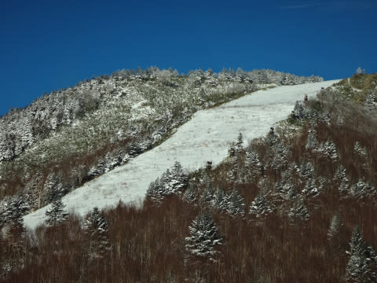
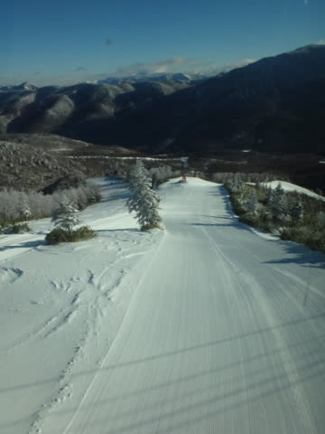
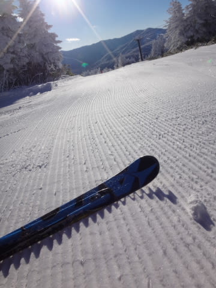
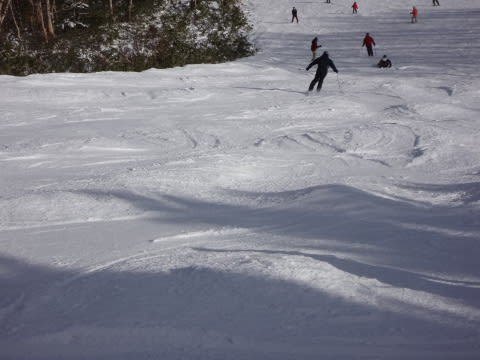

# 12月28日，月曜の志賀高原は…天気晴朗なれど積雪少なし（涙）．

📅 投稿日時: 2015-12-29 03:50:26

🏷️ カテゴリ: [2016スキー滑走日記](c70c67ed5248e9432b899dcd5747048bb.md)

はいはいはいはい．

月曜も，会社を休んで滑っちゃいましたよ～．

ってことで，今日も志賀高原のレポートを行くのだ！

えー．

朝は，すごい晴天っ！

というより，上林チェーン場までは，

路面にも雪が全くないんですが…

…よーするに．昨日からの積雪が

なかったってことだな（涙）．

＃上林のチェーンチェックから上は

＃気合の入った積雪路面ですので，ご注意を

そして，やってきました焼額第1ゴンドラっ！

今日から，待ちに待った第1ゴンドラの営業開始ですっ！！！

ああ…この看板も8か月半ぶり…！

帰ってきたよ，第1ゴンドラっ！！！

…しかし．

第1ゴンドラから見えるオリンピックコースが…

なんじゃ，こりゃ．

…オリンピックコース，オープンは

まだまだ先のようだな…

でも，今日オープンのジャイアントスラロームコースは…

ふむ．

良さそうな感じっ！

ってことで．

山頂へ到着すると．

気温は-12℃！

冷え冷えですっ！

いやーーーーー．

帰ってきたよ，わが心の故郷（なんのこっちゃ？），

ジャイアントスラロームコースっ！！！

天気はピカピカ，雪は冷え冷え！

朝の1本目は…

うはーーーーっ！

チョー気持ちいいっ！！

んもう，最高っ！

やっぱり第1ゴンドラはいいっ！

…と，数本滑っていると．

あら？

あれれ…

やっぱり，結構混んできちゃいました…（涙）．

でも，第1ゴンドラの待ちは，最大でもこの程度．

これで，2-3分待ちってところでしょうか．

いや．

昨日に比べればずっとまし．

30分待ちに比べれば，許す．

ぜんぜん許せる…

と，結構人が多いゲレンデを滑っていた，

午前10時過ぎ…

あれ？

なんだ，こりゃ？

…

…

なんだー！こりゃーっ！！

雪が薄いよっ！！

…おかげで．ブッシュというより，

そこかしこに，地面が出てきてます（大泣き）

はっきり言って，避けて滑るのは無理なレベル．

午前11時以降の第1ゴンドラのGSコース．

石を踏まずして下山するのは不可能でした．

おかげで．

朝はあれだけ人であふれていたコース．

昼ごろには…

…誰もいない．

そして，ゴンドラも，飛び乗り状態に…

ゴンドラ待ち時間が無いのは嬉しいけど．

しかし，コース状態がひどすぎる…（泣）．

だもんで．

第2ゴンドラのパノラマコース側へ逃げてみましたが．

うむ．

こっちはやっぱり，人が多いぞ．

…混んでる…（残念）．

そして，人工雪で硬くて．

さらに，コースも凸凹だよ（涙）．

うーむ．

人が多くて雪が固いけど，ブッシュの少ない第2ゴンドラにするか．

石が多くて滑れたもんじゃないけど，

人がいなくて待ちの無い第1ゴンドラにするか．

究極の選択状態だな…（激泣）．

とりあえず．

第1ゴンドラがホームゲレンデの私は．

石が出ているのをものともせず．

こーゆー状態の第1ゴンドラを滑り続けたのでした…

そして．

3時半の営業終了時には，こんな状態に…（泣）．

でも．

こんな状態でも，ゴンドラ営業終了まで焼額を

滑っている自分．

えらい！←何が偉いんだ？？

で．

焼額営業終了後は．

そう．

一の瀬へ移動です．

本日から，一の瀬ファミリーの正面バーン上部が

オープンしたらしいので．

Blogネタにせねば！

と，焼額から車で移動しました（笑）．

で，一の瀬正面バーンは…

一見まともそうだけど．

ゲレンデに出てみると…

…

…

だみだ，こりゃ．

やはり，ここも．

コース上，かなり土だらけ…（涙）．

そして，コース全体的に，人工雪の

ちょいと固めの斜面で．

うーむ．

あんまり楽しくないかも…（残念）．

と，思いながらも．

夕日が沈むリフトストップまで，

一の瀬で滑っていた，Skier_Sだったのでした．

で．

まだ，終わらない．

終わりません．

はい．

そうです．

ナイターです．

いやーーーーー．

やっぱり，こういう日はナイターだねっ！

しっかりたっぷり人工雪がつけてある，

焼額第4ロマンス沿い．

そして，圧雪かけたて…

最高っ！！

シアワセっ！！

いや．

この斜面．

どのくらいしっかり人工雪がつけてあるかというと．

営業中に降雪機が動いちゃうくらいなのだ←普通営業しているコースに降雪はやらないと思う…

うーむ．

こんな間近で降雪機が動いてるの，初めて見たよ…

ってことで．

この日もナイター営業終了まで滑り．

朝イチ（の2本くらいだけ）は最高だった第1ゴンドラと，

ナイターで．

とりあえず満足できた，Skier_Sだったのでした…

しかし，明日，第1ゴンドラ側のGSコース，滑れるのかな…？？？

オープンするとは言ってるけど…

あー．ちなみに私は，現在自宅に戻ってます．

だもんで，29日のレポートはありません…

明後日30日から，再び志賀に行く予定です．

＃あくまで志賀に「行く」であり，志賀に「帰る」ではない

＃ところに注意←それより，ナイターまで滑ったあと5時間以上運転して帰宅して，帰宅後こんな時間にレポート書いているところがツッコミどころでは？

## 💬 コメント一覧

### 💬 コメント by (マルハバ)
**タイトル**: 私の錯覚でなければ・・・
**投稿日**: 2015-12-29 07:07:51

連日、Ｋ奈川県から

“通勤”されてるように見えるのですが？・・（汗）

### 💬 コメント by (いか)
**タイトル**: Unknown
**投稿日**: 2015-12-29 07:42:35

どこも土まみれのようですね…

私は昨日ゴンドラに7時に並んで11時まで待ちましたが動かず…、ピザ食べてビール飲んで帰ってきました。

そのため滑り納めは日曜日となりました。

日曜日がパウダー祭り50センチだったので諦めもつきましたよ（笑）

スカイラインのリフト待ちは伝説になりそうです。（写真をアップしてみました）

### 💬 コメント by (Skier_S)
**タイトル**: 今日はスキーしない一日でした
**投稿日**: 2015-12-29 20:56:22

＞マルハバさま

確かに，普段の週末は志賀に

「通勤」しているように見えるかも…（笑）．

この3日間は，中野市街の宿に泊まっていたので，

毎朝志賀の登り坂を登ってました…

さすがに連日ナイター終わった上に

K奈川県から通ってたら，自宅滞在には1時間

くらいしかいられませんから（笑）．

＞いかさま

写真見ましたが…

スカイラインがあんなに待つとは…

歴史に残るリフト待ちですね．

さらに，動かないゴンドラ待ちお疲れ様でした．

滑らずに一日終わっちゃったんですね…

