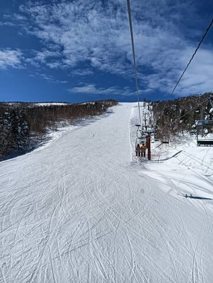
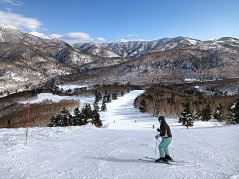
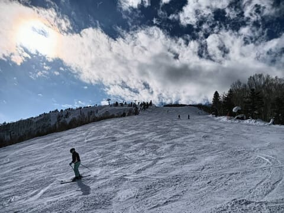

# 2月28日の志賀高原スキー場は，晴れ~曇りで気温は上がったけど雪は良かったみたい！…そして私は今週末は志賀高原に行けず（泣）

📅 投稿日時: 2025-03-01 03:59:34

🏷️ カテゴリ: [日記](cc4b5682fb7b8b144980957a978653fb0.md)

えー．

私の感覚が間違ってなければ．

今，すでに日本は3月の世界に突入して

しまった気がするのですが…

ちょっと待て．

3月といえば…私が口にするのも嫌な，

春

という季節になってしまうのではないか？？

花粉が飛びまくり，スキー場のトップ

シーズンが終わってしまう，私の

大嫌いな季節ではないか？？？

そして，シーズンが短いスキー場は，

そろそろ営業終了の声が聞こえてくる

季節ではないか…？？

ウソだ…

ウソだと言ってくれ！！

まだ今日は，2月29日のはず…

明日は2月30日で，明後日は2月31日の

だよね…

3月はまだ先だと言ってくれ…！！！

そして．

トップシーズンが終わってしまうこの時期．

今後，いい雪で滑れるチャンスはだんだん

減っていくので…

当然，今週末も滑りに行きたいのだけど．

このBlogの2億7千万読者のほとんどが，

今週末も私は志賀高原に滑りに行くと

思っているでしょうけど．

…今週末は，滑りに行けないのだ（泣）

今週末は，終わってない仕事をやっつけ

なくてはならないのと，娘の勉強を見なくては

ならないのと．いろいろあって…

睡眠時間を削って何とかなるくらいなら

何とかして滑りに行きたいけど．

それだけでは間に合わないので，

今週は志賀高原に行けないのだ…（泣）

ということで．

今週末，焼額でSkier_Sを探してもいません

ので，ご注意ください．

あぁ…滑りに行きたかった…

28日の金曜の特派員からの写真を見ると．

気温が上がり，雲が多かったものの

晴れ間も多い，絶好のスキー日和だった

ようで…

気温は上がっても雪は思ったほど緩まず，

かなりいい感じの一日だったみたいです…！

…確かに，雪がそんなに緩んでるようには

見えませんね…

雪は結構締まってきたので，

明日の朝はかなりいいんじゃないかな？？？

という，特派員からのレポートで…

うがーーーー！！

滑りたい！！

滑りたいよ～！！！

とりあえず，この土日の天気図を改めて

見てみると．

明日の土曜はやっぱり焼額の山頂でも

気温は+7℃から8℃くらいまで上がり，

暑く感じるくらいになりそうなものの，

終日晴れていい感じで，朝イチは

かなり締まったいいバーンを滑れそう

だし．

明後日の日曜も，気温が上がりそうな

ものの，夕方まで降らなさそうな予想に

変わってきました…！！

おそらく，一日ほぼ曇り空ながらも，

リフト営業終了までは液体は降らずに

済みそうです…！！

そして，月曜の気温も当初予想より

ちょっと気温が冷えそうな感じになって

来たので…

夜の降り始めから朝まで液体が降るかも

しれないけど，リフト営業開始前後から

雪になって．

昼間はかなり重い，ゴーグルに着くと

前が見にくくなるような湿った雪ながらも，

かなりの勢いで雪が積もるかも…？？

昼間だけで20-30cmの重い雪が積もりそう．

月曜の朝のうちの，雨から雪に変わった

直後は，ガリガリバーンの上に重い

雪が乗った滑りにくいコンディションか

もしれないけど．

重い雪が積もっていけば，下地の

ガリガリが隠れていってくれそうな感じ…

ってなことで．

この週末も，雪は緩みそうながらも

思ったよりいい感じの週末になりそうな

天気図を見て，

何で今週末滑れないんだ

という悲しい気分になっているわけですが．

今週末滑れない身としては，天気がありえないほど

めちゃくちゃボロボロに崩れて，

空からみそ汁とか醤油とかでも降って，

スキーどころじゃなくなっている様子が

特派員から送られてきたなら，心穏やかに

家で仕事ができるんだけど…

と．

遠くK奈川県の地から志賀高原に，

みそ汁が降るように怨念を送ろうと

思った，Skier_Sだったのでした…

あぁ…

滑りに行きたい…

そして今日もまた，夜中の4時近くに

なっちゃっている…（泣）

早く寝ないと…

## 💬 コメント一覧

### 💬 コメント by (hapi44)
**タイトル**: Unknown
**投稿日**: 2025-03-01 10:06:40

初めてコメさせていただきます！

分かります〜

行けない日のゲレンデコンディション…

私も良くない報告を聞いて心の中で喜びます😅

でもたまには味噌汁の降るゲレンデの夢を見ながらゆっくり5時間くらい寝て下さい🤣

### 💬 コメント by (レインボー77)
**タイトル**: Unknown
**投稿日**: 2025-03-01 20:29:54

土曜日の、エス様不在の志賀高原情報

朝の蓮池-2℃。久々に奥志賀ゴンドラ8時00分スタート。まずはダウンヒル。最高の状態でターンを楽しんでたら、隊員が速すぎて離される。あとはさ○らちゃんのイメージで三高で20本。なんかいい感じ。そんなんで10時00分終了。中野のじょうやでトンカツです。

エス様には悪いけど、今日もまた最高でした。

### 💬 コメント by (Skier_S)
**タイトル**: みそ汁は降らず…
**投稿日**: 2025-03-02 03:19:13

＞hapi44さま

初めまして～！

コメントありがとうございます！

そうですよね．やっぱり自分が行けない時にゲレンデのコンディションがいいと，

家で悶絶しちゃうから，天気悪くなってくれたら心落ち着くんだけど…と思いますよね．

今日は一日家にいましたが，仕事と娘の勉強を見るのとスキー板の手入れをしていたら，

また今日も深夜3時を過ぎちゃいました（涙）

＞レインボー77さま

今日は昼間かなり気温が上がったはずだけど，朝は冷えていたので

良かったみたいですね～！！

そして，お昼はじょうやまで下りたんですね．

今は夜営業してないので，じょうやさんには長らく行ってないです…

### 💬 コメント by (富山県民)
**タイトル**: Unknown
**投稿日**: 2025-03-06 12:08:26

こんにちは。

3月はスキー好きには嫌な時期ですね。

気温が上がり春が来てスキーシーズンが終わるのがさみしく感じます。

私は今までは3月は青春18きっぷが使えるので好きでしたが今年の冬から青春18きっぷが連続する3日間または5日間用に改悪されたために青春18きっぷがかなり使いにくくなりました。

なので今年の3月は私にとっても億劫です。

### 💬 コメント by (Skier_S)
**タイトル**: ＞富山県民さま
**投稿日**: 2025-03-07 02:09:30

3月は寂しい季節ですよね…4月になると，まだ気温が上がっても諦めがつきますが．

そして，青春18きっぷの改悪は痛いですよね…

