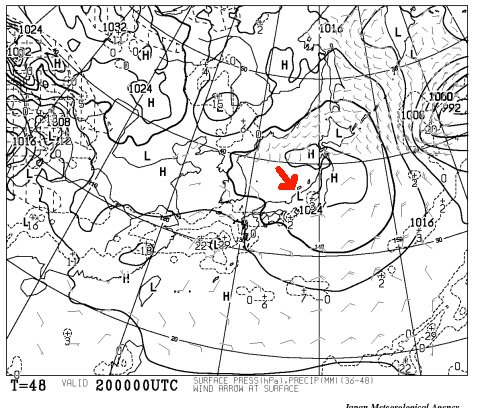
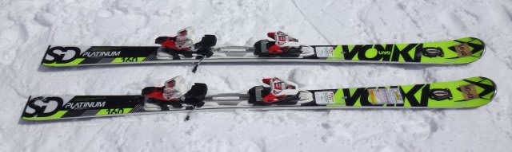
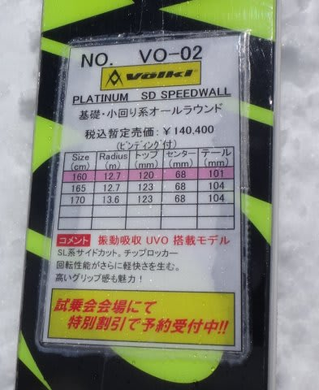
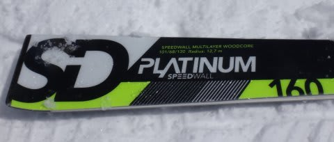
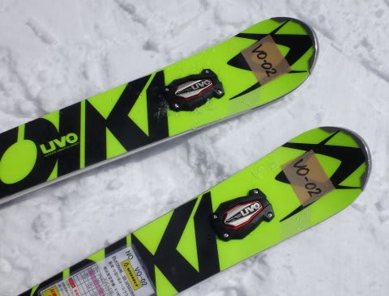

# 2015シーズンモデルのスキー試乗レポート12…VOLKL編その3

📅 投稿日時: 2014-04-18 23:47:35

🏷️ カテゴリ: [スキー板試乗](c0bd8048615710cee890e403a36cc9a2b.md)

あー．

土曜は基本的に，昨日の予想通りの天気になりそうですが．

…なーんか，こんな感じで．

なんだか，日曜朝9時の地上天気図，

ドンピシャ志賀高原を中心とした

低気圧（Lマーク）が予想されているんですが（涙）．

これは．

もしかすると．

…朝からちょっとぽつぽつと．

スキー場に降ってほしくないものが降るかも…

早朝なら雪になってくれそうですが．

うーーーむ．

まぁ，この予想が外れるようにこれから祈りますので．

日曜，雨にならなければ．

それは，私の祈りが通じたということですので～！

ってことで．

本題のスキー試乗インプレッション．

いつもの通り，

あと4時間で出発ですので．

今日は，1機種のみのレポート．

フォルクル編その3です．

-----

VOLKL PLATINUM SD SPEEDWALL 160cm

基礎小回り用．

うはーー！

これは，気に入った！

トップからテールまで，すごく長くエッジが利く．

エッジの接雪長がすごく長い感じ．

荷重ポイントはセンター．

土踏まず部分に荷重すれば，きれいに回っていきます．

センター荷重キープで左右に踏んでいくだけでOK.

かなり張りとエッジグリップは強く．ドライな感じの板．

返りはむちゃくちゃ早いです．

スピードを出していくと，切り替えで板が体の下を

通過し，すっとターン反対にすっ飛んでいきます．

そこで板を抑えていくと，しっかりと足場が確保され，

板が体の下に戻ってきます．

板の動きは軽快だけど，UVOの効果か？スピード耐性も十分．

トップ部のばたつきが少なく，

荒れた斜面でも，滑らかに滑っていけます．

ずらしを使っていろんな小技をしよう，という板ではないけど．

かなりアグレッシブな小回りを楽しみたい方にお勧め．

来年のSXはちょっとマイルドになったので．

強い小回り板が欲しい，って人はこっちが良いかも…

ただ，硬くてグリップ強いので，

軽くてもコブは厳しいか…

とりあえず，整地をアグレッシブにハイスピードで

小回りするには，かなり刺激的で最高に楽しめる板です．

＃ちょっと疲れそうだけど
