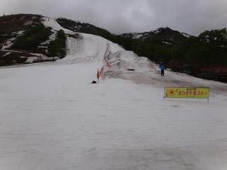
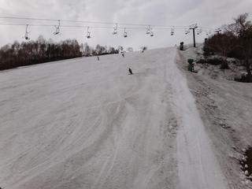
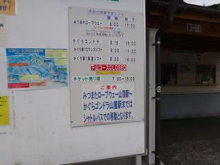
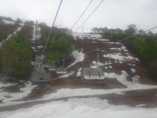
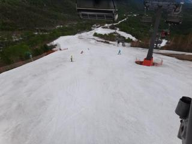
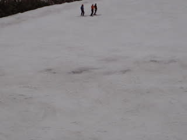
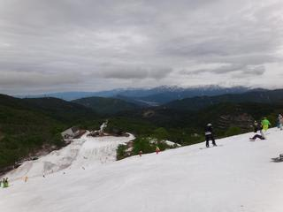

# 5月28日のかぐら　速報

📅 投稿日時: 2011-05-29 04:35:30

🏷️ カテゴリ: [2011スキー滑走日記](ca488c98cfb9169941c3e73770dcefb56.md)

予告どおり．

土曜はかぐらに行ってきました．

雨の天気予報のせいか，人は少なかったですね～．

で，終日曇りで，雨は降らず．

それでいて，人が少なくリフト待ちはほとんど0という…

日ごろの行いがよかったか？？？ラッキー！

ロープウェーからゴンドラは，残念ながら

土曜からバス移動になってました…

テクニカル・ジャイアントは雪が消えてました．

メインコースの雪は，まだコースいっぱいOK.

ただ，午後になるとちょっと土が出てくるところが

ありましたが…

まぁ，雨にならず終日過ごせたので結果オーライ．

詳細はまた明日以降に…
