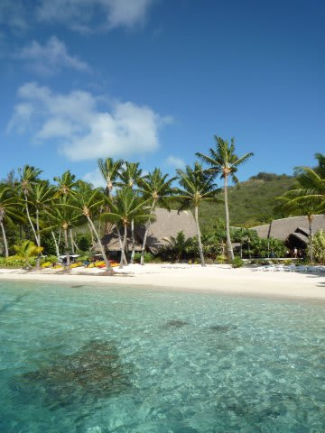
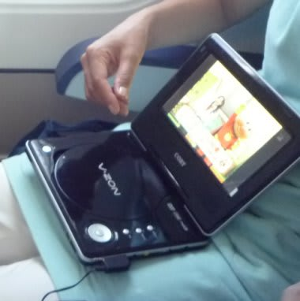
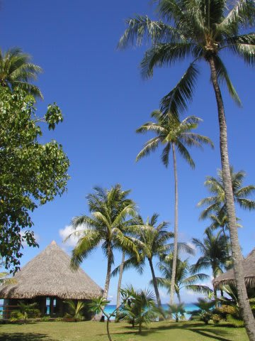

# 2009年　初の海外子連れダイビング旅行記　プロローグ4　子連れ海外旅行の準備

📅 投稿日時: 2012-08-25 01:18:50

ということで．

まだまだ続くプロローグ…

さすがにこれが最後の予定

で．

行く先は決まったので．

予約するわけですが．

2歳までなら，飛行機だけじゃなく．ホテル代も大体タダですね～．ありがたや．

子連れだと，事前にお願いすれば飛行機は前に席がないスクリーン前を確保できます．

タダの子供にも，事前にお願いすればベビーミールも出してくれます．

んで．

予約が終わったら，実際に準備を開始するわけで．

子連れ旅行だ．

さらに，海外，だ．

離島のリゾートだし，現地でのオムツや離乳食の購入は不可能と見て，

必要数分はもっていく必要があるなぁ…

一週間分のオムツだけでかなりの量だよ．

離乳食は，基本的に「食事が食べられないときのエマージェンシー用」

ということで一日一回分くらい．

瓶詰めじゃなく，お湯で溶けばよい軽量コンパクトなもの．

あとは，お菓子を大量に．

＃いつも食べなれているお菓子があると，ぐずったときとか

＃渡せて便利

そして，シールブックなどの暇つぶし用絵本類．

あと，虫除けやら虫刺され，かぶれなんかの薬．

怪我したとき用の絆創膏，消毒薬．

そして，着替え，水着類．

ついつい心配になり，あれもこれも…

ともって行きたくなりますが．

とりあえず，これだけに絞りました．

あー．

しかし今回．

新たにGetしたものがあります．

それは…

じゃじゃーん．

ポータブルDVDプレーヤーっ！

7インチ程度のモニタが付いて，電池で3-4時間くらい見れるやつ．

安売り店にいけば，7000円とかそれ以下で売ってるものです．

こーんなやつと一緒に，いつも見ている番組を録画したDVDを持っていきます．

…はっきり言って．

むちゃくちゃ役立ちました．

とりあえず，静かにさせておきたいとき，

これを見せておけば，しばらくは黙っていてくれます．

日本のTVがやっていないホテルで役立つし．

電池で動くので，移動の待ち時間などのに子供を落ち着かせるのにもいいし．

その他いろいろ役に立って，必殺の武器といっても過言じゃなかったです…

子連れ海外旅行には，超お勧めしておきます．

って感じで．

準備は終えて，後は出発を待つばかりになりましたが．

はたして．

娘は，大人でも辛い，12時間のフライトに耐えられるのか？？

時差に耐えられるのか？夜中にずっと起きてたりしないか？？時差で体調崩さないか？

現地で，食べるものはあるのか？

食べ物や水が合わなくて体調崩さないか？

病気になったりしないか？

何かあったらどうするのか？？

お家に帰りたいって泣かないか？

何か…なにか，現地で「しまったー！」ってトラブルに巻き込まれないか？？？

などと．

出発に至るまで．

心配の種は尽きなかったのでした…

