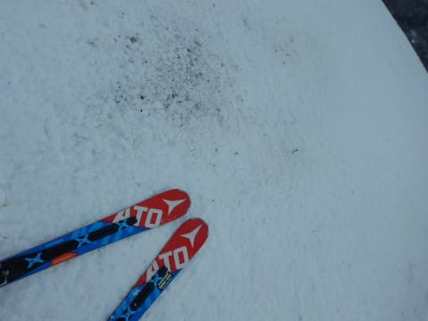
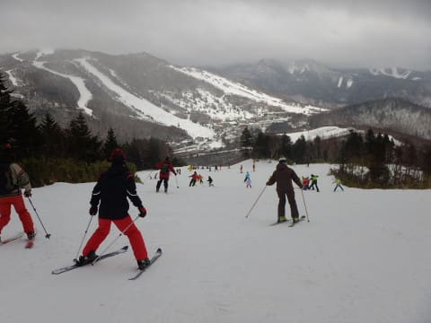
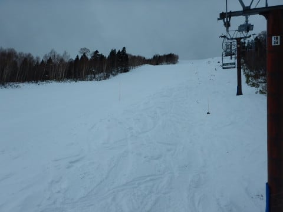
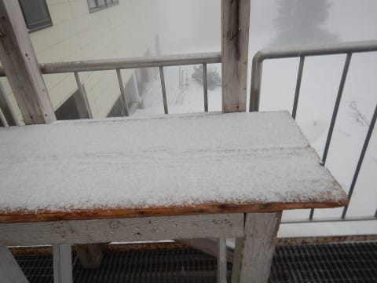

# 2018/12/23(日)の志賀高原スキー場は…曇り時々山頂付近雪，ふもとは雨（涙）．雪は少ないよ…

📅 投稿日時: 2018-12-24 00:53:04

🏷️ カテゴリ: [2019スキー滑走日記](c3e4496fc0fb7f9c17ff21214a35b1ace.md)

ってなわけで．

昨日某国から戻ってきて．

本日，志賀高原に復活しました～！

まず．

朝の志賀高原の登り坂ですが．

雪がないですね…（涙）

気温もプラス4度ですか…

朝の志賀高原としては，気温が高すぎ（涙）

さすがに一の瀬近くまで来ると

路面は積雪路で，ちょっと安心．

そして．

昨日から運転開始した，焼額の第1ゴンドラの

営業開始に並びます…

いやーー．

今シーズン初！

久しぶりのわが生息地，第1ゴンドラ！←いや，住んでないから…

実に8か月ぶりの再開です…（感動）

久しぶりの1ゴンに乗って山頂にやってくると…

…そうですか．

ブッシュが出てますか…（涙）

そして．

気温は朝の山頂で‐1度ですか…

天気も曇り空で．

　23日は…ちょっと微妙な感じ．

　曇り空で，朝は0度をちょっと下回るくらいかな．

と書いた通りの天気ですね．

で．

超久しぶりに滑る，第1ゴンドラの

GSコースに繰り出しますが…

朝イチは…そうです．シマシマっ！！

ところどころちょいと固めだったけど．

でも，シマシマ！

と，思っていたら…

朝イチから，もう．

ところどころ雪が茶色くなってますね（涙）

さらに．

3連休中日の今日．

オープンから1時間も経たないうちに…

ええええ！！

ゲレンデの人口密度がかなりの状態に

なっちゃったんですが…（涙）

当然，大勢の人数で削られたゲレンデは…

雪が．

雪が薄くなっていく…（泣）

第1ゴンドラ側，GSコースを離れて，

第2ゴンドラ側，パノラマ～サウスを

滑りに行ってみますが．

こっちは，GSコースよりさらに

ひどい混雑ですね（涙）

で．

人口密度が高いということは．

雪もさらに削られるということで．

パノラマコースの人工降雪がない

山頂部分．

かなりのブッシュ＆石ころエリア化(涙）

さらに追い打ちをかけるように．

気温が高いために，雪は

「今，４月だったっけ？」

と思うような，激重のかなり残念な

感じの雪に…(涙）

そして．

さらに追い打ち．

第2ゴンドラは最大20分程度の

待ち時間（涙）

（このときはまだ10分待ちだった…）

さらに，一の瀬側からかなりの

人が流れてくる第2高速も，

数分待ちに…（泣）

でも．

GSコースが小石だらけで滑りにくかった

というのもあるのか．

輸送力の高い1ゴンはそれほど混まなかったし．

昨日から運転開始した第3高速は，

終日待ちほぼ0だったので．

まぁ，まだ我慢できたかな…

とはいえ．

やはりゲレンデ状況があまりよくないので．

昨日からほぼ全面オープンとなった奥志賀が

どんな状況か，レポートするために

覗きにいかねば！！

…という義務感のため．

焼額の呪いを振り切って，わざわざ

奥志賀へやってきました！←ただ自分が奥志賀に行きたかっただけでは？

奥志賀のゴンドラ側，ダウンヒルコース．

この看板の通り…

2壁はちょっとブッシュやら小石が

出てましたが．

でも，全体的に焼額よりは

まだブッシュが少な目だし．

何よりコースがガラガラ！

当然，ゴンドラも飛び乗りでした…

奥志賀第3ペアのコースは，ブッシュもなく

結構フラットで滑りよかったかな！

そして，第2ペアの横，エキスパートコースも…

なんと．

急斜面部分はほぼブッシュ無し！

そして，コースもそれほど混んでないし…

今日はエキスパートが一番良かったかも？

ただ．

第2ペア下側の緩斜面は，かなり

土が出てましたが…

まぁ，回避可能なレベル．

と．

奥志賀を滑っていた昼過ぎ…

うぎゃーーーー！！

なぜか，ぽつぽつと空から液体が！（涙）

そんなにひどい降りではなく．

長くは降り続かなかったけど…

雨は夕方からって適当なこと言ったの，

誰だ～っ！？？←自分でしょ

高温と，このわずかの雨のおかげで．

午後のゲレンデの雪は，さらに重く

なっていきます（涙）

そして．

焼額に戻った午後3時ごろには…

山頂付近にはガスが出たり．

コース途中のブッシュエリアは，

さらにひどいことになっていたり．

ちょっと楽しくない感じ…（残念）

さらに追い打ち．

リフト終了30分前に．

また雨が降り出し…

今度はウェアがしっとり濡れる程度の

降りに（激涙）

…リフト営業時間中は本降りには

ならないと思っていたのに…

予想外した…(泣）

でも．

この雨．

ゴンドラ山頂付近ではぎりぎり雪になってたし．

これから気温が冷えていくので．

やはり予想通り，明日までには積もって

くれるんじゃないかな～…

ってな状況の中．雨に濡れつつも．

1ゴンに久しぶりの再会を果たした本日．

再会の喜びのため，今日もしっかり

営業終了まで滑り続けたのでした…

しかし．

夜11時現在．

志賀高原，それほど雪は積もってません（涙）

明日までに，ホントに20㎝積もって

くれるのかな…（ちょっと心配）

## 💬 コメント一覧

### 💬 コメント by (なちちゃん)
**タイトル**: Unknown
**投稿日**: 2018-12-24 02:51:40

エキスパート良かったですよね、私も昼過ぎの雨に打たれましたが

今晩に期待したいですよね

### 💬 コメント by (Goku)
**タイトル**: パウダーDay？
**投稿日**: 2018-12-24 06:59:29

おはようございます。

昨日はお疲れさまでした。

雪はいっぱい積もりましたか？

私の分までパフパフ楽しんでくださいね～♪

### 💬 コメント by (もりや)
**タイトル**: 雪は積もりましたか？
**投稿日**: 2018-12-24 07:12:08

昨日はお疲れ様でした！昨夜はナイターを滑る予定でしたが、手袋が雨でビチョビチョになってしまったので、断念しました(泣)今朝は長野市、須坂市、小布施町周辺は雪が全然積もって無いです。志賀高原はどの位積もりましたか？

### 💬 コメント by (michi)
**タイトル**: ありがとうございました
**投稿日**: 2018-12-24 08:00:15

昨日はラストまでありがとうございました。

あのゲレンデコンディションと雨で15時に力尽きました（笑）

息子はあのペースでお昼15分休んだ以外はずっと滑り続けたのにビックリしました。途中で休まないのでホントに追いついていけなくなりました（爆）

また来週宜しくお願いします！

### 💬 コメント by (若杉勲71)
**タイトル**: すごい人、発見
**投稿日**: 2018-12-24 09:14:25

土曜日にお会いしたあと、静岡の浜北在住86才年間50日滑走、しかも20000クラブ並みの速さ、途中でとまらない、ひとりでジャイアント宿泊、姿勢はピシッとがっちり。あと何年滑れるかという命題に大きな希望をもたらしてくださるかたと知り合いました。多分レイクホテル発で奥志賀まで滑って食事して、また滑って３時まで毎日滑る。

板に『中瀬』とありました。

あと15年滑れるかもという希望が湧いてきました。sさんなら40年以上いけますよ。

### 💬 コメント by (しんちゃん)
**タイトル**: お礼
**投稿日**: 2018-12-24 10:49:50

昨日はありがとうございました！

朝のイチゴン前の雑談は楽しかった（笑）

やっぱり会長S様がいると盛り上がりますね（笑）

早めの治療がよかったのか、朝起きたらマシになってきました。ご心配をおかけしました。

今シーズンもよろしくお願いしまーす(^^)/

### 💬 コメント by (アズマです)
**タイトル**: ご一緒できて嬉しかったです
**投稿日**: 2018-12-24 19:33:21

志賀高原の「神メンバー」にお会い出来て嬉しかったです

柚子胡椒頂きました

Yさんに御礼お伝えくださいーー

### 💬 コメント by (Skier_S)
**タイトル**: 年末は冷えるよ！
**投稿日**: 2018-12-25 01:17:04

＞なちちゃんさま

意外と積もりませんでしたね（涙）

でも，10cmでもゲレンデはかなり改善したし．

今日の午後の焼額は結構良かったですよ～！

＞Gokuさま

20cm予想のところ．

わずか10cm．

圧雪コースは，圧雪の上に3～5cmの積雪，

という感じでした．

GSコースのゴンドラくぐる下，

奥志賀ダウンヒルの2壁とかはまだ土が

出てきてますが．

それ以外は，ゲレンデ状況は改善されましたよ．

＞もりやさま

日曜はお世話になりました～！

あら…ナイター行かなかったんですね．

月曜の志賀高原は，朝までに10cm．

ゲレンデオープンしてからも時折

数cmずつ積もり，朝よりむしろ午後のコンディション

の方が，私は好きでした…

＞michiさま

日曜はお疲れ様でした！

子供たちに付き合うと，自分もオーバースピードに

なってしまいます…

お昼わずかに15分だったんですね！

それで，ゴンドラスタートから終了までですか…

このペースで一の瀬が滑れれば，20000m行ってしまうかも…

＞若杉さま

手袋ありがとうございました～！

使ってみたら，手首も長くカバーされているし，

厚めにもかかわらず，問題なく上に手袋をはめられるし．

使ってみたら結構いいです！

ありがとうございます！

…そして．86歳でそんな本格的に滑りこんで

いる人がいるんですね…

我々も，うかうかしてられませんね…

しかし，いろんな希望になりますね．

こういう方がいらっしゃると…

＞しんちゃんさま

日曜のアクシデント，ちょっとびっくりしましたけど．

朝起きたらマシになってきたということなら．

骨折ではなかったのでしょうか…

しかし，日曜の朝礼＆終礼は賑やかでしたね～．

＞アズマさま

宿＆ゴンドラの中では，お世話になりました～！

今日は珍しいメンバーが焼額に揃いましたよね…

そして，YさんはこのBlogを読んでいますので，

お礼はもうYさんに伝わっていますよ～！

