# 2月23日の志賀高原は…雪質，天気ともに最高！…だったのだが．

📅 投稿日時: 2014-02-25 01:27:33

えー．

ということで．

一日遅くなりましたが．

日曜の志賀高原のゲレンデ状況はというとですね～．

…最高でした！！！！！

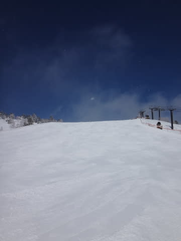

いや．ホント．

[天気予想](e1494efb6b2bff1cd384de4c76efe3e15.md)の通り．

晴れて冷えて．

先週の憂さを晴らすには最高でしたね～．

最後のあれさえなければ…（ぼそ）

とりあえず．

朝イチはマイナス10度まで冷え込み…

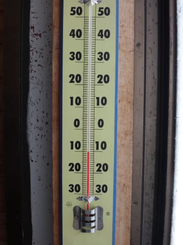

雪質は，比較的締まった圧雪の，絶好コンディション！

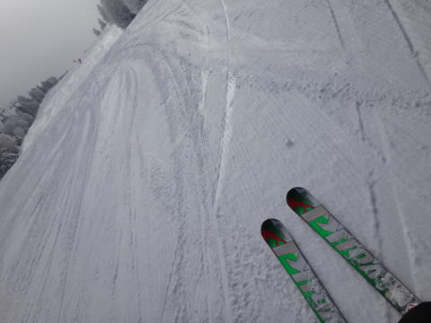

朝のうちはちょっと薄雲がかかっていたけど…

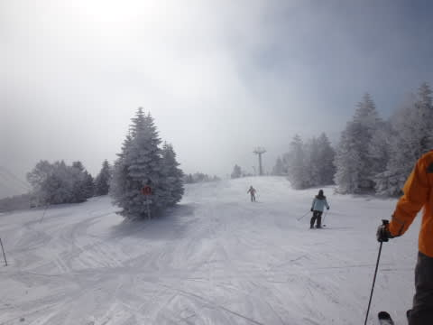

すぐに日が射して…

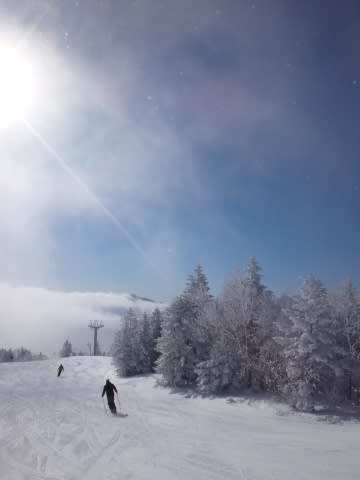

太陽のもと，きれいな冷え冷え圧雪を滑れる最高の

コンディションにっ！！！！！

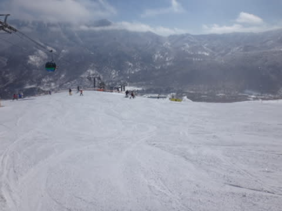

神様，ありがとう～！

ゴンドラは，午前中にわずかに待ちがあったものの，

焼額第1ゴンドラの最大待ち時間はこの程度で．

せいぜい1－2分程度かな．

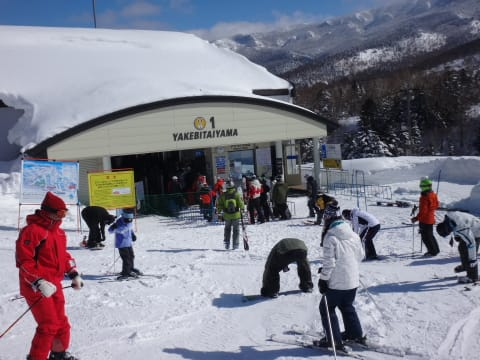

ってことで．

ゲレンデの人も少なく…

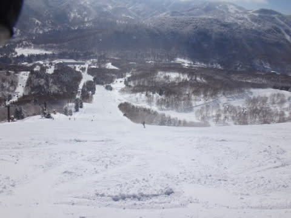

景色もよく…

（一の瀬正面バーンで，人がこんな少なくていいのかっ？？）

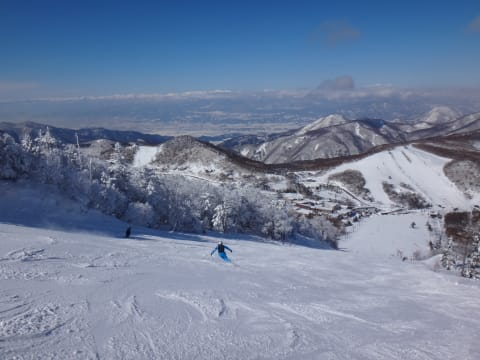

いや，これ以上．

何を望もうというのか！

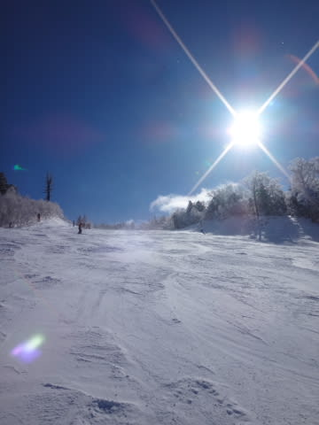

やはり，神様が．

日ごろの行いが大変よいスキーヤーがいるのに．

先週，悪天候で滑れなかったことを大変たいへん哀れに思って．

最高の晴天を準備してくれに違いありませんっ！！←違いありすぎだと思う

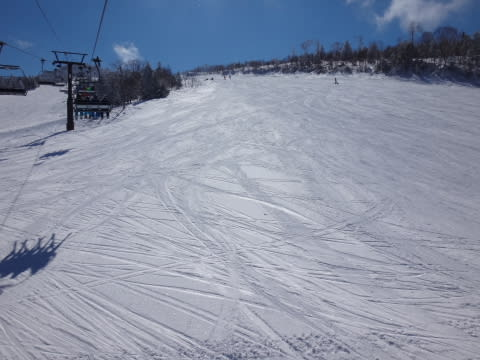

昼間は日が射すのに，最高気温はマイナス4度程度と低く．

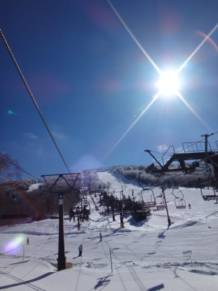

こんなに天気がいいのに，雪質は最高のままっ！

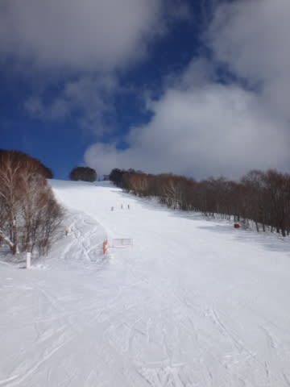

さらに，人が少なかったので…

ブナ平とか，昼過ぎでもこんな感じだったんですが．

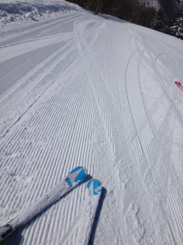

いいんですか？

いいんですか？

午後まで，こんなシマシマを滑れちゃって…（感動の嵐）

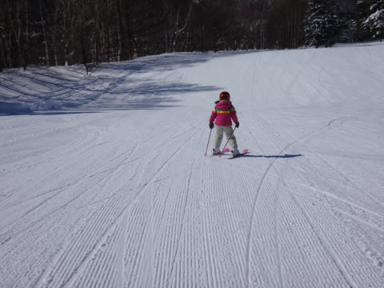

…ってことで．

今日もがらがら，天気最高，雪質最高のゲレンデを．

リフトストップまで思いっきり楽しんだのでした…

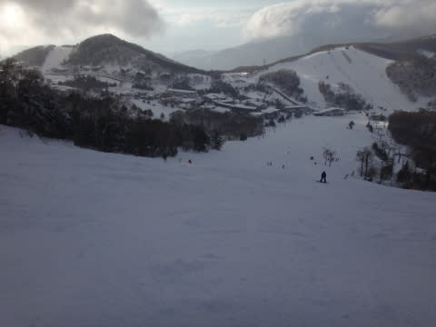

この時は．

まさか．

このあと．

あんな悲劇が待っているとは思わずに…

（続く）

## 💬 コメント一覧

### 💬 コメント by (Ｇｏｋｕ)
**タイトル**: Unknown
**投稿日**: 2014-02-25 20:17:50

娘さんが色々なゲレンデを滑れるようになると志賀高原の楽しさも倍増しますね。

それにしても何が起きたのか・・・気になる。

### 💬 コメント by (Skier_S)
**タイトル**: Gokuさま
**投稿日**: 2014-02-26 01:23:22

いやー．

娘も，志賀高原は一部を除いてだいたい

滑れるようになりました…

この日は一の瀬→寺子屋→東館山→ブナ→西舘→高天ヶ原→タンネ→一の瀬コースでした．

で．

何が起きたのかというと．

昨日ちらっと書いたように．

帰りの渋滞がすごかったんです…

レポート書きましたので，どれだけ悲惨だったか

見てやってください…（涙）．

