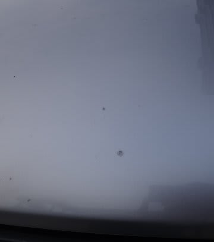
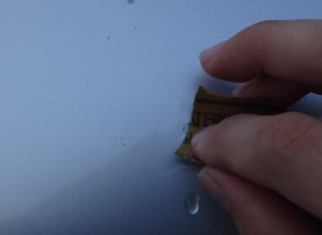
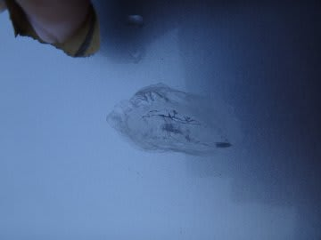
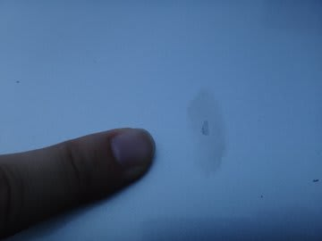
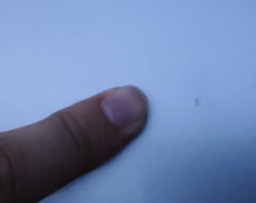

# 18万kmの傷を消してみる

📅 投稿日時: 2012-06-06 03:59:11

で．

無事18万kmの点検が終了した我が車．

やっぱり，18万kmも走ると，飛び石なんかでボンネットがいっぱい傷つくわけで

点検のとき，お願いして傷のタッチアップ塗装をサービスしてもらいました．

＃自分でタッチアップペイントを買うと結構高いし…

＃こういうことをしてくれるのもディーラーのメリットかも

でも．

タッチアップペイントって，傷の上にさびないように塗料を乗せてくれるだけで．

塗りむらが出ます．

なので…

この塗りムラを消してみましょう．

まずは．

1000番あたりの耐水サンドペーパーで水をつけて軽く磨きます

サンドペーパーはホームセンターで60円くらいで売ってます．

磨いている途中はこんな感じ．

で，適当にこのくらいまで磨けたら…

今度はコンパウンドで磨いてみましょう．

コンパウンドは500円くらいで売ってます．

液体の，鏡面仕上げ用のコンパウンドを使ってください．

コンパウンドで磨いたら，この程度まできれいになります．

という感じで．

18万kmの傷も，目立たなくなりました．

がんばって20万kmまで走ってもらいましょう…
