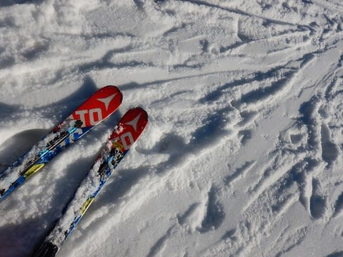
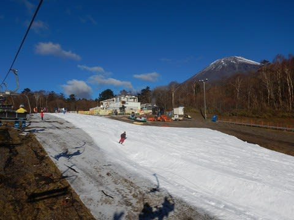
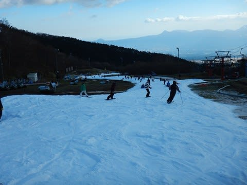

# 11月12日(日)のYeti詳細レポート…ほぼ一日曇り空のひえひえ．それほどひどい混雑ではなかったかな

📅 投稿日時: 2017-11-14 00:04:48

🏷️ カテゴリ: [2018スキー滑走日記](c11b88dc181f34079ab41db74a3587646.md)

ということで．

昨日空港から速報した，日曜のYetiの詳細レポートです~！

えー．

まず．

日曜の朝…

御殿場に向かう東名高速から，くっきりと

冠雪した富士山が拝めるではないですか！

…これは，今日はすっきり晴天の一日に違いない！

と，朝8時オープンのゲレンデに飛び込むと…

うーむ．

雪はアイスクラッシュのザラメがそのまま

広げられたような，板が軽く潜っていく感じの

締まりがない雪ですが…

でも，コース幅も広がり．

気温もひえひえで．

晴天の中，最初の数本は

「たのし～！」

って感じ！！

朝イチは人も少なめだし…

リフトも9時近くまでは飛び乗りで．

雪の厚みも十分あるし．

いや…

これは今日は終日晴天の中，

気持ちよく滑れるに違いないっ！

と，思っていたら．

あれ…

オープンから1時間後，9時過ぎには．

なんだか，曇りだしてきましたよ…？？

そして，やっぱりリフト待ちが…（ちょっと涙）

でも．

午前中はだいたいこの程度のリフト待ちで．

並行したペアリフトを動かすほどじゃなかったので．

それほどひどい混雑じゃなかったかな～．

午後のリフト待ちピークでも，せいぜいこの程度．

まぁ，許せるレベルかな．

…ってよりも．

明らかに去年より人が減る気がするんですが…

うーむ．

天気が悪い日ならまだしも，この天気で

これだけ人が少ないとは…っ！

人が減った影響で，また来シーズンから

値上げしたりしないだろうなぁ…（ちょっと心配）

で．

ペアリフトが動かなかったので，

逆にゲレンデはそれほど混まず…

タイミングによっては詰まることも

あったけど．

でも，コース幅もオープン時の倍近くまで

広がった感じがあるし．

時折クリアなラップも取れて，

意外と快適に滑れました～！

ってことで．

なぜか，終日晴れの天気予報のはずが．

午前9時からずっと曇りという天気で．　←なぜか，あなたが来ると晴れの天気予報でも曇りになる日が続いてませんか？？？

そのおかげで．

気温がかなり寒かったというのも相まって．

雪は結構冷えて滑りもよく，いい感じでしたよ～．

で．

この日は夜の飛行機で米国（こめぐに，と読まない．米どころ新潟ではない）←しつこい

へ発たねばならなかったため．

まだまだ滑りたかったところ．

泣く泣く午後2時前には切り上げましたが．

結局この日は，

リフト待ちは2－3分程度あったものの．

それほど激混みではなく．

意外と楽しめた一日だったのでした…

（帰りの時の駐車場混雑…第2駐車場はほぼ満車）

…しかし．

この後，車を運転して帰宅．

シャワーを浴びて即空港へ向かい．

それから飛行機を乗り継ぎ17時間の移動が続いて．

ちょっとだけ疲れた，Skier_Sだったのでした…

## 💬 コメント一覧

### 💬 コメント by (yama)
**タイトル**: イエティその後
**投稿日**: 2017-11-14 04:35:56

ご一緒させていただきありがとうございました。Sさんが帰った後から少しずつ混み始めました。１０分に１本乗れたリフトが１５分に１本まで伸びました。ちょうど良い時に帰ったと思います。来週は諸事情で昼間は参戦出来ないので、次に会えるのは志賀高原オープンでしょうか。アメリカ出張頑張って下さい。

### 💬 コメント by (Skier_S)
**タイトル**: yamaさま
**投稿日**: 2017-11-14 16:37:50

あ，あれから混んだのですね…

いいタイミングでした．

来週は，日曜昼間にしかいけないので，また志賀高原

でお会いしましょう！

### 💬 コメント by (Goku)
**タイトル**: 海外出張お疲れ様です
**投稿日**: 2017-11-14 19:47:09

信州も15日夜から寒気が入り雪になりそうです。

週末も冷え込むようなので、23日から滑れるスキー場がいくつかありそうです。

12月の焼額山オープンはかなりいいコンディションで迎えられそうですね（気が早すぎるか）

出張頑張ってください！

### 💬 コメント by (Skier_S)
**タイトル**: Gokuさま
**投稿日**: 2017-11-15 14:21:40

こちらは今夜10時半です．

まだまだ仕事が続きます（涙）

いやー．

15日から，かなり冷え込むと思いますよ～！

真冬並みの冷え込みです…

今シーズン，このまま順調に冷え続けてくれれば

いいのですが…

### 💬 コメント by (Unknown)
**タイトル**: 15日のイエティ
**投稿日**: 2017-11-16 07:19:56

昨夜もイエティに行って来ました。

かなり冷えてきて、ナイター営業後は従来型スノーマシンが稼働できたのでは？と思います。

今年はスノーマシンも増やしたので、これから一気に広がることを期待しています。

私も今週末、茶水に出没予定です。

その前に地元のショップで16SXが激安だったので逝ってしまうかもしれません。(^^;

### 💬 コメント by (ほっぽ)
**タイトル**: 上のコメントは私です。
**投稿日**: 2017-11-16 07:20:52

すみません、名前入れ忘れました。m(__)m

### 💬 コメント by (Skier_S)
**タイトル**: ほっぽさま
**投稿日**: 2017-11-16 19:06:50

あ，イエティはそんなに冷えたんですね…

今週末，お茶の水ですか．

物欲選手権開催ですね！！

16SXは，まだ165cmが残っているんですか？

VARビンディングだったら買いかも…

でも，SXは結構クセが強いので（トップを

抑えると性能が発揮できない．テールを

抑えづける），最初は戸惑うかもしれません…

でも，いい板ですので．

逝ってしまいましょう！←物欲仲間を増やそうとしている

