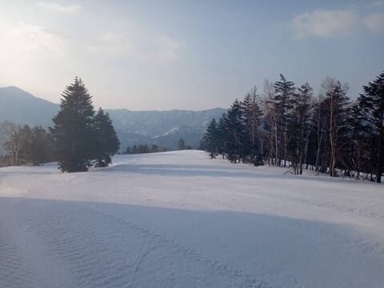
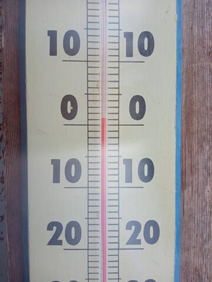
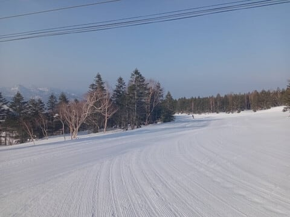
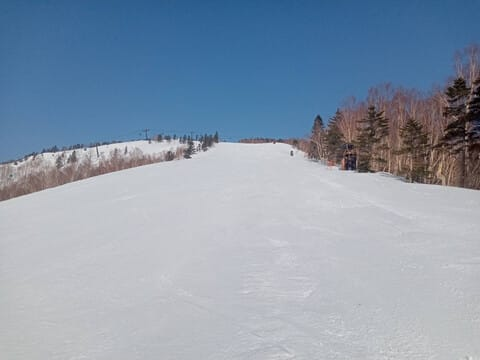
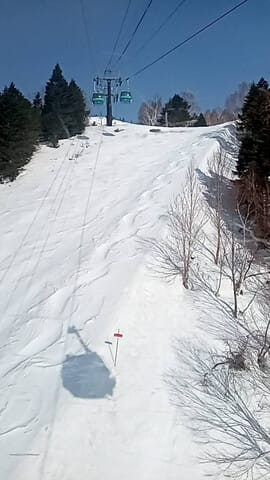
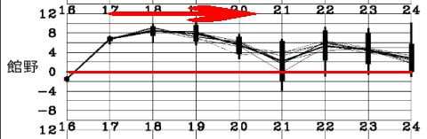
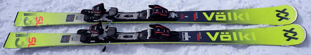
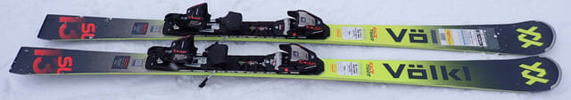
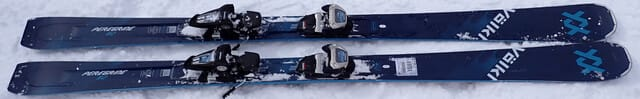
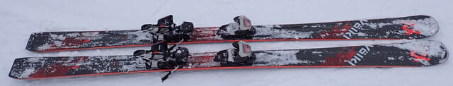

# 2026シーズンモデルのスキー板，試乗レポート速報版！その4…VOLKL編

📅 投稿日時: 2025-04-18 02:48:49

🏷️ カテゴリ: [スキー板試乗](c0bd8048615710cee890e403a36cc9a2b.md)

4月になって，歓迎会という名の飲み会が

連続し…

お財布にも厳しいし，ただでさえ短い

睡眠時間がさらに削られていき，

コロナ時代の飲み会が無かったころは

平和だった…

と，ちょいと危険な発想が脳裏をよぎる

今日この頃ですが．

いや．

しかし．

この時期，歓送迎会で，ものすごい勢いで

お金が飛んでいく…（泣）

これだけのお金があれば，ゴーグルやら

ウェアやらが買えるのに…っ！！

…ってな感じで，ついつい金額をスキー用具で

換算してしまうのですが…

おそらく，2億4000万のこのBlog読者の

読者の多くがそうであるはずと信じている，

Skier_Sです．

…皆さん，スキー用具で金額換算しますよね…

10万円…1スキー，5万円…1ウエア，

2万円…1ゴーグル，1万円…1グローブ，ってな感じで．

7万円なら1ウェア1ゴーグル．

25万円なら2スキー1ウェア…

と表現するはず…！！

…しますよね…

ってな冒頭のあいさつの後は．←これが挨拶だったのか…

本日も志賀高原の特派員から写真が

送られてきましたが…

今日は予想通り早朝から天気が良く，

終日晴れのいい天気だったようです！

ただ，ここも予想通りなんですが．

早朝6時過ぎから早くもプラス気温（涙）

とはいえ，朝のうちは圧雪もきれいで

楽しめたようです～！

いや…平日の早朝時間帯，誰も滑って

ませんね…

8時頃には雪が緩み始め，

一部板の滑りが悪くなったところも

あったようですが…

天気も良く，結構楽しめたみたいです…！

ただ，GSコースの最後の落ち込み，

ゴンドラの下を通っていくあたりの

コースは，ついにクローズになった

ようですが…

でも，まだまだ全然雪が残っている焼額．

GSコースもオリンピックコースも，

SGSコースもイーストコースも

パノラマもサウスも雪がたっぷりですよ～！！

…だけども…

これから週末まで，平年比+6℃以上の，

「6月か？？？」というくらいの気温が

続きそうなので…

雪があんまり解けないことを祈りたい…

ってなことで，ようやっと本題へ．←早く寝たいはずなのに，

なぜこんな本題より長い前フリを書いているのだ？？

今日は2026モデルのスキー板の試乗速報レポート，

フォルクル編です！

今日は4機種いきます！

〇VOLKL RACETIGER SL 165cm

基礎小回り．

SLという名前だけど，WG SLと違い

プレートも入ってない，ゲレンデ向きの

小回りモデルですが…

やっぱり小回り専用機ですね…これ．

フレックスが柔らかくよくたわみ，

それでいてトーションはそんなに弱く

ないので，しっかりグリップした中で

板が大きくたわんでいき，カービング

小回りっぽくなっていきます．

縦目に落としていこうとしても，

板が食いついてたわんでいき，小回りに

なっていく感じ．

ただ，板のトップが勝手に食い込んで

トップが左右にステアして回っていくという

板ではなく，キレイにたわんで，足元の

たわみに沿って回っていくので，操作性は

いいし快感度も高め．

でも，やはりスピードを出すと弧が小さく

なっていき…

自動的に小回りになっていきます．

何も考えなくても勝手に板が小回り

してくれる，オートマチック小回りマシン．

この板と別に大回り板を持っていて，

ある程度の技術はあるけど，そこまで体力や

脚力がないので，フレックスが柔らかめの

板をたわませてカービング小回りをしたい！

小回り専用機が欲しい！

という人にはいいかも．

〇VOLKL RACETIGER SL MASTER 165cm 

基礎小回り

ガッツリしたレース用プレートが入った，

さっきのRACETIGER SLより上級者向けの

ゲレンデ小回りトップモデル．

プレートが強いので，板のフレックスの硬さが

RACETIGER SLと全然違う…

フレックスは硬いけど，板は軽いし，

グリップだけではなくズレもそこそこ使えるし．

フレックスが強いのでたわませないでおけば

割とまっすぐ目に落とすこともできるし，

万能性はかなり高い板．

結構硬めなので，たわませて回るというより，

サイドカーブに乗って回る感じ．

切り替えもたわみが解放されて吹っ飛ぶ

というより，サイドカーブを左右入れ替えて

レールターン的にスッと切り換えていく板．

ターン弧は角付け量で変えられる感じ．

ハイスピードでの安定感は高いけど，

板が求めるスピード域も高い感じで，

かなりスピードを出していった時の

操作性・キレ感がいい．

逆に言うと，低速で滑ってもこの板の

本領は発揮できない感じ…

ハイスピードが好きで，体力があれば

結構楽しめる板．

〇VOLKL PEREGRINE 82 177cm

セミファット，オールラウンド

センター82mmと広いセミファットだと

舐めてはいけない．

GS板かと思うほどの強烈なグリップの

カービングマシーン．

朝イチの硬く締まったフラットバーンを

全力で滑ってみて，FISCHERのRCより

フレックスとグリップが強いんじゃないか…

と思う，しっかりメタルが効いた大回り板．

それでいて結構軽いし，幅が広いので

荒れたバーンの走破性もFISCHERのRC

よりずっと高く…

幅広さのおかげで，新雪が蹴散らされたバーン

でも安定性があって滑りやすい！！

ハイスピード耐性も，セミファットとしては

恐ろしく高く，ガッツリカービングしたまま

かなりのハイスピードまで怖さを感じず

かっ飛ばせます．

私が朝一の焼額で全く不満を感じなかったから，

普通の人なら，この板で高速安定性に不満が

出る人はいないと思う…

ただ，フレックスとグリップが強いので，

ズレでユルユルと滑る板ではないです．

普段でも大回り板を履いてるような人が，

新雪や春雪の荒れた雪でもGS板並みの

滑りができるという，荒れたバーンに強い

カービング大回り板です！！

〇VOLKL PEREGRINE 80 177cm

セミファット，オールラウンド

PEREGRINE 82とセンターが2mm違う

だけじゃなく，フレックスもかなり優しく

なっています．

普通の人がゲレンデで履くには，このくらいが

ちょうどいいフレックスかも…

ただ，グリップの強さはしっかり残っている

ので，よくグリップして良くたわんで，

いい感じで回ってくる板です．

良くたわむので，177cmという長さのわりに，

大回りから小回りまで，回転弧の自由度が高い板．

踏まなければかなり縦目に落とせるし，

踏んでいけばよくたわんでぐっと回ってきます．

滑ってみると，振動が少なく感じて，長さも

あるためスピードを出しても安定感を

かなり感じます．

フレックスや回転弧は，私が春雪や軽い新雪用に

使っているDEACON 84に近い感じ．

幅が広く，荒れた雪でもその上を乗り越える

ように滑っていけるし，新雪での浮力も強めで

楽だし…

セミファットは履きたいけど，グリップが甘くて

カービングできない板はいや！！

という人にはこれをおススメ！

## 💬 コメント一覧

### 💬 コメント by (カンタロス)
**タイトル**: Unknown
**投稿日**: 2025-04-18 07:07:26

エスさま、こんにちは。

スキー用品換算はしますね（笑）

私事ですが、今年はスポーツデポのPBのゴーグル（ダブルレンズのグレード）を買ってみました。

個人的な使用感は20000円するゴーグルとの差がわからない…（笑）

ちなみに、価格は6980円という驚きの安さ。

