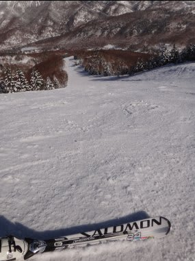

# 4月8日の志賀高原焼額は…シアワセでした

📅 投稿日時: 2012-04-09 00:14:36

明けて日曜ですが．

えー．

最高でした．

以上．

…って終らせたくなるくらいの感じ．

もう，言うことなし．

これ，4月か？？？

2月末よりいいんですけど…

季節が1ヵ月半逆戻りしましたね．

早朝の焼額は…

気温マイナス10度くらいでしょうか．

トップシーズンと同じ格好してきたのに，手がしびれるほど寒い！

でも，ゲレンデは昨日の夜から積もったトップシーズンの粉雪が

きれいに圧雪されたバーン．

トップシーズンでも，これだけいいコンディションの日はそうそうない！

ってほどの最高ピカピカ圧雪バーン．

人も少なく，もうシアワセ…

この早朝は，今シーズンで最も気持ちよい1本に数えていいくらい．

まさか，4月になってこんなゲレンデが滑れるとはっ！

で．

8時から通常営業開始．

ゴンドラのコースも最高の雪質！

天気は快晴！

最高っ！！！

でも，9時ごろから，太陽が高くなるに従い，気温が上がり

ちょっとゲレンデ柔らかくなったかな…

昼ごろには，南斜面はボソボソした春雪になってきたけど．

でも，3月の雪ですね．

普通の4月の，水を吸って透明になって板に張り付く雪とは大違い．

日向の南斜面以外は，柔らかめになったものの，気温が0度まで

あがるかどうかという，比較的低目の気温でしたね～

(昼の山頂の気温表示)

おかげで，この時期の晴天と考えると，最高のゲレンデコンディションを

夕方までキープしました…

夕方でも，こんなにいい雪！

あ，南斜面の第2高速沿い，唐松コースはちょっとザクザクした

感じになってましたが．

それでも，この時期と考えるとGoodですね～．

しかし．

この景色．

とても4月と思えないんですけど…

夕方になっても，木の上に積もった雪が溶けてない…

とりあえず．

ここしばらく雨にたたられていたけど．

この週末は最高の週末を過ごせました．

あー．

最高．

シアワセ．

神様，ありがとうっ！！

で．

…なんだ，これは．

またやっちゃいました．

ということで．

試乗レポートパート2が，今後しばらく続きます．

お楽しみに…

…楽しみにしている人がいるのかな…

いますよね…

いると信じたい(自信なさげ）

## 💬 コメント一覧

### 💬 コメント by (mari)
**タイトル**: Unknown
**投稿日**: 2012-04-09 16:39:51

ハイ、少なくとも一人はいます…(^o^)丿

しかし同じ板でも男性と女性で印象全然違うんですよね。。。

って、日曜日も試乗会に参加されてたのですか？

### 💬 コメント by (雪上の翁)
**タイトル**: 試乗レポ
**投稿日**: 2012-04-09 23:57:27

確実にもう一人います！＾＾

もし同じ板に乗っていたら面白いですね。

### 💬 コメント by (Skier_S)
**タイトル**: 試乗レポートお楽しみに
**投稿日**: 2012-04-10 00:31:58

>mariさま

板の印象は，やっぱりスキーレベルや

体重の有り無しも大きいかと…

試乗したスキー場のゲレンデ状況も

大きいですね～

私は日曜はずっと子供と一緒に滑ったり，

雪だるま作ってました．

残念ながら試乗はできずです…

>雪上の翁さま

同じ板に乗っていたら，私の嗜好が良くわかるかと…

とりあえず，私のレポートは

「単なるレジャースキーヤーのおぼえがき」

というところですので，よろしくお願いします(笑）．

