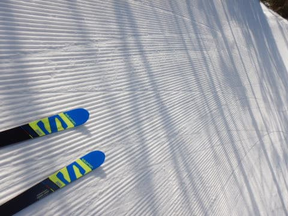
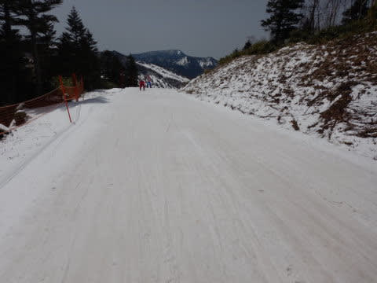
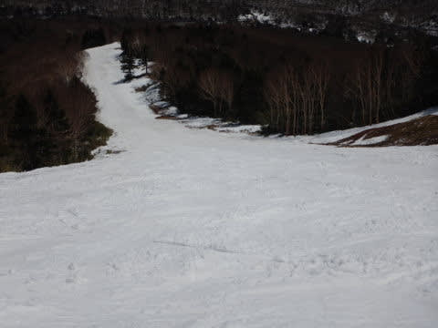

# 2021/5/4(火)の志賀高原スキー場は…終日晴天！朝の雪は締まってたけど，気温が高く昼前には滑りの悪い雪に(涙）

📅 投稿日時: 2021-05-04 21:22:54

そろそろ，

「Skier_Sは何日連続で志賀高原に

滞在するんだ…？」

と思う方がいるんじゃないかと思う

今日この頃，皆さまいかがお過ごし

でしょうか（時候の挨拶）

読者の方も，志賀高原レポートに

飽きてきたころと思いますが．

…まだ志賀高原に滞在してますので．

読者の皆さんの

「飽きた」

の声は聞こえないふりで，今日も

志賀高原レポートです！！！

えー．

昨日は完全積雪路だった志賀への

登り道．

今日は，路面の雪は完全に消えて，

夏タイヤでも普通にやってこれる

感じでした…！

そして．

今日もいつも通り．

6:30の焼額早朝からスタート！

（この一言も何日連続だろう…みんな飽きてるころ）

昨日の雪でコンディションが良くなったのを

期待してか，早朝の営業開始前に並んで

いる人はそこそこいて，駅舎の建物から

ぎりぎり外まではみ出るくらい並んで

ましたね…．

そして．

早朝一番のあさイチの山頂は…

+2℃と，昨日に比べればちょいと高め（涙）

でも，今朝はすっきり晴れていたので…

うはーーー！

放射冷却でバーンは冷えていて．

あさイチは予想よりかなり硬めの，

スピードが出ていい感じのバーン！！

…硬いのが嫌いな人はダメだろうけど．

でも，気温が高いザブザブに比べれば

100倍まし！

これはいいよ！！

硬くてスピードが出るバーン，この時期

では最高！！

ただ，日が射していたので．

ガチガチだったのは3本目くらいまで．

4本目，8時前にはもうゆるみはじめて

きました…（涙）

あぁ…

日が射さなくていいのに．

むやみに晴れているのが悔しい…

強烈に日が射す本日．

気温はぐんぐん上がり．

朝10時には，もうかなり緩んだ

重い雪になっちゃって…（涙）

パノラマコースの廊下部分は，

滑りの悪い，板が走らない雪に

なってきました…（泣）

昨日は真冬の恰好じゃないと寒い

くらいの，「冬か？？？」

って天気と気温だったけど．

今日はウエアのジャケットはいらない

くらい，暑く感じる一日で．

昼にはもう，コース全面荒れ荒れで，

さらに雪の滑りもかなり悪い感じに

なってきて．

10時を過ぎるとほぼゴンドラが

完全に飛び乗りになるほど人が少なかったのに．

重くて緩み切った雪は，写真では

分かりにくいけど，かなり荒れた感じに

なっていき…

とてもロングの板で滑れる状況じゃないので，

久々のショート板投入！！

…でも．

荒れてて滑らなくて楽しくない…（涙）

そして，今日の昼間の最高気温は

+15℃近くまで上がり，日差しが

強いので…

ウエアのジャケットを着ていると

「なにこれ？ガマン大会？」

と思うほどの汗だくになる感じ（泣）

昨日とあまりに違いすぎる…！！

そんな中でも．

ゴンドラが動いている限り，滑る！

板が全然滑らなくても，ゴンドラ降り場

からゴンドラ乗り場まで，移動を

続けるのだ！！←もう，何が楽しくて滑っているかよくわからない

…でも．

ホントに板が滑らず，ゲレンデが荒れてて

楽しくないので…

この私が昼休みをとってしまうレベル

でした…

（昼休みを取ったのは一体どれだけぶりだろう？？）

これまで人が少なく，そんなに荒れなかった

焼額．

今日はかなり荒れ荒れになり，ところどころ

小回り道ぽくなってきてたけど…

荒れて板も滑らずコンディション悪いので．

滑っている人がいなくなってしまった

ゲレンデを．

ゴンドラが動いている限り，ひたすら

滑り続けてしまうという習性を

もっている私は，

ついつい今日も，営業終了まで

滑りつづけてしまったのでした…

でも．

4月29日のころは，5月5日の営業最終日まで

雪が持つかどうか厳しいなぁ…

GW途中で雪不足で営業終了かな…？

と思っていたけど．

焼額スタッフによる，コースのヤバい

ところへの大量の雪入れと，

昨日，おとといの積雪おかげで．

コースは問題なく明日のシーズン

最終日まで滑れそうです！！

ただ．

明日の営業最終日．

なんだか，朝は南風が強く．

そして，昼ぐらいから雨になりそう…（涙）

果たして，最終日は無事ゴンドラが

動くのか！？？

午後は雨のなか，第4ロマンスを

滑る羽目になるのか？？

とりあえず，営業最終日．

とんでもない天気にならないことを

祈るばかり…

## 💬 コメント一覧

### 💬 コメント by (naoちゃんねる)
**タイトル**: Unknown
**投稿日**: 2021-05-04 22:53:54

毎年の年末年始とGWのお決まりのパターンですね(笑)でも、誰も飽きてないと思います☆

GW後半は絶対にヤバいだろうと言う声があちらこちらから聞こえてましたが、まさかまさかの天の恵み☃でしたね！！

しかし、張り付き雪になろうと、荒れ荒れになろうとゴンドラストップまで滑り倒す気力と体力は流石です…(驚)

### 💬 コメント by (真美子)
**タイトル**: Unknown
**投稿日**: 2021-05-05 06:34:37

３日はコンディション良く滑り事が出来て良かったですね。4日は厳しかったようですが、５日の今日はどうなんでしょうね。

焼額愛を来シーズンも見せてくださいね。

### 💬 コメント by (ikkun)
**タイトル**: Unknown
**投稿日**: 2021-05-05 11:52:10

おそようございます(笑)

(^-^ゞそんな輩??(笑)はこちらにお世話になりません？はい失礼します(笑)焼額山は昨season４月頭に仲間とコブも含め滑った以来(・・;)昨日行けたら良かったですよ(・・;)下手なくせに浅いコブならば特異ですが「伸び上がり多いからだめ」と指導員様に言われました(笑)ラストですか？楽しんでくださいませ風大丈夫かな？

### 💬 コメント by (Unknown)
**タイトル**: Unknown
**投稿日**: 2021-05-05 15:56:31

流石です

朝一滑ってその後ホテルで朝食を食べに戻ると、うちのグループはもう終了となりました。

### 💬 コメント by (かず)
**タイトル**: Unknown
**投稿日**: 2021-05-05 21:18:56

結局着替えないでそのまま帰りました この位GW空いてるなら来シーズンもアリですが 今年は参考にならないですよね…

今シーズンありがとうございました！！

### 💬 コメント by (Skier_S)
**タイトル**: 焼額も終わってしまった…
**投稿日**: 2021-05-06 01:48:06

＞naoちゃんねるさま

いやー．ホントに5月2，3日の雪は天の恵みでしたね！！

最終日まで滑れてよかった…

けど，最終日にゴンドラが運休ってのがかなり寂しかったです(泣）

＞真美子さま

3日は5月としてはこれ以上望めないコンディションでした！

来シーズンも焼額愛（？）を全力で発揮しますよ～！！

＞ikkunさま

ラストはやっぱり風にやられました(涙）

来シーズンはぜひ焼額再訪を…

＞Unknownさま

早朝の楽しいところだけ楽しむのが，ゼイタクなスキーというもの．

私のは貧乏性スキーです(笑)

＞かずさま

GWまでお疲れ様でした！

例年，GWは5連休だと2，3日目は混みますがそれ以外は

そんなに混まないですよ．

5連休後半2日とかは例年ガラガラです．

でも，今年の5月3日のようないいコンディションは数年に1回です…

