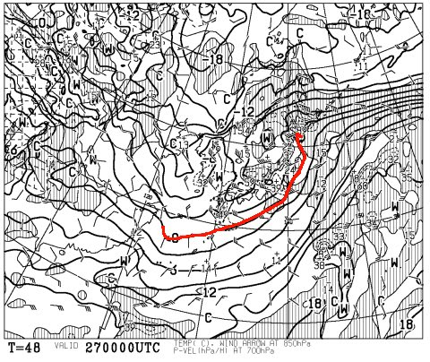
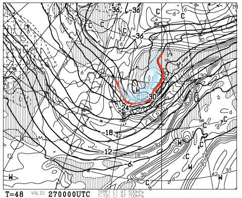
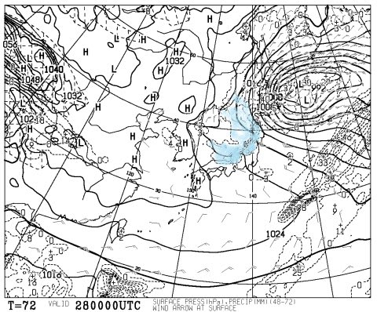
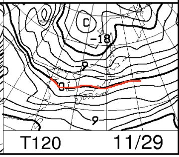
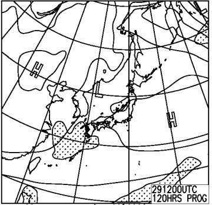
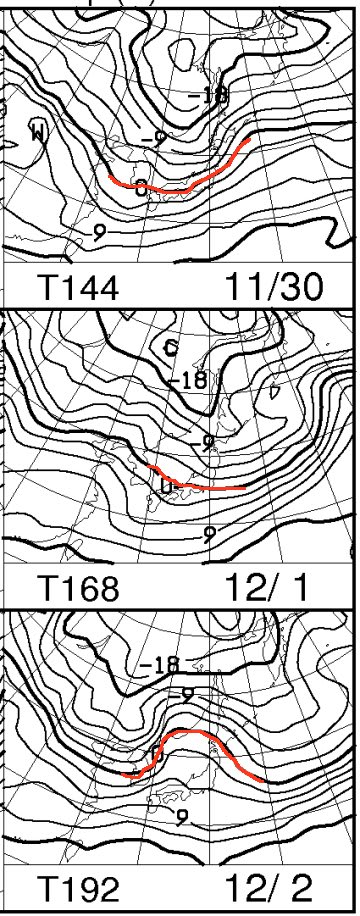

# 今週末は…来る！一級の寒気が，来る！

📅 投稿日時: 2015-11-26 00:38:06

えー．

予想通り，本日は冷え込み．

志賀高原でも，[ついにスノーマシンが動き出した](http://shigakogen-ginrei.com/blog-entry-174.html)

今日この頃．

みなさまいかがお過ごしでしょうか．

ってなわけで．

さてさてさてさてさて．

来ましたよ～っ！

っていうか，来ますよ～！

第一級の寒気が，やってきます！

いや，

ちと残念なことに．

26日は一日，ちょいと気温が上がって，雨が降ってしまうかも

しれないんですけど…

26日夜から，来ますよ来ますよ～！

どどーん！

27日朝9時の850hpa気温．

赤くマークした0℃線は，かなり南まで下がり…

信州には，-6℃の線がかかってます．

…これは，志賀高原は早朝，-10℃近くまで冷える感じ！

それどころか，この日の500hpa気温図は…

をを！

そこそこの雪の目安，-30℃の線が信州に

かかっているではありませんか！

これは期待できそう…

26日木曜の夜から，27日金曜にかけて．

日本海側は雪です．

待ちに待った天然雪が来ます！

人工雪もガンガン打てます！

で，これが土曜日28日朝9時の850hpa図ですが…

赤くマークした0℃線は，日本の南に下がり続けており．

…この日も，冷え込みそうな感じです！

で，土曜の朝の地上天気図は…

見事な西高東低！

水色でマークした降水量が予想される領域．

典型的な，日本海の吹き出しの雲による降水パターンで．

日本海側の山沿いでは，冷え冷えの雪が降ります！

金曜から続けての天然雪です！

…だけど．

風向きがちょいと西寄りすぎるので．

…木，金ともに，志賀高原は雪がそれほど

積もらなさそう…

白馬，かぐらとかは積もりそうなんですが…

でも，人工雪は打てる！

ガンガン打てる！

木曜夜から土曜にかけて，ひたすら人工雪がつけられるはず！

がんばれ，人工降雪機！！！

で，日曜日は．

850hpaの気温はこんな感じで…

うーむ．

ぎりぎり信州あたり．

…この日は，昼間はちょっと気温が上がるかも…

昼間は人工降雪が打てるかどうか微妙な感じ．

日曜の地上天気図はこんな感じなので…

まぁ，昼間は日が射す可能性があり，

そうすると気温が上がるので，人工降雪は

厳しいかな．

ってことで．

おそらく．

金・土曜日に，数多くのゲレンデが雪付けにいそしみ．

「今週末オープン」というゲレンデが出てくるかも…

土曜に何とかゲレンデを作って，「日曜オープン」

ってゲレンデもありそうな感じですね．

で，

そのあとですが…

うーむ．11月30日と12月1日は，赤くマークした0℃線が

信州より南にあるので．

30日は雪が積もり，1日も人工雪がつけられそうなんですが…

2日は，0℃線が北まで上がってしまい，

信州にも+6℃線が近づいているくらいで．

昼間の気温は，志賀高原でも+5度近くにまで

上がってしまいそうな感じ…

うーむ．

まだ，継続的に冷え込む感じじゃないなぁ…

とりあえず．

この週末は．

木曜夜から土曜いっぱい，日本海側のスキー場は

冷え冷えで雪がドサドサ降る．

信州や群馬はそれほどの降雪は無いかな…

でも，人工雪でゲレンデ状況は改善．

日曜もそこそこ冷え込むので．

日曜からオープンのスキー場が出てくるかも？？

この日は気温がそこそこ低いわりに，

天気も良さそうなので，

ゲレンデがオープンできれば，

良いスキー日和になりそう…

…あ，Yetiは土日とも晴れるかな．

Yetiでも，金～日曜の朝は，アイスクラッシュじゃない

人工雪が打てるレベルなので．

ゲレンデは結構広がるかも？

うーむ．

今週末のオープンをあきらめたアサマが，

土曜にどっさり天然雪が降って，いきなり日曜に

オープンとか，そんな奇跡，おきてくれないかな～．

## 💬 コメント一覧

### 💬 コメント by (まいる)
**タイトル**: やっと雪が・・・
**投稿日**: 2015-11-26 22:11:29

やっと雪が降ってきましたねー

来月の初滑りは予定通り行けそうです。

Skier_Sさん、私は、スキーもやりますよー

コブがなかなか克服できませんが・・・(>_<)

### 💬 コメント by (Skier_S)
**タイトル**: まいるさま
**投稿日**: 2015-11-27 01:24:08

お，スキーヤーかつボーダーなのですね．

技術選は，やっぱりスキーの方ですよね？？

初滑りは，一体どちらの予定でしょうか…？？

### 💬 コメント by (まいる)
**タイトル**: 私のメイン
**投稿日**: 2015-11-29 18:38:37

Skier_Sさん、私はスノーボードメインでスキーは時々です。すみませんm(__)m

初滑りは、箕輪にしようかなと思っています。

### 💬 コメント by (Skier_S)
**タイトル**: まいるさま
**投稿日**: 2015-11-29 21:36:03

ボードメインですか…

初滑りもボードですね．

来週あたり，初滑りですか？？

